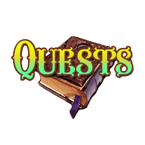

# WELCOME EVERYBODY!

If you're seeing this message, you have arrived at the very first part of the Beginner Cadence Course. WELCOME! My name is Jacob Tucker, and I will give a brief introduction of the course and what you can expect.

# *Want to watch a Welcome Video instead of reading this text? You can watch <a href="https://www.youtube.com/watch?v=JBtmLjZBR6M" target="_blank">here</a>.*

## "What will this course look like?"

In this course, you will learn the basic Cadence concepts needed to deploy your own contracts. Specifically, you will learn how to code out your own NFT contract by the end of this course.

The lessons will be split into "chapters," and chapters will be split into "days." I did it this way so you can manage your time and progress through the course as you like. Do not feel pressured to do this every day. Do it at your own pace and have fun with it! It will always be here :)

Here's an overview of what this will look like:
- Lessons split into days
- Written & video content associated with each day. The videos will be from my [YouTube Channel](https://www.youtube.com/channel/UCf6DzMRwj7SJ3nPrZqd5hHw).
- Quests to complete (if you would like to. This is not necessary)
- A completion certificate if you have completed all the quests. This will be proof that you have significant Cadence knowledge, and you will be able to show it to whoever you like as proof of expertise. Or just for fun! :D

I would like to be very clear that how you learn from this course is completely up to you. If you'd like to just watch the videos, you can do that. If you only want to read the text, you can do that. If you want to skip right to the quests, you can do that. Note that you will only recieve the certificate of completion if you submit all the quests.

## "What do I need ahead of time?"

Nothing.

In order to complete this course, you need to know absolutely nothing about coding. I included Chapter 1.5 that teaches you the basics of computer programming. 

**Although Chapter 1.5 is a great introduction to programming, if you have never written code before, you may also want to do some outside learning before this course, because it can get complicated very quick. It is impossible to learn how to Code by watching tutorials/reading articles. You must mess up on your own to make true progress.**

If you would to learn a similar language to Cadence to get a good grasp of how to program, I would suggest trying to learn the basics of Javascript to get some programming fundamentals down. Knowing Javascript will be benefitial, however it is not necessary. 

*I will introduce you to all the tools and programming concepts necessary, even if you are not a developer.*

## "What are quests?"

You do not have to do quests to learn all the material. However, they will help your understanding, and if you'd like a certificate of completion, you must complete them.

There will be quests associated with each day. They will test your understanding of the concepts that are in that day's content. 

### How to Submit Quests

When you finish a quest, please store all your quests together. Then, when you want me to review them, you can send me a link to all of your quests and tell me which day you'd like me to review.

If you are ready for me to see one of your quests to review it, please message in the [Emerald City DAO Discord](https://discord.gg/z6zgjr7HEm) (the #quest-submissions channel). Once you do that, I will personally review your submissions, give you valuable insight on what you could improve, and mark it as complete.

*Note: The Emerald City DAO is the first DAO on the Flow Blockchain. I founded it in November 2021 and it has some amazing people in it! We are dedicated to teaching people all about Flow and Cadence, as well as building the tooling for all DAOs on Flow. If you'd like to learn more about it or learn how to get involved, please join our [Discord](https://discord.gg/emeraldcity).*

## "When can I start?"

Whenever you want my friend! :)

You can start the first day [here](https://github.com/emerald-dao/beginner-cadence-course/tree/main/chapter1.0/day1).

## <a href="https://academy.ecdao.org" target="_blank">Emerald Academy</a>

This course is being used inside of <a href="https://academy.ecdao.org" target="_blank">Emerald Academy</a>, which is a series of educational resources & bootcamps created by your *best* friends at Emerald City. If you're interested in more educational content or getting involved in the broader Emerald City community, come join our <a href="https://discord.gg/emeraldcity" target="_blank">Discord</a> :)

## Ending Remarks

If you have any feedback, please let me know. You can message me on Twitter, on Discord, on YouTube, anything. I am not smarter than any of you. If you have suggestions, I am sure they are great and I'd love to hear them.

Feel free to reach out to me on any of these platforms:

[Twitter](https://twitter.com/jacobmtucker)

[YouTube](https://www.youtube.com/channel/UCf6DzMRwj7SJ3nPrZqd5hHw)

Discord: tsnakejake#8364
