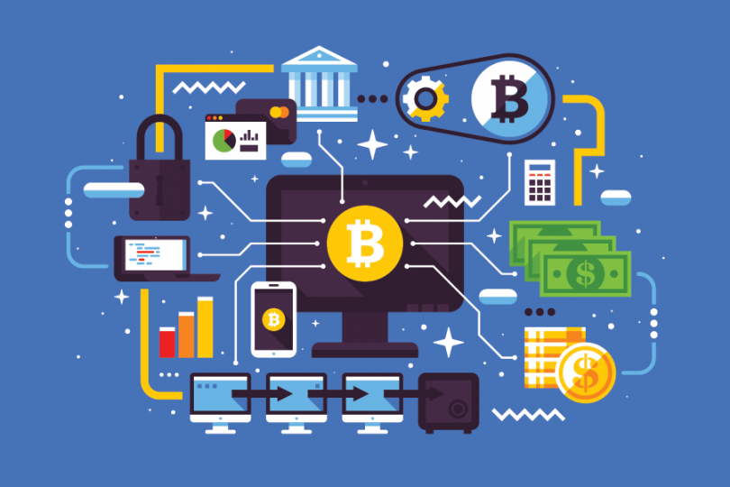
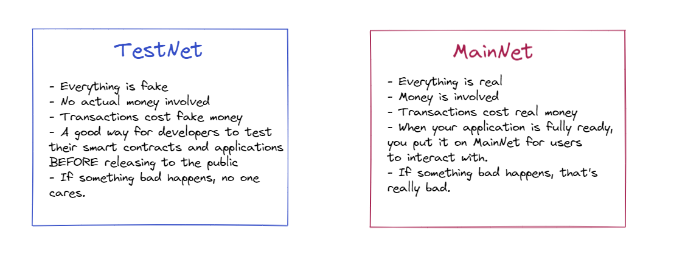
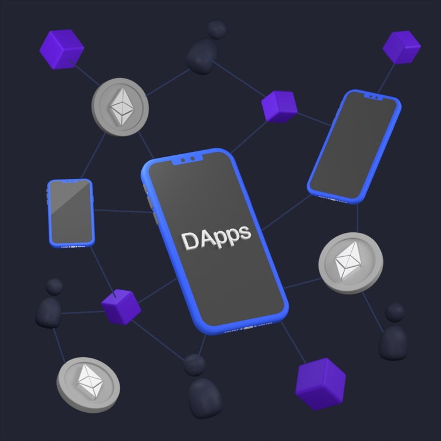

# Глава 1 - День 1 - Изучение концепций Блокчейна

Привет! Да, это я. Ваш любимый разработчик всех времен и народов Джейкоб. В настоящее время вы просматриваете первый день всего курса. Давайте начнем это путешествие вместе.

Давайте начнем наш первый день с рассмотрения, казалось бы, сложных терминов, которые вам нужно будет понять, чтобы продолжить дальше свой путь.

## Что такое Блокчейн?

*Если вы уже понимаете, что такое блокчейн, или вам просто все равно (что справедливо!), можете пропустить этот раздел.*

Изучая Блокчейн, вы можете встретить несколько сложных статей. В них легко запутаться и почувствовать, что вы хотите всё бросить. Поэтому я собираюсь объяснить Блокчейн простым способом, который может содержать некоторые неточности или упущенную информацию, но поможет вам приступить к обучению. **В частности, я помогу вам понять Блокчейн с точки зрения человека, который хочет написать смарт-контракты или сделать несколько децентрализованных приложений (и то, и другое мы сделаем!).**

Короче говоря: Блокчейн - это открытая, децентрализованная, общая база данных, которая позволяет любому человеку публично хранить информацию.

Хорошо. Что это значит?

1. **ОТКРЫТЫЙ**: Любой может взаимодействовать с ним. Нет никаких ограничений. 
2. **ДЕЦЕНТРАЛИЗОВАННЫЙ**: Никто не владеет им. Нет центрального органа, диктующего что-либо.
3. **БАЗА ДАННЫХ**: Вы можете хранить в нем информацию.
4. **ПУБЛИЧНЫЙ**: Любой желающий может просмотреть данные на нем.

Благодаря этим вещам мы можем взаимодействовать с Блокчейном как угодно. Зачастую мы можем установить "правила", которые определяют, как люди могут взаимодействовать с определенными частями Блокчейна, чтобы он обладал некоторой функциональностью - в частности, нашими собственными приложениями, которые мы определим. Это делается с помощью смарт-контрактов.

Важно также отметить, что существует множество различных Блокчейнов. Например, Ethereum, вероятно, является самым популярным Блокчейном. В этом курсе мы будем изучать замечательный Блокчейн Flow, потому что именно в этом я разбираюсь ;)

## Смарт-контракты? Ооо, звучит круто.

Да, да, именно так. Смарт-контракты - это очень круто. Смарт-контракты - это программы, или "своды правил", которые создают разработчики. Разработчики создают их, потому что это позволяет нам задать некоторую функциональность, с которой могут взаимодействовать пользователи. Например, если я хочу создать приложение, позволяющее пользователям хранить свои любимые фрукты в Блокчейне, мне нужно создать смарт-контракт который:

1. Имеет функцию, которую может вызвать любой пользователь
2. Принимает параметр (любимый фрукт человека)
3. Хранит этот параметр в некоторых данных
4. Отправляет обновленные данные в Блокчейн (происходит автоматически)

Если я создам этот смарт-контракт и "разверну" его на Блокчейне (развернуть означает поместить контракт на Блокчейн, чтобы люди могли взаимодействовать с ним), то любой человек сможет поместить свой любимый фрукт на Блокчейн, и он будет храниться там вечно! Если только у нас не будет функции для удаления этих данных.

Итак, почему мы используем смарт-контракты?

1. **Скорость, эффективность и точность**: Смарт-контракты работают быстро, и в них нет посредников. Также отсутствует бумажная работа. Если я хочу обновить данные в Блокчейне с помощью смарт-контракта, который позволяет мне вызвать какую-то функцию, я могу просто сделать это. Мне не нужно получать разрешение от родителей или банка.
2. **Доверие и открытость**: Блокчейн, а значит и смарт-контракты, чрезвычайно безопасны, если мы сделаем их такими. Взломать или изменить состояние Блокчейна практически невозможно, и хотя это связано с другими причинами, в основном это происходит благодаря смарт-контрактам. Если смарт-контракт не позволяет мне что-то сделать, я просто не могу этого сделать. Нет никакого способа это обойти.

Какие есть недостатки?
1. **Сложные для понимания**: Хотя смарт-контракты - это круто, они НЕ умные. Они требуют сложного уровня знаний со стороны разработчика, чтобы убедиться, что у них нет проблем с безопасностью, они недорогие и делают то, что мы хотим. Все это мы узнаем позже.
2. **Может быть вредоносным, если разработчик недобросовестный**: Если разработчик хочет создать смарт-контракт, который крадет ваши деньги, а затем обманом заставляет вас вызвать функцию, которая это делает, ваши деньги будут украдены. В мире Блокчейна вы должны быть уверены, что взаимодействуете с надёжными смарт-контрактами.
3. **Невозможно отменить действие**: Вы не можете просто отменить что-то. Если только у вас нет функции, которая позволяет вам это сделать.

## Транзакции и Скрипты

*"Итак, у нас есть смарт-контракт. Как с ним взаимодействовать? Вы все время говорите "вызвать функцию", но что это значит?!?"*

**Транзакция - это известный, платный вызов функции.** Это самое простое, что я могу сказать. Важно знать, что транзакция изменяет данные на Блокчейне, и обычно это ЕДИНСТВЕННЫЙ способ изменить данные на Блокчейне. Транзакции могут стоить разные суммы денег в зависимости от того, на каком Блокчейне вы находитесь. На Ethereum хранение вашего любимого фрукта на Блокчейне может стоить почти 100 долларов. На Flow это доли цента.

В то же время, скрипты используются для ПРОСМОТРА данных на Блокчейне, они не изменяют их. Скрипты не стоят никаких денег, это было бы глупо.

Вот обычный порядок работы:
1. Разработчик "разворачивает" смарт-контракт на Блокчейне 
2. Пользователь проводит "транзакцию", которая принимает некий платеж (для оплаты газа, исполнения и т.д.), вызывающий некоторые функции в смарт-контракте
3. **Смарт-контракт каким-либо образом изменяет свои данные**

## "MainNet" vs. "TestNet"

Возможно, вы слышали эти термины, но что они означают на самом деле? 

**TestNet** это среда, в которой разработчики тестируют свои приложения, прежде чем выпустить их в открытый доступ. Это идеальное место, чтобы выяснить, что не так с вашим приложением, прежде чем выпускать его для публичного использования. Вот несколько дополнительных примечаний:
- Все ненастоящее
- Никаких реальных денежных затрат
- Транзакции стоят ненастоящих денег
- Хороший способ для разработчиков протестировать свои смарт-контракты и приложения ДО публичного выпуска
- Если происходит что-то неладное, это никого не волнует

**MainNet** это среда, где все реально. Когда вы выпускаете свое приложение в открытый доступ, вы размещаете его в MainNet. В MainNet все происходит в реальном времени, поэтому все стоит реальных денег, существуют риски, и вы должны быть уверены, что все работает правильно. Вот несколько дополнительных примечаний:
- Все по-настоящему
- Задействованы реальные деньги
- Транзакции стоят реальных денег
- Когда ваше приложение полностью готово, вы размещаете его в MainNet, чтобы пользователи могли взаимодействовать с ним
- Если случится что-то неладное, то это будет очень плохо

## Децентрализованные приложения (DApps)

О нет, это звучит сложно. Нет! Это не так. DApps - это буквально обычные приложения (Javascript, Python и т.д.), в которых ВСЕГДА задействованы смарт-контракты. Вот и все.

Кроме того, мы будем их создавать :)

## Почему меня все это волнует?

Ну, потому что именно об этом и пойдет речь в этом курсе, болван! В этом курсе мы будем создавать собственные смарт-контракты, именно, на Блокчейне Flow. Кроме того, мы будем создавать децентрализованные приложения, которые будут *использовать* эти смарт-контракты.

## Заключение

Джейкоб - лучший. Нет, нет. Вывод не в этом. Вывод в том, что хотя все это звучит очень сложно, на самом деле это не так. И если вы все еще не понимаете НИЧЕГО из этого, это совершенно нормально. Иногда лучше перейти к примерам, чтобы все стало более понятным. Мы сделаем это в ближайшие дни.

# Квесты

Вы можете отвечать на вопросы на любом языке по своему выбору. И нет, я не имею в виду язык программирования, хаха.

1. Объясните своими словами, что такое Блокчейн. Вы можете прочитать это, если необходимо, но это не обязательно: https://www.investopedia.com/terms/b/blockchain.asp

2. Объясните, что такое смарт-контракт. Вы можете прочитать это, если необходимо, но это не обязательно: https://www.ibm.com/topics/smart-contracts

3. Объясните разницу между скриптом и транзакцией.