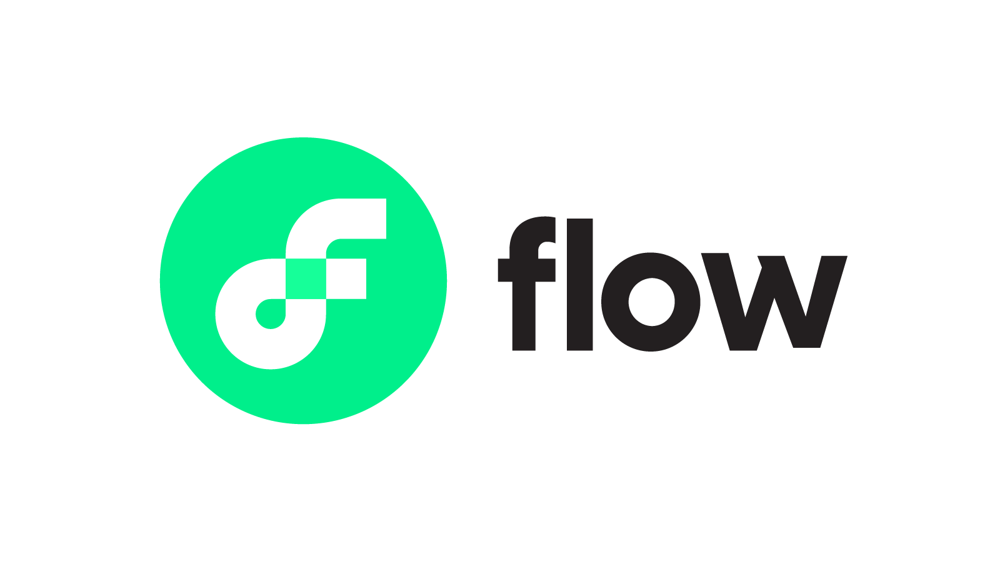
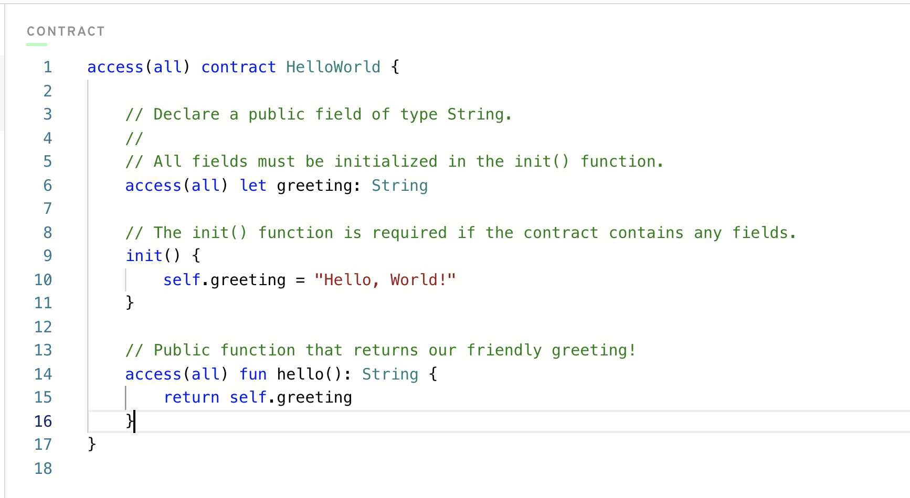

# Chapter 1 - Day 2 - The Flow Blockchain & Cadence

Yo yo yo! It's meeeeee! Jacob here. Hello. Now that we learned what the Blockchain is, Day 2 will cover why we have decided to learn the Flow Blockchain and how it compares to other Blockchains out there.

## Video

If you'd like to learn with a video, you can do that from the link below.

[Introduction to Flow and Cadence](https://www.youtube.com/watch?v=iVevnipJbHo)

## The Flow Blockchain

The Flow Blockchain is the best. Boom! I said it.

### Little History Lesson

The Flow Blockchain is relatively new. I would say it did not become well known until the Summer of 2020 when the Flow team started to show it to the world and people became interested. Dapper Labs, the company that owns Flow, had originally created the famous [CryptoKitties DApp](https://www.cryptokitties.co/) which grew to insane levels of popularity during previous years. In fact, I would argue CryptoKitties was one of the first "blockchainy" things that the world actually adopted, which was a huge deal for the industry. 

After Dapper Labs had immense success with CryptoKitties, which was on Ethereum, they also began to see some issues with both Ethereum and Solidity, which is the Smart Contract programming language for many Blockchains on the Ethereum Virtual Machine (EVM). Thus, Cadence was born.

### Facts about Flow

- It is much, much, MUCH cheaper than Ethereum to do stuff on. As an example, on Ethereum, if you are to try and change the data on the Blockchain through a transaction (explained in day 1), it could cost on average around 80$ from personal experience. However, on Flow, they didn't even have transaction costs until around October 2021, and now, transactions cost fractions of a cent. Thus, Flow is much more approachable to build production-level DApps on for the average user.
- It is very new, so there are still tons of things being improved upon. This means there are bound to be bugs here and there, but we will work through them together. This also means that it is the perfect opportunity to learn Flow and Cadence now.
- There are barely any learning resources to get started on Flow. Hence, this course.
- There have been many successful DApps on Flow, including [NBATopShot](https://nbatopshot.com/), which was (and still is) a massive success.

## Cadence

Cadence is the Smart Contract programming language for the Flow Blockchain. That is, the code you will be writing to make Smart Contracts in this course will be in Cadence.

Because Flow was largely founded to address some of the issues on Ethereum, the foundational elements of Cadence are rather responses/improvements (some would argue against this, but take it as you will) to Solidity. These are listed below.

The fundamentals, or rather, "Cadence Programming Language Pillars":
1. **Safety and Security**: Every Smart Contract must be secure. Cadence maximizes efficiency while maintaining the highest levels of safety and security. It accomplishes this because of its insanely strong type system, separation between contracts and transactions, and Resource Oriented Programming (see #5).
2. **Clarity**: Code should be easy to read, especially Smart Contract code so that we, as users, can verify it is safe. This is achieved by making the code declarative and allowing the developer to express their intentions directly. Cadence makes those intentions very clear by design, which, along with readability, make auditing and reviewing more efficient.
3. **Approachability**: The way Cadence is written is very familiar to other programming languages, making it easy to transition to if you have prior experience.
4. **Developer Experience**: The developer should be able to debug in an easy manner, understand what does where, and not feel frustrated. Cadence does this by making error messages very clear.
5. **Resource Oriented Programming**: This is by far the most important, and will take up about 80% of our time in this course. Cadence at its core uses things called `Resources`, and they define pretty much everything we do on Flow. I will not get into this now, because we will have an entire lesson on `Resources` at some point.

*You can view them more in-depth on the Flow website [here](https://docs.onflow.org/cadence/#cadences-programming-language-pillars).*

If you do not understand these, that is perfectly fine. We will touch on these topics throughout the entire course, and you will learn why each of these is so crucial to Cadence.

## Conclusion

That about wraps things up for today! In the next day, we will start getting into some Cadence code.

# Quests

Please feel free to answer in the language of your choice.

1. What are the 5 Cadence Programming Language Pillars? 

2. In your opinion, even without knowing anything about the Blockchain or coding, why could the 5 Pillars be useful (you don't have to answer this for #5)?

# <a href="https://forms.gle/RxwXCUrj6kakid529">Quiz</a>