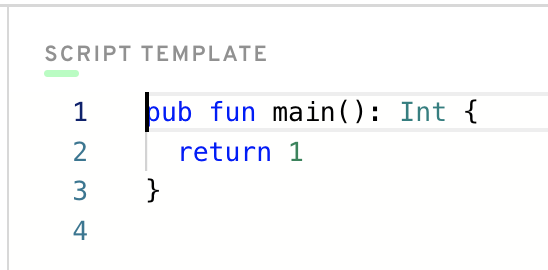
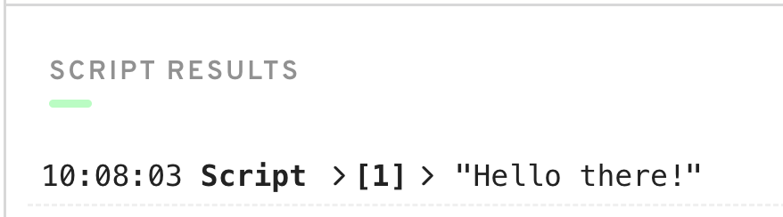
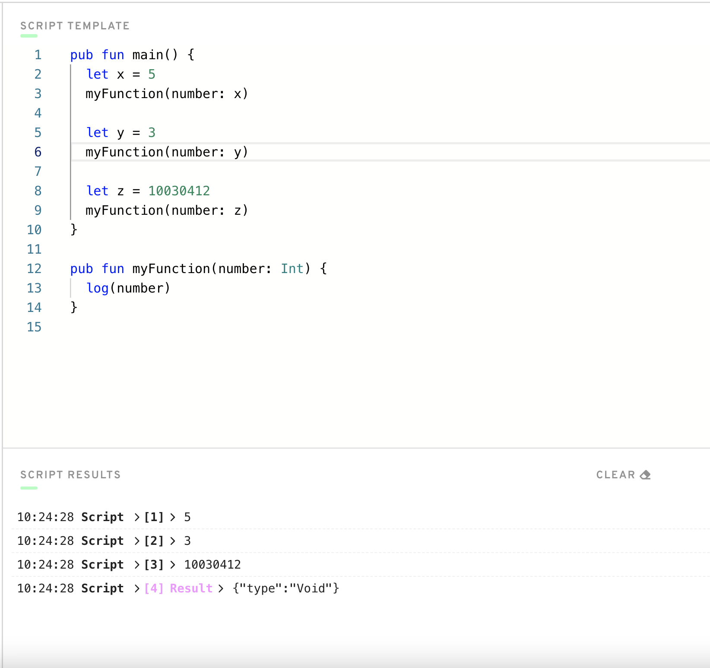

# Chapter 1.5 - Basic Computer Programming Concepts

This chapter will cover the very basics of computer programming. ***If you have ever coded before, this will be very boring for you, so please skip this chapter if you want to.***


## The Most Important

If you are reading this chapter, that means you have probably never coded before, or you want to review the basics. 

The most important thing I could ever tell you as a beginner programmer is that the hardest part of computer science is learning **how to think like a programmer**. Often, it's not the coding itself that's hard, it's training yourself to think like an efficient programmer to write good programs. No matter what people tell you, that can not be taught. It is up to you to play around with code and be patient to truly grasp that skill.

Thus, if you find yourself getting frustrated, I totally understand! I did too. But the only way to really learn it to mess up A LOT and figure out errors on your own. That will be way more helpful to you than watching tutorials or reading articles online.

With that being said, let's learn about programming!

## Programming



What is programming? What is coding?

Basically, programs are just a bunch of numbers and letters you type on a screen that *do things*. For example, if I want to write a program that says "Good Morning" to me every time I click a button, I can do that!

In order for a program to work, you need to use something called "syntax". Every single programming language has a different syntax that allows you to communicate with the computer. For this bootcamp, you will be using the syntax provided by the Cadence programming language, but you have probably heard of others like Javascript, Python, C++, HTML, CSS, and many others. 

## How to Tell the Computer What to Do

Well, how do we actually tell the computer what to do? 

We have to use the syntax that the computer wants. So, in Cadence, there's a bunch of things that are pre-defined for us that allow us to communicate with the computer, and well, the blockchain in general.

### Functions

When you're coding a program, there are always a lot of useful tools to help you do what you want. For example, we can use things called `functions` to execute a piece of code when it is called. 

The most basic function in Cadence is `log`, which means, "print this to the screen so I can read it." You can write it in code like this:

```cadence
log("Hello, idiot!")
```

See what we did? We wrote `log`, followed by a set of parenthesis. Functions always take in things called `arguments` (also called `parameters`) that get put into the function so it knows what to do. If we were to execute that program, it would say, "Hello, idiot!" which is exactly what we want. :)

Let's look at an example program I wrote in Cadence:


You can see the `log` statement in the middle there. But what is surrounding it? Hey, it's another function! But this time, we had to define the function ourselves. `log` already exists in the language, it's part of the syntax. But the function `main` is something I wrote myself. You don't have to worry about how I did that, just know that the function `main` gets executed when the program starts. It will print "Hello there!" back to us, like this:



You can actually run this code yourself if you go to https://play.onflow.org and type the same code into the "Script" tab on the left.

https://play.onflow.org is a "playground" for you to write programs in Cadence. Furthermore, the Script tab is a place where we can write some simple programs to test our understanding.

### Variables

Variables are easier than functions, honestly. While a function allows you to execute some logic, a variable simply stores data inside of it.

You can think of variables as something that holds a piece of data at a certain point in time. You can change what the variable represents (if you're allowed to) so that it points to something else. Here's an example:


In this case, `x` is a `variable`. On line 2, you can see that we bring x into existence by "declaring" it. We say, `var x = 5`, which is the Cadence way of saying "I want to create a variable named x that stores a value of 5."

At the beginning of the program, `x` held the value of 5, which is a number. After we log it, we change `x` to hold 3 instead, and we log it afterwards as well. You can see the values being logged at the bottom.

### Types

In Cadence (and most other programming languages), everything has something called a "type". A type is the broader representation of what *kind* of thing something is. For example, `5` is a number. But, `"Hello World"` is a piece of text. How can we differentiate between these two?

In Cadence, we call a number an "Integer". More specifically, it has type `Int`. However, we call text a "String", also known as `String`. Here's an example:

```cadence
let x: Int = 5
let text: String = "Hello idiot"
```

You can see the different types of the variables here. And don't worry, we will learn all about this later on.

Here's an example mistake so you can see the difference:

```cadence
let x: String = 5 // WRONG
let y: String = "5" // GOOD
```

Make sure not to get confused between different types. `"5"` is a `String`, but `5` is an `Int`. 

In Cadence, you will see many different types. For example, `UInt64` is a fancy way of saying "a positive number between 0 and 18,446,744,073,709,551,615." The trick is to not lose hope, and you will get used to it over time :)

## Writing our Own Functions

Let's come up with an example of writing our own functions to test our understanding.

Open the <a href="https://play.onflow.org" target="_blank">Flow playground</a> and go to the Script tab. Let's start with this:


Sweet! All we did so far is say our variable `x` represents the number `5`.

Let's make our own function now and call it.


Woah, we added a lot. Let's look at it in steps:
1. On line 6, we defined our own function named `myFunction`. Remember, a function is just something that does a thing when you call it. Don't worry about how I made this function. All you have to know is that when we call it, it'll do something (which is on line 7).
2. Notice that `myFunction` takes in 1 "argument": a `number` that is an Integer. 
3. On line 7, we "log" `number` to the console.
4. On line 3, we call `myFunction` so that it executes.

When you click `Execute`, you should see this:


Great! We got our expected answer.

Notice that if we had not put line 3, `myFunction` would have never gotten called, and we would've never logged `number` to the console.

We can change our code up a bit to log a LOT of different numbers to the console. Let's do that here:



In this example, we defined 3 different variables:
`x`, `y`, and `z`, all of which hold a different number. For each of them, we pass them into `myFunction` so that it logs to the console. Woohoo!!

## "Why do we write functions?"

You'll begin to notice that functions are helpful for writing out some code that we may want to do more than once. It saves us from having to write that code over and over and over again. For example, let's look at this code:


In this example, we define two variables `greeting` and `person` that store a message inside of them. Then, we use the pre-defined `concat` function to combine the two messages. We then log it to the console.

This is great and all, but what happens when we want to do this a bunch of times, with different greetings and people?


Okay, that's a LOT of code. What's the issue with this?

The problem is we are constantly writing the same code that combines the two pieces of text together. Why re-write the same logic over and over again? Is there a way we could make this easier? Or make it so that we only have to write that logic one time, and then use it multiple times? Of course! Let's use a function:


In this example, we define a function called `combine`, which does the following:
1. Takes in 2 messages
2. Uses a pre-defined `concat` function that combines them together
3. Logs it to the console

What's the purpose of this? Well, now that we wrote the `combine` function, we don't have to update our `newMessage` a ton of times and continuously combine the two pieces of text. Now, we can call `combine` to do that for us!

It may not look really benefitial to make a function right now, but if we had more complex code that was repeated a lot, you would save tons of time coding by making a function.

## Functions and Return Values

The last thing I'll mention is that functions can also give you back some information as well. Let's look at an example:


In this example, we define a function called `add` that takes in 2 numbers, adds them, and returns them back. You can tell a function returns a value because of the `: Int` on line 12. That means, "this function returns an Integer."

You can see on line 2 for example that we set `answer` equal to the result of the `add` function. That's super cool!

## Conclusion

I wanted to show you the very basics of computer programming, however there is only so much I can do. After all, I need to be out there saving the world right now, I don't have time for noobs like you!

In all seriousness, if you want to learn more about basic computer programming concepts, or you struggled with this chapter, I'd recommend looking up YouTube tutorials online. However, the only way to really learn is to mess around with code yourself. I promise you, you will never improve by just reading/watching videos. You have to try it yourself!


That's all, and enjoy the course! With love,

Jacob