# Capítulo 1.5 - Conceptos de Programación de Computadoras Básicas 

Este capítulo va a cubrir los básicos de programación de computadoras. ***Si has codificado antes, este se va muy aburrido para ti, así que por favor omitir este capítulo si quieres.***


## Lo Más Importante

Si estás leyendo este capítulo, eso significa que no has codificado antes, o quieres revisar los básicos. 

La cosa más importante podría decirte como programadora principiante es que la parte más difícil de las ciencias de computadoras es aprender **cómo pensar como programadora**. A menudo no es la codificación lo que es difícil, es entrenarte a ti mismo cómo pensar como una programadora eficiente. Depende de ti jugar con código y sé paciente para comprender verdaderamente esa habilidad. 

Por lo tanto, si te encuentras a ti mismo frustrado, ¡te entiendo totalmente! Pero la única manera para aprender actualmente es para cometer MUCHOS errores, y descúbrelos por tu cuenta. Eso será más fácil para ti que viendo tutoriales o leyendo artículos en línea. 

Dicho esto, ¡vamos a aprender sobre programación! 

## Programación

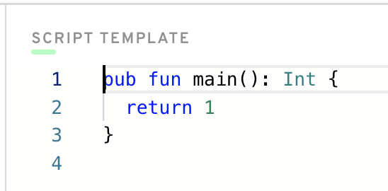

¿Qué es programación? ¿Qué es codificación?

Básicamente, programas son justo muchos números y letras que tecleas en una pantalla que *haces cosas*. Por ejemplo, si quiero escribir un programa que me dice “Buenas Dias!” cada vez que yo haga clic un botón, ¡puedo hacer eso!

Para un programa funcionar, necesitas usar algo que se llama “syntax”. Cada idioma de programación tiene una “syntax” diferente que permite comunicar con la computadora. Para este bootcamp, te vas a usar el syntax proporcionado por el idioma de programación Cadence, pero probablemente has oído sobre otros como Javascript, Python, C++, HTML, CSS y otros.

## ¿Cómo Decir la Computadora Qué Hacer?

Pues, ¿cómo le decimos realmente a la computadora qué hacer?

Tenemos que usar el syntax que la computadora quiere. Así que, en Cadence, hay muchas cosas que son pre-definidas para nosotros que permiten comunicarnos con la computadora, y pues, el blockchain en general. 

### Funciones

Cuando estás codificando un programa, siempre hay muchas herramientas útiles que te ayudan a hacer lo que quieres. Por ejemplo, podemos usar cosas que se llaman `funciones` para ejecutar un pedazo de código cuando se está llamado.

La función más básica en Cadence es `log`, cual significa, “Imprima esto a la pantalla así que puedo leerlo” Puedes escribirlo en código como así:

```cadence
log("Hello, idiot!")
```

¿Ver lo que hicimos? Nos escribe `log`, seguido de un conjunto de paréntesis. Las funciones siempre toman cosas que se llaman `argumentos` (también se llaman `parámetros`) que se ponen en la función entonces sabe qué hacer. Si yo fuera a ejecutar ese programa, se diría, “Hello, idiot!” cual es exactamente lo que queremos. :) 

Vamos a verlo en la programa de ejemplo yo escribí en Cadence: 

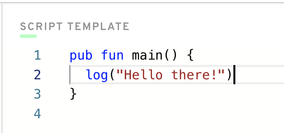

Puedes ver la declaración de ‘log’ allí en la mitad. Pero que hay a alrededor? Oye, es una otra función! Pero esta vez, tuvimos que definir la función nosotros mismos. `log` ya existe en el idioma, es parte de la syntax. Pero la función `main` es algo que escribí yo mismo. No tienes que preocuparte sobre cómo yo hiciste eso, solo conoce que esa función `main` será ejecutada cuando el programa empiece. Se va a imprimir “Hello there!” de vuelta a nosotros, como así:

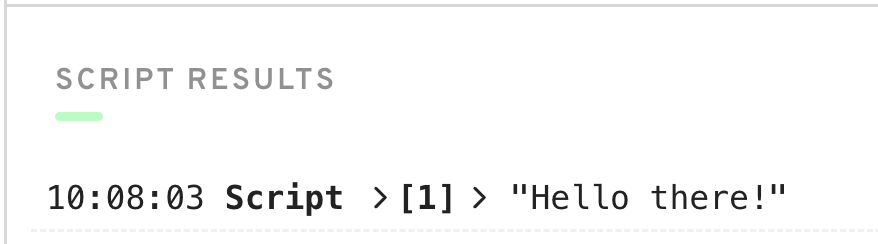

Puedes realmente ejecutar este código si te vas a https://play.onflow.org y teclar el mismo código en la pestaña de “Script” a el lado izquierdo. 

https://play.onflow.org es un “playground” para ti así que puedes escribir programas en Cadence. Además, la pestaña de Script es un placer donde podemos escribir algunos programas simples para probar nuestro entendimiento. 

### Las Variables

Variables son más fáciles que funciones, sinceramente. Mientras una función permite ejecutar algún lógico, un variables simplemente almacena data adentro.

Puedes pensar variables como algo que se mantiene un pedazo de data en un momento determinado. Puedes cambiar que el variable representa (si se le permite) para que apunte a algo más. Aquí es un ejemplo: 

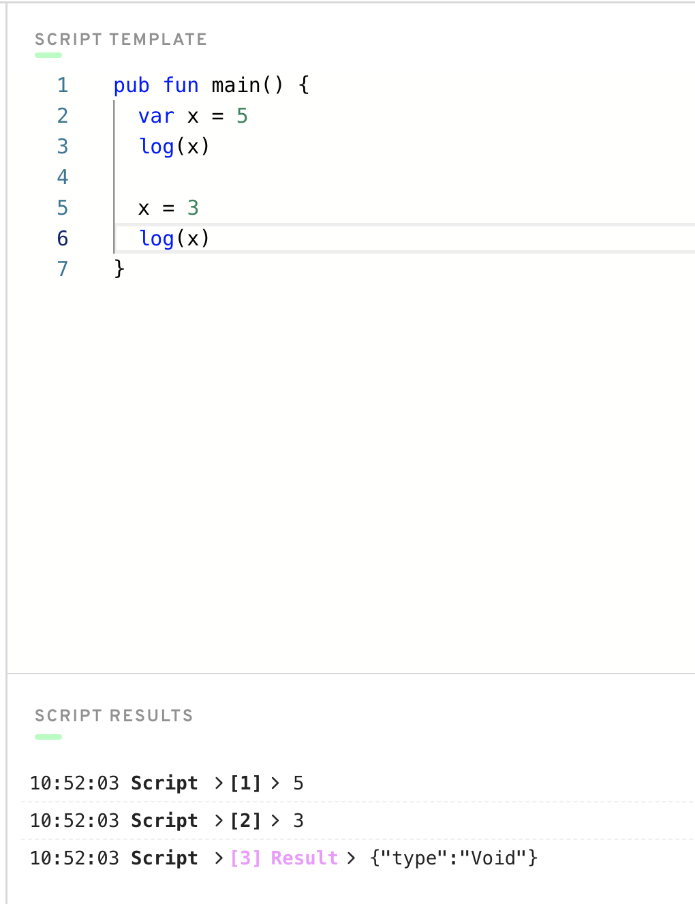

En este caso, `x` es una variable. En línea 2, puedes ver que traemos x a la existencia “declarándolo”. Nosotros decir, `var x = 5`, cuál es la manera de Cadence de decir “Yo quiero crear una variable llamada x que almacena un valor de 5.”

Al principio del programa, `x` tiene el valor de 5, cual es un número. Después que lo registramos, nos cambia `x` a el valor de 3, y lo registramos después también. Puedes ver los valores siendo registrado en la parte inferior.

### Tipos

En Cadence (y otros idiomas de programación), todo tiene algo llamado un “type” o tipo. Un tipo es la representación más amplia de qué tipo de cosa algo es. Por ejemplo, `5` es un número. Pero, `“Hola, Mundo”` es un pedazo de texto. ¿Cómo podemos diferenciar entre los dos?

En Cadence, llamamos a un número un “Integer”. Más específicamente, tiene el tipo de `Int`. Sin embargo, llamamos al texto un “String”, también conocido como `String`. Aquí es un ejemplo:

```cadence
let x: Int = 5
let text: String = "Hello idiot"
```

Puedes ver los diferentes tipos de variables aquí. Y no te preocupes, vamos a aprender sobre todo esto más tarde.

Aquí es un ejemplo error así que puede ver la diferencia:

```cadence
let x: String = 5 // WRONG
let y: String = "5" // GOOD
```

Asegúrese de no confundirse entre los diferentes tipos. `“5”` es un `String`, pero `5` es un `Int`.

En Cadence, vas a ver muchos tipos diferentes. Por ejemplo, `UInt64` es una manera elegante de decir “un número positivo entre 0 y 18,446,774,073,709,551,615.” El truco es no perder la esperanza, y usted se acostumbrará a él con el tiempo. :) 

## Escribiendo Nuestro Propio Funciones

Vamos a hacer un ejemplo de escribir nuestro propio funciones para prueba nuestro entendimiento.

Abrir el <a href="https://play.onflow.org" target="_blank">Flow playground</a> a var para la pestaña de Script. Vamos a empezar con este: 

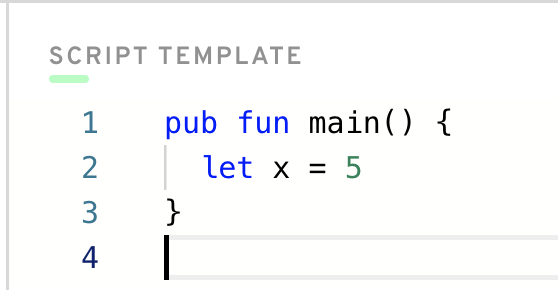

¡Genial! Todo lo que hemos hecho es decir nuestra variable `x` representa el número `5`. 

Vamos a hacer nuestra propia función ahora y llamarlo. 

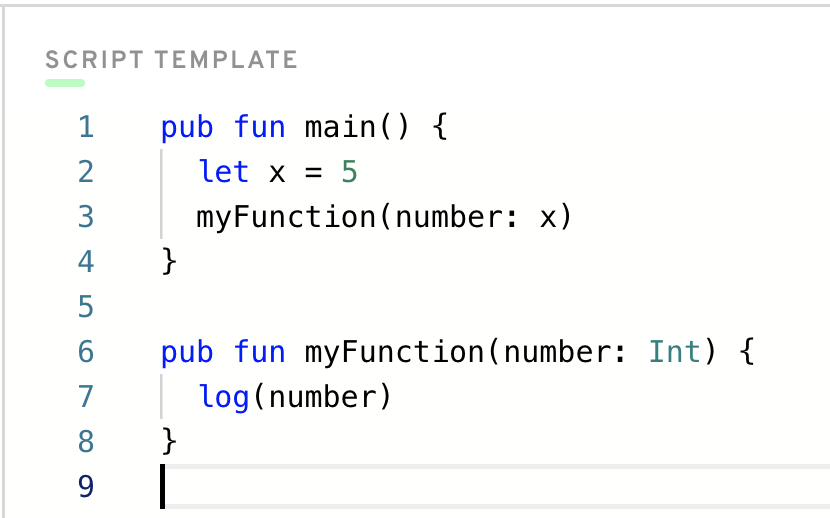

Wow, nos añadimos mucho. Vamos a verlo en los pasos: 
1. En línea 6, hemos definido nuestra propia función llamada `myFunction`. Recuerda, una función es justo algo que hace una cosa cuando se llama. No te preocupes sobre como yo hice esta función. Todo lo que tienes que saber es que cuando lo llamamos, hace algo (cúal es en la línea 7).
2. Tenga en cuenta que `myFunction` toma en 1 “argumento”: un `number` que es un Integer. 
3. En línea 7, nos "registramos" `number` en la consola. 
4. En línea 3, nos llaman `myFunction` para que se ejecuten.

Cuando te haz clic “Execute”, debe ver este: 

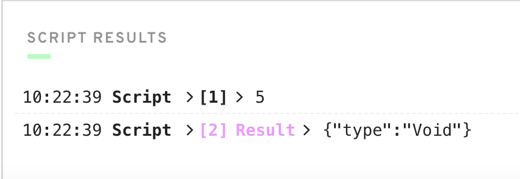

¡Genial! Obtuvimos nuestra respuesta esperada. 

Tenga en cuenta si no hubiéramos puesto linea 3, `myFunction` no habría sido llamado, y nunca hubiéramos registrado `number` a la consola. 

Podemos cambiar nuestro código un poco para registrar muchos números diferentes a la consola. Hagamos esto aquí. 

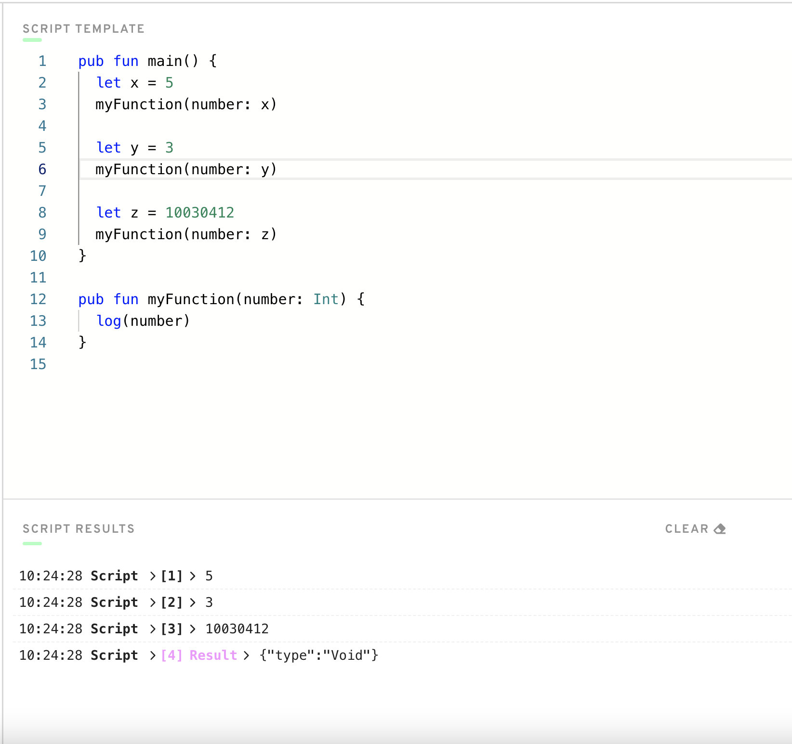

En este ejemplo, hemos definido 3 variables diferentes, `x`, `y`, e `z`, todo que contiene un número diferente. Para cada de ellos, los pasamos a `myFunction` para que se registraran en la consola. ¡Woohoo!

## “¿Por qué nos escribe funciones?”

Te darás cuenta que funciones son útiles para escribir código que queramos hacer más de una vez. Nos salva de tener que escribir ese código una y otra vez. Por ejemplo, vamos a ver a este código:

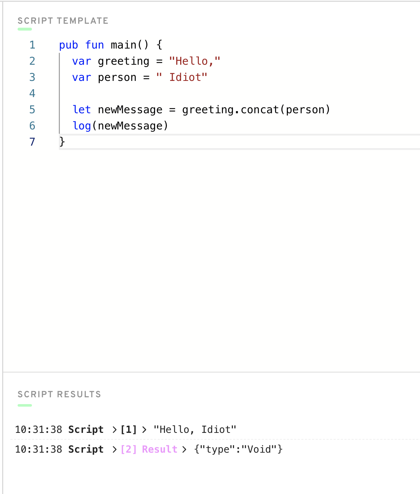

En este ejemplo, definimos dos variables: `greeting` y `person` para almacenar un mensaje dentro de ellos. Entonces, usamos la función de `concat` pre-definido para combinar los dos mensajes. A continuación, lo registramos en la consola.

Este es genial y todo eso, pero qué pasa cuando queramos hacer este muchas veces, con diferentes saludos y personas?

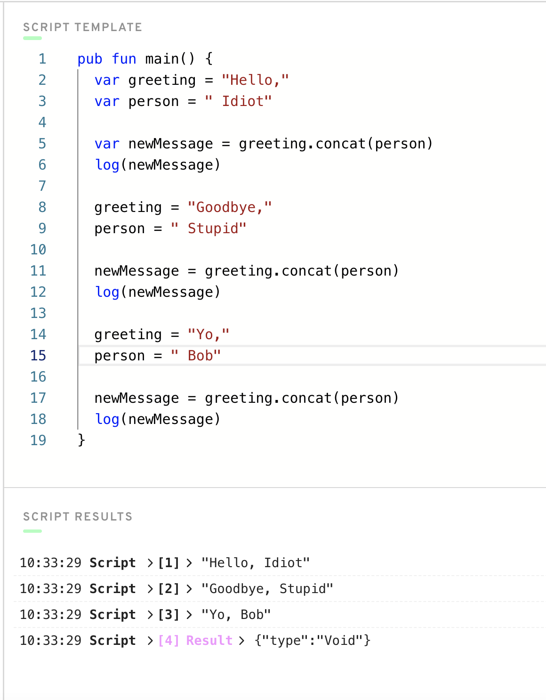

Okay, eso es MUCHO código. ¿Cuál es el problema con este? 

El problema es que estamos constantemente escribiendo el mismo código que combina dos pedazos de texto juntos. ¿Por qué re-escribir el mismo lógico una y otra vez? ¿Hay una manera en que puede hacer esto más fácil? O hacerlo así tenemos que solo escribir eso lógico una vez, y entonces usarlo muchas veces. ¡Claro que sí! Vamos a usar una función: 

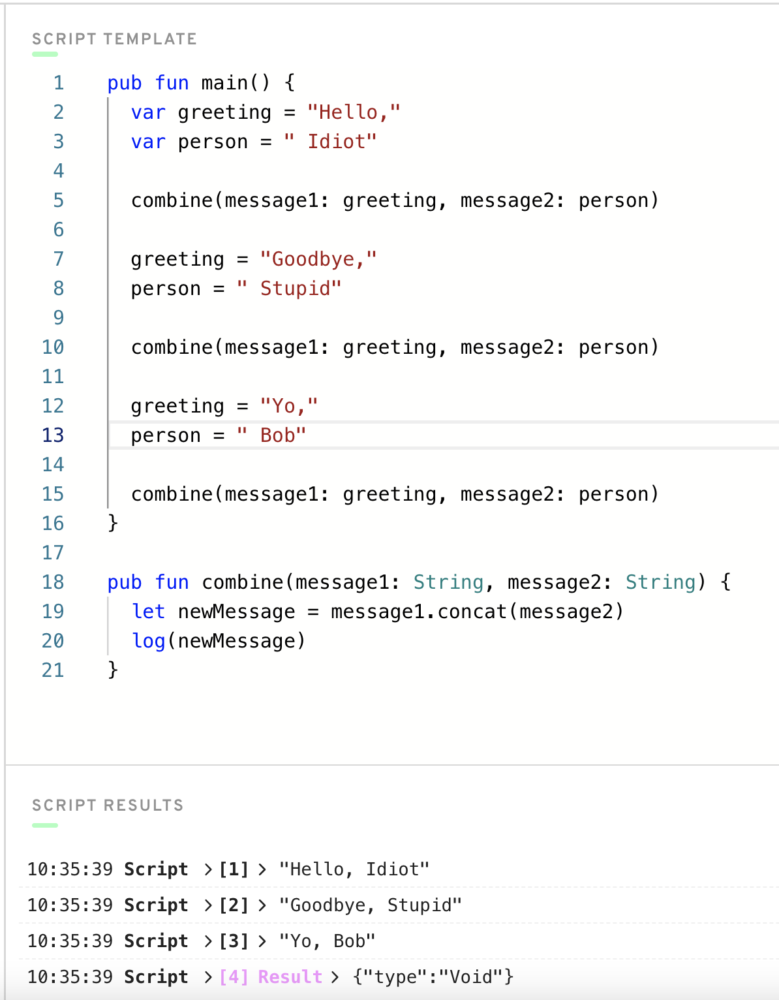

En este ejemplo, definimos una función llamado `combine`, que hace lo siguiente:
1. Toma en 2 mensajes
2. Usa una función de `concat` pre-definido que combina ellos juntos
3. Registrate a la consola

¿Cuál es el propósito de este? Pues, ahora que hemos escrito la función de `combine`, no tenemos que actualizar nuestro `newMessage` muchas veces y combinar continuamente los dos pedazos de texto. Ahora podemos llamar `combine` para hacer eso por nosotros.

Puede que no sea muy beneficioso para hacer una función ahora, pero si hubiéramos código más complejo que se repitió mucho, ahorraría mucho tiempo de codificación haciendo una función. 

## Funciones y Valores Devueltos

La última cosa mencionaré es que funciones también puede devolverle alguna información también. Vamos a verlo un ejemplo: 

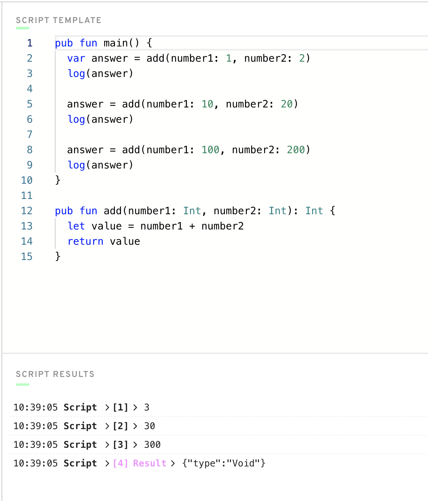

En este ejemplo, definimos una función llamada `add` que toma 2 números, agréguese y devuélvase. Puedes saber que una función devuelve un valor porque de el `: Int` en línea 12. Eso significa, “esta función devuelve un Integer”.

Puedes ver en línea 2 por ejemplo que establecemos `answer` igual a la resultada de la función de `add`. ¡Eso es súper genial! 

## En Conclusión

Quería mostrarte los basicos de programacion de computadora, sin embargo sólo hay tanto puedo hacer. Después de todo, necesito estar ahí afuera salvando el mundo ahora, no tengo tiempo para noobs como tu! 

Con toda seriedad, si quieres aprender más sobre conceptos de programación de computadoras básicas, o si tuviste dificultades con este capítulo, yo recomiendo buscar tutoriales en línea de YouTube. Te lo prometo, nunca mejorarás solo leyendo/mirando videos. ¡Tienes que probarlo a ti mismo! 

Eso es todo, y ¡disfrutar el curso! Con amor,
Jacob
