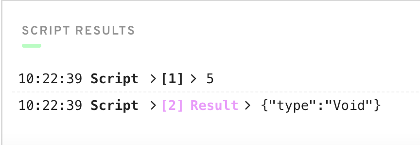
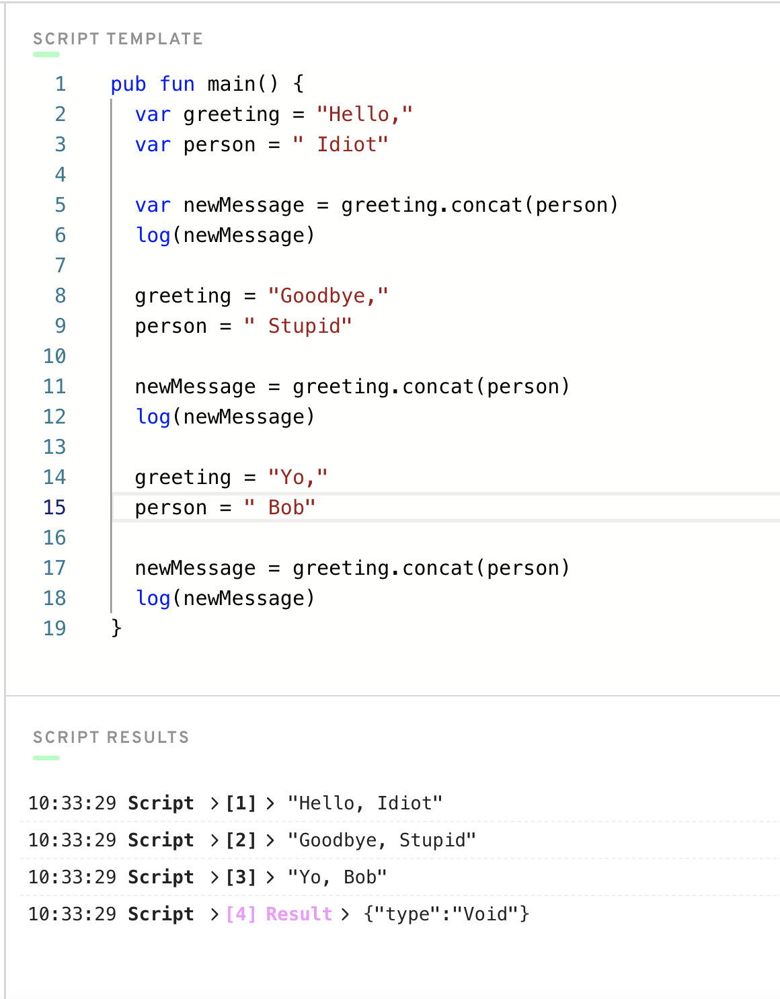
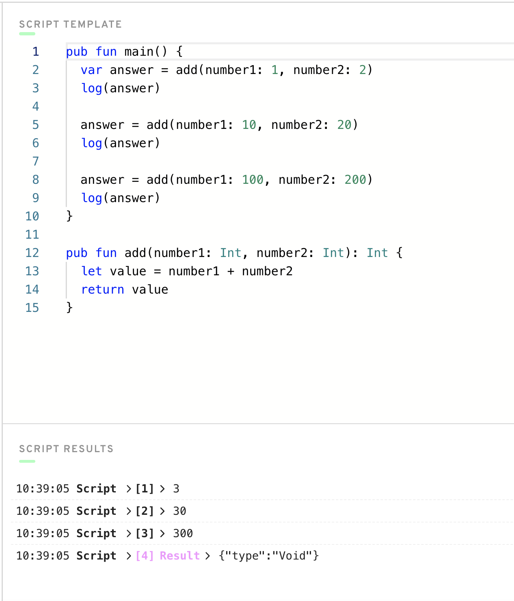

# Глава 1.5 - Основные концепции программирования

В этой главе мы рассмотрим самые основы программирования. ***Если вы раньше программировали, то для вас эта глава будет очень скучной, поэтому если хотите, можете её пропустить.***


## Самое важное

Если вы читаете эту главу, значит, скорее всего, вы никогда раньше не программировали или хотите ознакомиться с основами. 

Самое важное, что я могу сказать вам как начинающему программисту, это то, что самая трудная часть - это научиться **думать как программист**. Зачастую сложно не само программирование, а научиться думать как эффективный программист, чтобы писать хорошие программы. Что бы вам ни говорили, этому нельзя обучить. Вы сами должны играть с кодом и быть терпеливыми, чтобы по-настоящему овладеть этим навыком.

Поэтому, если вы расстроились, я вас полностью понимаю! Но единственный способ по-настоящему научиться - это много практиковаться и самостоятельно разбираться в ошибках. Это будет гораздо полезнее для вас, чем смотреть уроки или читать статьи в Интернете.

Учитывая это, давайте узнаем о программировании!

## Программирование


Что такое программирование? Что такое кодинг?

По сути, программы - это просто набор цифр и букв, которые вы набираете на экране и *которые выполняют некоторые действия*. Например, если я хочу написать программу, которая говорит мне "Доброе утро" каждый раз, когда я нажимаю на кнопку, я могу это сделать!

Для того чтобы программа работала, необходимо использовать то, что называется "синтаксис". Каждый язык программирования имеет свой синтаксис, который позволяет вам общаться с компьютером. В этом буткемпе вы будете использовать синтаксис языка программирования Cadence, но вы наверняка слышали и о других языках, таких как Javascript, Python, C++, HTML, CSS и многих других.

## Как сказать компьютеру, что делать

Как мы можем сказать компьютеру, что ему делать?

Мы должны использовать синтаксис, который понимает компьютер. Поэтому в Cadence есть куча вещей, которые заранее определены, что позволяет нам общаться с компьютером и вообще с Блокчейном.

### Функции

Когда вы пишете программу, всегда есть множество полезных инструментов, которые помогут вам сделать то, что вы хотите. Например, мы можем использовать вещи, называемые `функциями`, для выполнения фрагмента кода, когда он вызывается. 

Самая основная функция в Cadence - это `log`, что означает "вывести на экран, чтобы я мог это прочитать". Вы можете написать ее в коде следующим образом:

```cadence
log("Hello, idiot!")
```

Видите, что мы сделали? Мы написали `log`, за которым следуют круглые скобки. Функции всегда принимают вещи, называемые `аргументами` (также называемые `параметрами`), которые помещаются в функцию, чтобы она знала, что делать. Если бы мы выполнили эту программу, она бы сказала: "Привет, идиот!", а это именно то, что мы хотим. :)

Давайте рассмотрим пример программы, которую я написал в Cadence:


Вы можете увидеть оператор `log` в середине. Но что окружает его? Эй, это еще одна функция! Но на этот раз мы должны были определить функцию сами. Функция `log` уже существует в языке, это часть синтаксиса. Но функция `main` - это то, что я написал сам. Вам не нужно беспокоиться о том, как я это сделал, просто знайте, что функция `main` выполняется при запуске программы. Она выведет нам "Hello there!", вот так:


Вы можете запустить этот код самостоятельно, если перейдете на сайт https://play.onflow.org и введете тот же код на вкладке "Script" слева.

https://play.onflow.org - это "игровая площадка", на которой вы можете писать программы в Cadence. Более того, вкладка Script - это место, где мы можем написать несколько простых программ для проверки наших знаний.

### Переменные

Переменные проще, чем функции, честно говоря. В то время как функция позволяет вам выполнить некоторую логику, переменная просто хранит данные внутри себя.

Вы можете думать о переменных как о чем-то, что хранит часть данных в определенный момент времени. Вы можете изменить то, что представляет собой переменная (если вам это разрешено), чтобы она указывала на что-то другое. Вот пример:


В данном случае `x` - это `переменная`. В строке 2 вы можете увидеть, что мы создаем `x`, "объявляя" ее. Мы говорим: `var x = 5`, что является способом Cadence сказать: "Я хочу создать переменную с именем x, которая будет хранить значение 5".

В начале программы `x` имело значение 5, которое является числом. После того, как мы выведем в консоль это значение, мы изменим `x` на значение 3, и после этого также выведем его в консоль. Вы можете видеть значения, записываемые в консоль, внизу.

### Типы

В Cadence (и большинстве других языков программирования) все имеет нечто, называемое "типом". Тип - это более широкое представление того, к какому *типу* вещей относится что-либо. Например, `5` - это число. Но ``Hello World`` - это текст. Как мы можем отличить одно от другого?

В Cadence мы называем число "Integer". Точнее, оно имеет тип `Int`. Однако текст мы называем "String", также известный как `String`. Вот пример:

```cadence
let x: Int = 5
let text: String = "Hello idiot"
```

Вы можете заметить различные типы переменных. И не волнуйтесь, мы узнаем обо всем этом позже.

Вот пример ошибки, чтобы вы увидели разницу:

```cadence
let x: String = 5 // WRONG
let y: String = "5" // GOOD
```

Будьте внимательны, не путайте разные типы. `"5"` - это `String`, а `5` - это `Int`. 

В Cadence вы увидите множество различных типов. Например, `UInt64` - это необычный способ указать "положительное число от 0 до 18 446 744 073 709 551 615". Главное - не терять надежду, и со временем вы привыкнете к этому :)

## Написание наших собственных функций

Давайте придумаем пример написания собственных функций, чтобы проверить наше понимание.

Откройте <a href="https://play.onflow.org" target="_blank">Flow playground</a> и перейдите на вкладку "Сценарий". Давайте начнем с этого:


Отлично! Все, что мы пока сделали, это сказали, что наша переменная `x` представляет число `5`.

Давайте теперь создадим нашу собственную функцию и вызовем ее.


Ух ты, мы много чего добавили. Давайте посмотрим на это пошагово:
1. В строке 6 мы определили нашу собственную функцию под названием `myFunction`. Помните, что функция - это просто что-то, что делает что-то, когда вы ее вызываете. Не беспокойтесь о том, как я создал эту функцию. Все, что вам нужно знать, это то, что когда мы ее вызовем, она что-то сделает (это происходит в строке 7).
2. Обратите внимание, что `myFunction` принимает один "аргумент": `number`, который является целым числом. 
3. В строке 7 мы выводим `число` на консоль.
4. В строке 3 мы вызываем `myFunction`, чтобы она выполнилась.

Когда вы нажмете `Execute`, вы должны увидеть следующее:



Отлично! Мы получили ожидаемый ответ.

Обратите внимание, что если бы мы не вызывали функцию в строке 3, `myFunction` никогда бы не была вызвана, и мы бы не вывели `number` в консоль.

Мы можем немного изменить наш код, чтобы выводить в консоль множество различных чисел. Давайте сделаем это:


В этом примере мы определили 3 различные переменные:
`x`, `y` и `z`, каждая из которых содержит свое число. Каждую из этих переменных мы передаем в `myFunction`, чтобы она вывела лог на консоль. Ух ты!!!

## "Для чего мы создаем функции?"

Вы начнете замечать, что функции полезны для написания кода, который мы будем выполнять несколько раз. Это избавляет нас от необходимости писать этот код снова и снова, снова и снова. Например, давайте посмотрим на этот код:


В этом примере мы определяем две переменные `greeting` и `person`, которые хранят в себе сообщение. Затем мы используем предопределенную функцию `concat` для объединения двух сообщений. Затем мы выводим сообщение в консоль.

Это здорово и все такое, но что будет, если мы захотим сделать это несколько раз, с разными приветствиями и людьми?



Хорошо, тут очень много кода. В чем проблема?

Проблема в том, что мы постоянно пишем один и тот же код, который объединяет эти два куска текста. Зачем переписывать одну и ту же логику снова и снова? Есть ли способ сделать это проще? Или сделать так, чтобы нам нужно было написать эту логику только один раз, а затем использовать ее несколько раз? Конечно! Давайте воспользуемся функцией:


В этом примере мы определяем функцию `combine`, которая делает следующее:
1. Принимает 2 сообщения
2. Используется предопределенная функция `concat`, которая объединяет их вместе
3. Выводит результаты в консоль

Какова задача всего этого? Теперь, когда мы написали функцию `combine`, нам не нужно обновлять `newMessage` тонну раз и постоянно объединять два куска текста. Теперь мы можем вызвать `combine`, чтобы она сделала это за нас!

Сейчас создание функции может показаться не очень выгодным, но если бы у нас был более сложный код, который часто повторяется, вы бы сэкономили массу времени на написание кода, создав функцию.

## Функции и возвращаемые значения

Последнее, о чем я упомяну, это то, что функции также могут возвращать вам некоторую информацию. Давайте рассмотрим пример:



В этом примере мы определяем функцию `add`, которая принимает 2 числа, складывает их и возвращает обратно. Вы можете сказать, что функция возвращает значение, благодаря символу `: Int` в строке 12. Это означает, что "эта функция возвращает целое число".

Например, в строке 2 видно, что мы установили `answer` равным результату функции `add`. Это очень круто!

## Заключение

Я хотел показать вам самые основы компьютерного программирования, однако я могу сделать гораздо больше. В конце концов, мне нужно спасать мир прямо сейчас, у меня нет времени на таких олухов, как ты!

Если вы хотите узнать больше о базовых концепциях программирования или у вас возникли трудности с этой главой, я бы рекомендовал поискать уроки на YouTube. Однако единственный способ по-настоящему научиться - это самому возиться с кодом. Я обещаю вам, что вы никогда не станете лучше, просто читая/смотря видео. Вы должны попробовать все сами!


Вот и все, и наслаждайтесь курсом! С любовью,

Джейкоб