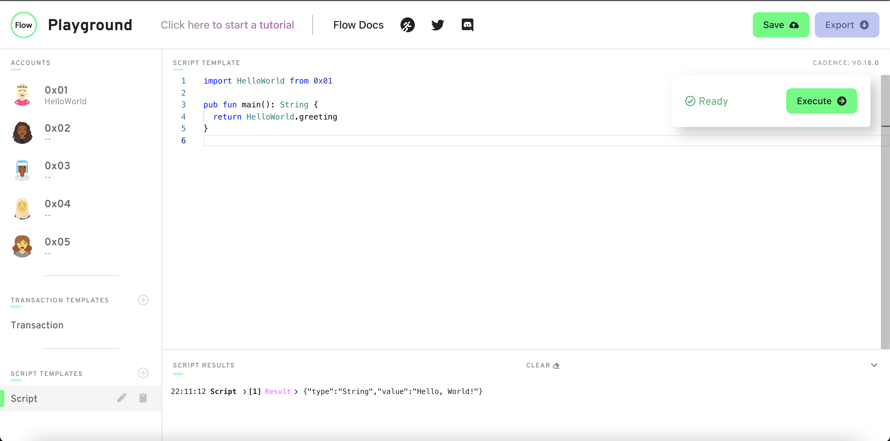

# Chapter 2 - Day 1 - Our First Smart Contract

Hello beautiful people! Welcome to the glorious Chapter 2, in which we will start diving into actual Cadence code. 

Today, we will be learning the very basics of Cadence code by implementing our first Smart Contract. That is, how to declare a variable, how to write a function, etc.

## Video

If you'd like some videos to watch, you can watch these two videos (they are very similar):

1. https://www.youtube.com/watch?v=QbqNM4k76B0 (overview of smart contracts, accounts, and deploying our first contract)
2. https://www.youtube.com/watch?v=DSwNNOEdBXU (explanation behind some basic syntax + deploying a contract) **NOTE**: watch this video from 00:00 - 07:23. Anything beyond 07:23 is not covered in this lesson.

## Our First Smart Contract

*Before going on, make sure you've read Chapter 1, Day 1. That day covers everything you need to know about Smart Contracts up to this point.*

In order to start making our first Smart Contract, we need to figure out a place to actually put it! To do that, launch a browser of your choice (I would recommend Google Chrome), go to the Flow playground by pasting in this URL: https://play.onflow.org. After you do that, do the following
1) On the left hand side, click the '0x01' tab.
2) Delete everything in that page.

It should look like this:


What we have done is clicked on the `Account` with address `0x01` and deleted the contract in its account. This brings up an important topic.

### What's an address?

An address is something that looks like `0x` and then a bunch of random numbers and letters. Here's an example address on Flow: `0xe5a8b7f23e8b548f`. On the Flow playground, you'll see much shorter addresses like `0x01`. That's just to make things simpler.

But what actually IS an address? Well, you can think of them as a user. When I want to do something on the blockchain, I need to have an account. Every account has an address associated with it. So when you see something like `0xe5a8b7f23e8b548f`, that's really just a person's account that they use to store data, send transactions, etc.

### Where do smart contracts live?

Smart Contracts are deployed accounts. As we mentioned above, accounts are owned by a user, and every account has an address associated with it that always begins with `0x`. In this case, since we are on the Flow playground, it has automatically given us 5 accounts, namely `0x01`, `0x02`, and so on. Thus, Smart Contracts live at an address. So when we deploy a contract named "Hello World" to account `0x01`, that is how we identify it. If we wanted to interact with it, we would have to know both the name of the contract and the address. We'll see this more in-depth when we import stuff later on.

### Back to our example...

In this case, we will be deploying our Smart Contract to account `0x01`. This means account `0x01` is the **owner** of this Smart Contract. In the real world, you would deploy your Smart Contract to **your** account, but because this is a fake-simulation world, we can choose any account we want, so we chose `0x01`.

Let's make our contract now. In the empty space, type the following:
```swift
pub contract HelloWorld {

    init() {

    }
}
```

The `pub contract [contract name]` part will ALWAYS be what you type when you create a new contract. You can fill in `contract name` with whatever you'd like to call your contract.

The `init()` function is a function that every single contract MUST have. It is called when the Contract is initially deployed, which in the real world, only ever happens 1 time. So, we can initialize some stuff in it when we want to.

Okay, boom! This is your first Smart Contract, although it doesn't do anything ;( Let's make it store a `greeting` variable so we can store some data in this contract.

Modify your contract code so it looks like this:
```swift
pub contract HelloWorld {

    pub let greeting: String

    init() {
        self.greeting = "Hello, World!"
    }
}
```

In Cadence, when you declare a variable, you follow this format:

`[access modifier] [var/let] [variable name]: [type]`

Using our example above...
- Our access modifier is `pub`, which means anyone can read this variable. In the future, we will see lots of other access modifiers, but lets stick with `pub` for the next few lessons just to make life easy.
- `let` means that this variable is a constant. If you've coded in other programming languages, a constant means that once we make this variable equal to something, we **cannot change it**. On the other hand, `var` means we can change it.
- Our variable name is `greeting`
- The type of our variable is a `String`. This means we can put stuff like "Hello", "Jacob is the best", "I love Jacob", stuff like that.

Next, we put `self.greeting = "Hello, World!"` inside the `init()` function. Remember, the `init()` function is called when the contract is deployed, which only happens once. `self` is a keyword that means "the variable that is one layer above." In this case, `self.greeting` is referring to the `greeting` variable we declared right above it, and we set it equal to "Hello, World!"

To deploy this contract, click the green "Deploy" button. Your page should look like this:


NOTE: If you're getting errors, try first refreshing the page. If you still see errors like: "GraphQL error", try switching your browser to Google Chrome.

Awesome!!! You've deployed your first Smart Contract.

## Reading our Greeting

Let's make sure that our `greeting` variable actually got set to "Hello, World!". Remember, we can view data from the Blockchain using a script.

On the left hand side, under "Script Templates", click on the tab that says "Script" and delete everything inside of it. Next, write the following code:

```swift
import HelloWorld from 0x01

pub fun main(): String {
    return HelloWorld.greeting
}
```

This Script will return the value of greeting, which is "Hello, World!" In order to do that, let's see what we did:
1. First, we imported our Smart Contract by doing `import HelloWorld from 0x01`. In Cadence, you import a contract by doing `import [contract name] from [address of that contract]`. Because we deployed HelloWorld to `0x01`, we wrote the above.
2. Next, we wrote a function. In Cadence, you write a function by doing `[access modifier] fun [function name](): [return type] { ... }`. In this case, we used `pub` for our access modifier (more on that later), named our function `main`, and said we will be returning a `String` type, which remember, is the type of `greeting`.
3. We then accessed the `greeting` variable from the contract using `HelloWorld.greeting`.

If you click "Execute" on the right side, you will see in the terminal it prints, "Hello, World!" like below:



If yours looks like that, you have executed your first script!

## Concept Check

Okay, so we just wrote some code. That was fast. But how does all of this relate back to what I was saying in Chapter 1, Day 1?

Remember I said Smart Contracts are both programs and rulebooks. They allow us to do certain things, nothing more and nothing less. In this example, our Smart Contract let us initialize `greeting` and read `greeting`. Notice that it does NOT let us change `greeting` to be something else. If we had wanted to add that functionality, we would've had to do it ahead of time, before we deployed it. This is why it's so crucial that as a developer of a Smart Contract, you implement all the functionality you want a user to have before you deploy the contract. Because after you deploy, there's nothing you can do. (Of course, on the Flow playground, we can deploy the contract again. But in the real world you cannot do this.)

## Conclusion

Today, we learned how to deploy our first contract, declare a variable, write a function, and execute a script. Wow! That's a lot. But it wasn't too bad, right?

# Quests

For todays quest, please load up a new Flow playground by going to https://play.onflow.org just like we did in this lesson. You will use that for writing your code.

1. Deploy a contract to account `0x03` called "JacobTucker". Inside that contract, declare a **constant** variable named `is`, and make it have type `String`. Initialize it to "the best" when your contract gets deployed.

2. Check that your variable `is` actually equals "the best" by executing a script to read that variable. Include a screenshot of the output.

It's so awesome that I get to make these quests. I love this. 

Anyways, please remember to store your answers in some way so I can review them if you submit them to me. Good luck!