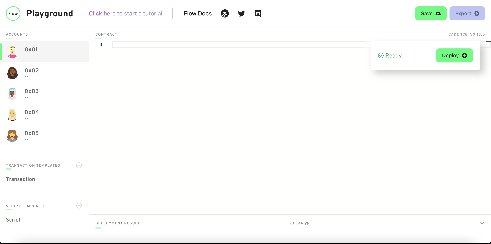
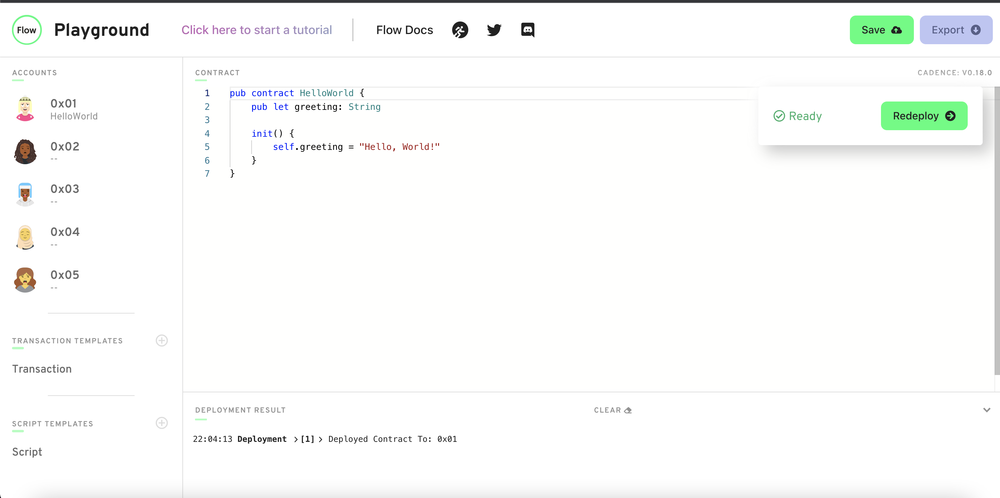
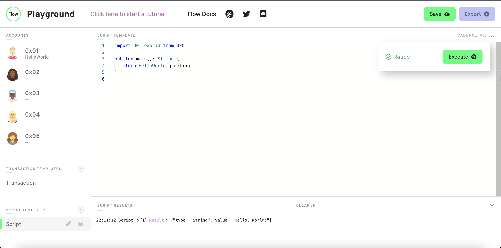

# 第二章·第一日·我们的第一个智能合约

小伙伴们，大家好！欢迎来到精彩的第二章，我们将从此开始深入学习实际的 Cadence 代码。

今天，我们要实现我们的第一个智能合约，以此来学习 Cadence 的基础知识——包括声明变量，编写函数等等。

## 视频

如果你想要一些视频学习材料，可以看看这两个视频（它们非常相似）：

[https://www.youtube.com/watch?v=QbqNM4k76B0](https://www.youtube.com/watch?v=QbqNM4k76B0)（智能合约的概述、账户，以及部署我们的第一个合约）

[https://www.youtube.com/watch?v=DSwNNOEdBXU](https://www.youtube.com/watch?v=DSwNNOEdBXU)（一些基本语法背后的解释+部署合约） 注意：看这个视频 00:00 - 07:23 的内容就好，07:23 之后的内容在本课中没有涉及。

## 我们的第一个智能合约

在继续之前，请确保你已经阅读了第一章第一日的内容，它涵盖了到目前为止你所需要知道的关于智能合约的一切。

为了开始编写我们的第一个智能合约，我们需要找个地方开始我们的工作。首先你需要选择一个浏览器并启动它（我推荐 Google Chrome），然后通过粘贴这个 URL 进入 Flow 的 Playground：[https://play.onflow.org](https://play.onflow.org/)。做完这些后，继续以下工作：

1. 在页面的左边，点击“0x01”标签。
2. 删除该页面中的所有内容。

页面现在看起来应该像这样：


我们所做的是点击地址为 `0x01` 的`账户`，删除其中的合约。这引出了一个重要的话题。

### 什么是地址？

地址看起来像是 `0x` 后面跟着一堆随机的数字和字母。下面是 Flow 上的一个地址样例：`0xe5a8b7f23e8b548f`。在 Flow Playground 中，你会看到像 0x01 这样更短的地址，但这只是为了简化起见。

但究竟什么**是**地址？嗯，你可以把它们看成是一个用户。当我想在区块链上做什么时，我需要有一个账户。每个账户都有一个与之相关的地址。因此，当你看到像 `0xe5a8b7f23e8b548f` 这样的东西，这实际上只是一个人的账户，他们用来存储数据，发送交易等等。

### 智能合约存在于何处？

智能合约部署在账户中。正如我们上面提到的，账户由用户拥有，每个账户都有一个与之相关联的地址，这个地址总是以 `0x` 开头。在 Flow Playground 中，它自动给了我们 5 个账户，即 `0x01`、`0x02` 等等，而智能合约存在于一个地址上。因此，当我们将一个名为“Hello World”的合约部署到 `0x01` 账户时，我们通过 Hello World 和 0x01 来识别它。如果我们想与它交互，我们就必须知道合约的名称和地址。当我们以后进行导入操作时，我们会更深入地看到这一点。

### 回到我们的例子…

在这个例子中，我们将把我们的智能合约部署到账户 `0x01`。这意味着账户 `0x01` 是这个智能合约的**所有者**。在现实世界中，你会将智能合约部署到**你的**账户，但由于这是一个模拟世界，我们可以选择任何我们想要的账户，所以我们选择了 `0x01`。

现在让我们来编写我们的合约。在空白处，输入以下内容：
```cadence
pub contract HelloWorld {

    init() {

    }
}
```

在你新建一个合约时，`pub contract [合约名称]` 总是你最开始输入的部分。你可以把你想要的任何合约名填入`合约名称`部分。

`init()` 函数是每个合约都必须有的一个函数。它在合约最初部署时被调用，在现实世界中，这只会发生一次。所以，如果我们想的话，我们可以在这个函数里面初始化一些东西。

好了，开始吧！这是你的第一个智能合约，尽管它没有做任何事情;( 让我们在它里面存储一个名为 `greeting` 的变量，这样我们就可以在这个合约中存储一些数据了。

修改你的合约代码，使它看起来像这样：
```cadence
pub contract HelloWorld {

    pub let greeting: String

    init() {
        self.greeting = "Hello, World!"
    }
}
```

在Cadence中，当你声明一个变量时，需要遵循这样的格式：

`[访问修饰器] [var/let] [变量名]: [变量类型]`

用我们上面的例子来说明：

- 我们的`访问修饰器`是 `pub`，这意味着任何人都可以读取这个变量。以后我们会看到很多其他的`访问修饰器`，但在接下来的几节课中，简单起见我们只使用 `pub`。
- `let` 意味着这个变量是一个常量。如果你用其他编程语言编写过代码，常量意味着一旦我们使这个变量等于某个东西，我们就**不能改变它**。另一方面，`var` 意味着我们可以改变它。
- 我们的变量名是 `greeting`。
- 我们的变量类型是 `String`。这意味着我们可以把“你好”、“Jacob is the best”、"I love Jacob "之类的字符串放到里面去。

接下来，我们把 `self.greeting = "Hello, World!"` 放在 `init()` 函数中。记住，`init()` 函数在合约部署时被调用，这只发生一次。`self` 是一个关键词，意思是“上一层的变量”。在本例中，`self.greeting` 指的是我们在上面声明的 `greeting` 变量，我们将其设置为“Hello, World！”

点击绿色的“Deploy”按钮以部署合约，你的页面应该看起来像这样：



注意：如果你遇到错误，先尝试刷新页面。如果你仍然看到像是“GraphQL error”这样的错误，尝试将你的浏览器切换到谷歌浏览器。

太棒了！！！你已经部署了你的第一个智能合约。

## 读取我们的“问候”

让我们确保我们的 `greeting` 变量确实被设置为 “Hello, World!”。记住，我们可以用脚本来查看区块链的数据。

在页面左侧的“Script Templates”下，点击“Script”标签，删除里面的所有内容。接下来，在里面写入以下代码：
```cadence
import HelloWorld from 0x01

pub fun main(): String {
    return HelloWorld.greeting
}
```
这个脚本将返回 greeting 的值，即 “Hello, World！”。让我们看看我们做了什么。
1. 首先，我们通过从 0x01 导入 HelloWorld 来导入我们的智能合约。在Cadence 中，你通过从 [合约地址] 导入 [合约名称] 来导入一个合约。因为我们把 HelloWorld 部署到了 0x01，所以我们写下 `import HelloWorld from 0x01` 来导入合约。
2. 接下来，我们写了一个函数。在 Cadence 中，编写一个函数的方法是：`[访问修饰器] fun [函数名]: [返回值类型] { ... }` 。在这个例子中，我们使用 `pub` 作为访问修饰器（后面会有更多的介绍），用 `main` 作为函数名，并声明我们的返回值为 String 类型，记住，这是 `greeting` 的类型。
3. 然后我们用 `HelloWorld.greeting` 从合约中访问 `greeting` 变量。

如果你点击右边的 “Execute”，你会在终端看到它打印出：“Hello, World!”，就像下面这样：



如果你的页面看起来像这样，你已经执行了你的第一个脚本！

## 概念检查

好了，我们写了一些代码。进展神速。但这一切又是如何与我在第一章第一天所说的内容联系起来的呢？

记得我说过，智能合约既是程序也是规则手册。它们允许我们做某些特定的事情，不多也不少。在这个例子中，我们的智能合约让我们初始化`greeting` 和读取 `greeting`。请注意，它并没有允许我们把 `greeting` 改成别的东西。如果我们想添加这个功能，我们就必须在合约部署之前完成。这就是为什么作为智能合约的开发者，在部署合约之前实现你希望用户拥有的所有功能是如此关键。因为在你部署合约之后，你就无能为力了。（当然，在 Flow 的 Playground 中，我们可以再次部署合约。但在现实世界中，你不能这样做）。

## 结论

今天，我们学会了如何部署我们的第一个合约，声明一个变量，编写一个函数，以及执行一个脚本。哇！这可真够多的。但感觉还行，对吗？

# 任务

对于今天的任务，请访问 [https://play.onflow.org，](https://play.onflow.org，加载一个新的)加载一个新的 Flow Playground，就像我们在本课中做的那样。你将用它来编写你的代码。

1. 在 `0x03` 账户上部署一个名为 ”JacobTucker“ 的合约。在该合约中，声明一个名为 `is` 的常量变量，并使其类型为 `String`。当你的合约被部署时，将其初始化为“the best”。

2. 检查你的变量 `is` 是否真的等于“the best”，方法是执行一个脚本来读取该变量。提交的答案中需要包括一张输出的截图。

能做这些任务真是太棒了，我喜欢这样。

总之，请记得以某种方式存储你的答案，如此一来，如果你把答案提交给我，我就可以检查它们。祝你们好运！