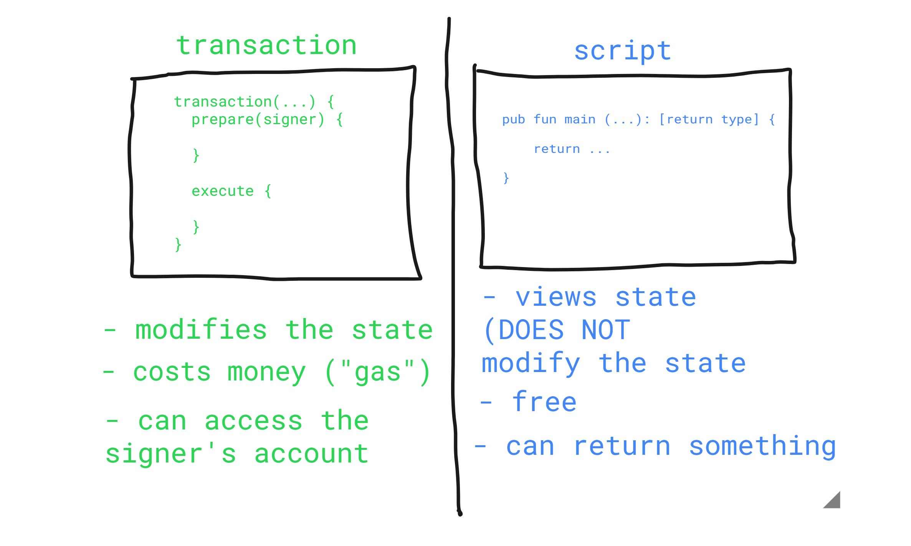

# Chapter 2 Day 2 - Transactions and Scripts

Hey there you crazy Cadence people! We are BACK for another day of content, and in this day, we will be going more in-depth on transactions and scripts. If you haven't already, make sure you read the [introductory part to transactions and scripts in Chapter 1 Day 1](https://github.com/jacob-tucker/Flow-Zero-to-Jacob/tree/main/chapter1/day1#transactions--scripts).

## Video

If you'd like to consume this (incredible) content in a video format, you can check out this video: https://www.youtube.com/watch?v=T2QTTFnQa5k

## Transactions & Scripts

Transactions and scripts are both essential to any blockchain application. Without them, we wouldn't be able to interact with the blockchain at all. On Flow, they are even more special because *they are both separate from the contract.* If you have coded on Ethereum before, you know that transactions are just functions you call inside the contract itself (if you don't know that, that's okay!). However, on Flow, transactions and scripts act as a sort of "middleman" between the person interacting with the blockchain and the smart contracts. It looks something like this:


## Transactions vs. Scripts

Now, what is the difference between transactions and scripts? Well, the biggest difference is that transactions **modify the data** on the blockchain, and scripts **view the data** on the blockchain. Here is a helpful diagram to understand the differences:



As you can see, scripts also do not cost any money (phew!). Transactions on the other hand cost "gas," which is a form of payment needed to change the data on the blockchain.

## Scripts

During the last day, we actually implemented our first script on the Flow playground. Let's revisit that example:

Load up the flow playground (https://play.onflow.org), copy this contract into the `0x01` account, and click "Deploy":
```swift
pub contract HelloWorld {

    pub let greeting: String

    init() {
        self.greeting = "Hello, World!"
    }
}
```

Then, go to the Script tab on the left hand side and bring back our script from yesterday:
```swift
import HelloWorld from 0x01

pub fun main(): String {
    return HelloWorld.greeting
}
```

If you click "Execute," you should see "Hello, World!" in the console. Great! What you just did is run a script. Notice there was no payment needed and we **viewed** the data in our smart contract.

## Transactions

Now, let's do an example of a transaction. On the left hand side, under "Transaction Templates," click on the "Transaction" tab. Go ahead and delete everything in that tab so it looks like this:


Okay, cool. Now, we want to modify the data on the blockchain. In order to do that, let's set up our transaction. We can do that by putting this code into the page:

```swift
transaction() {
    prepare(signer: AuthAccount) {}

    execute {}
}
```

Boom! This is an empty transaction that doesn't do anything. In order to explain what `prepare` and `execute`, we need to take a quick break and talk about accounts on Flow.

### Accounts on Flow

On Flow, accounts can store their own data. What does this mean? Well, if I own an NFT (NonFungibleToken) on Flow, that NFT gets stored in my account. This is *very different* than other blockchains like Ethereum. On Ethereum, your NFT gets stored in the smart contract. On Flow, we actually allow accounts to store their own data themselves, which is super cool. But how do we access the data in their account? We can do that with the `AuthAccount` type. Every time a user (like you and me) sends a transaction, you have to pay for the transaction, and then you "sign" it. All that means is you clicked a button saying "hey, I want to approve this transaction." When you sign it, the transaction takes in your `AuthAccount` and can access the data in your account. 

You can see this being done in the `prepare` portion of the transaction, and that's the whole point of the `prepare` phase: to access the information/data in your account. On the other hand, the `execute` phase can't do that. But it can call functions and do stuff to change the data on the blockchain. NOTE: In reality, you never *actually* need the `execute` phase. You could technically do everything in the `prepare` phase, but the code is less clear that way. It's better to separate the logic.

### Back to our Example

Alright, so we want to change our `greeting` field to be something other than "Hello, World!" But there's a problem. We never added a way to modify our data in the smart contract! So we have to add a function in the contract to do that.

Go back to account `0x01` and add this function inside the contract:

```swift
pub fun changeGreeting(newGreeting: String) {
    self.greeting = newGreeting
}
```

What does this mean? Remember from previous days what we said about functions. You set them up like so:
`[access modifier] fun [function name](parameter1: Type, parameter2: Type, ...): [return type] {}`

In order to keep things simple, we are using `pub` as our access modifier. `pub` means we can call this function from anywhere (in our contract or in a transaction). We also take in a `newGreeting` parameter that is a string, and we set our greeting equal to our new greeting.

But wait! There's an error in the contract. It says "cannot assign to constant member: `greeting`." Why is it saying that? Remember, we made our greeting be `let`. `let` means it's a constant, so if we want to change our `greeting`, we must change it to `var`. Make sure to hit "Deploy" again. Your code should now look like this:

```swift
pub contract HelloWorld {

    pub var greeting: String

    pub fun changeGreeting(newGreeting: String) {
        self.greeting = newGreeting
    }

    init() {
        self.greeting = "Hello, World!"
    }
}
```

Now that we've set up our contract, let's go back to our transaction. First, let's make sure to `import` our HelloWorld contract, like so: `import HelloWorld from 0x01`. Then, we must decide: where do we want to call `changeGreeting`? In the `prepare` phase, or the `execute` phase? The answer is the `execute` phase because we are not accessing any data in the account. We are just changing some data in the smart contract. 

We can do that by adding this line in the `execute` phase: `HelloWorld.changeGreeting(newGreeting: myNewGreeting)`. When you call a function in Cadence, you pass in parameters by doing `(argumentLabel: value`), where `argumentLabel` is the name of the argument and `value` is the actual value. You will notice we get an error that `myNewGreeting` isn't defined, which makes sense, because we aren't getting it from anywhere. So let's add a parameter called `myNewGreeting` to our transaction so we can pass in a value for a new greeting. We can do that like so:

```swift
import HelloWorld from 0x01

transaction(myNewGreeting: String) {

  prepare(signer: AuthAccount) {}

  execute {
    HelloWorld.changeGreeting(newGreeting: myNewGreeting)
  }
}
```

Now, on the right side, you'll see a prompt pop up. We can type in our new greeting into the little box! Because the Flow playground is a little glitchy, you have to surround your new greeting with quotes, like this: "Goodbye, World!". So let's type that in like so:


Notice also that we can "sign" this transaction from any account. Since it doesn't really matter (we aren't accessing data in an account), feel free to choose any account you wish.

After you click "Send", go back to your Script and click "Execute". You should now see "Goodbye, World!" printed in the console. Boom, you just successfully implemented your first transaction.

That wraps things up for today.

## Quests

Please answer in the language of your choice.

1. Explain why we wouldn't call `changeGreeting` in a script.

2. What does the `AuthAccount` mean in the `prepare` phase of the transaction?

3. What is the difference between the `prepare` phase and the `execute` phase in the transaction?

4. This is the hardest quest so far, so if it takes you some time, do not worry! I can help you in the Discord if you have questions.

- Add two new things inside your contract:
    - A variable named `myNumber` that has type `Int` (set it to 0 when the contract is deployed)
    - A function named `updateMyNumber` that takes in a new number named `newNumber` as a parameter that has type `Int` and updates `myNumber` to be `newNumber`

- Add a script that reads `myNumber` from the contract

- Add a transaction that takes in a parameter named `myNewNumber` and passes it into the `updateMyNumber` function. Verify that your number changed by running the script again.