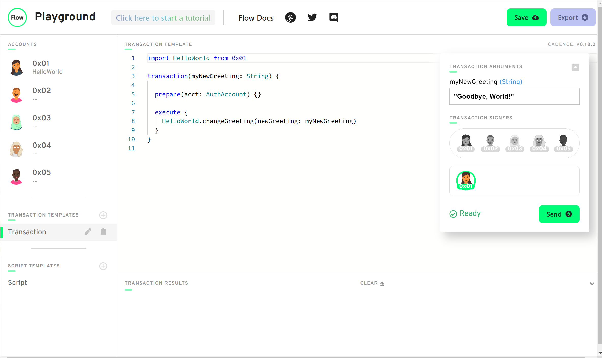

# Capítulo 2 Día 2 - Transacciones y Guiones

¡Hola a las personas locas de Cadence! Estamos de vuelta para otro día de contenido, y en este día, vamos a profundizar más en transacciones y guiones. Si aún no lo ha hecho, asegúrese de leer [la parte de introducción a transacciones y guiones en Capítulo 1 Día 1.](https://github.com/emerald-dao/beginner-cadence-course/tree/main/chapter1.0/day1#transactions--scripts)

## Video

Si quieres ver un video de este contenido, puedes hacerlo aqui: https://www.youtube.com/watch?v=T2QTTFnQa5k

## Transacciones & Guiones

Transacciones y guiones son esenciales en cualquier aplicación de blockchain. Sin ellos, no podemos interactuar con el blockchain. En Flow, ellos son más especiales porque ambos están separados desde el contrato. Si has codificado antes en Ethereum, sabes transacciones son como funciones que te llamas dentro del contrato (si no sabes eso, ¡está bien!). Sin embargo, en Flow, transacciones y guiones son como un intermedio entre la persona interactuando con el blockchain y los smart contracts. Se parece a algo como así:


## Transacciones v. Guiones

Ahora, ¿cuál es la diferencia entre transacciones y guiones? Pues, la diferencia más grande es que transacciones puede **cambiar el data** en el blockchain, y los guiones solo **ver el data** en el blockchain. Aquí es un diagrama útil para entender las diferencias: 


Como puedes ver, los guiones también no cuestan ningún dinero. A la otra mano, transacciones cuestan “gas”, cúal es una forma de pago necesario para cambiar datos en el blockchain.

## Guiones

Durante el último día, realmente implementamos nuestro primer guión en el Flow Playground. Vamos a regresar a eso ejemplo:

Abrir una nueva flow playground (https://play.onflow.org), copiar este contrato en la cuenta de 0x01, y haz clic el botón de “Deploy”:
```cadence
pub contract HelloWorld {

    pub let greeting: String

    init() {
        self.greeting = "Hello, World!"
    }
}
```
Entonces, ir a la pestaña de Script al lado izquierdo y traer de vuelta nuestro guión de ayer.
```cadence
import HelloWorld from 0x01

pub fun main(): String {
    return HelloWorld.greeting
}
```

Sí haz clic “Execute”, debe ver “Hello, World!” en la consola. ¡Genial! Lo que acabas de hacer fue ejecutar un guión. Tenga en cuenta que no había un pago necesario y **vimos** el data en nuestro smart contract. 

## Transacciones

Ahora, vamos a hacer un ejemplo de una transacción. A el lado izquierdo, debajo “Transaction Templates,” haz click en la pestaña de “Transaction”. Sigue adelante y borrar todo es eso pestana así que se parece así:


Ok, genial. Ahora, queremos modificar la data en el blockchain. Con el fin de hacer eso, vamos a configurar nuestra transacción. Podemos hacer eso poniendo este código en la página. 

```cadence
transaction() {
    prepare(signer: AuthAccount) {}

    execute {}
}
```

¡Boom! Este es una transacción vacía que no hace nada. Para explicar que preparar y ejecutar, necesitamos tomar un break y hablar sobre cuentas en Flow. 

### Cuentas en Flow

En Flow, cuentas puede almacenar tus propios datos. ¿Qué significa? Pues, si tengo un NFT (NonFungibleToken) en Flow, esa NFT es almacenada en mi cuenta. Este es *muy diferente* que otros blockchain como Ethereum. En Ethereum, tu NFT es almacenada en un smart contract. En Flow, permitimos las cuentas a almacenar el data a sí mismo, que es super genial. Pero, cómo accedemos el data en su cuenta? Podemos hacer eso con el tipo de `AuthAccount`. Cada vez que un usuario (como tú y yo) envía una transacción, tienes que pagar para la transacción, y entonces te “firmas” el. Todo esto significa que haz clic un botón diciendo “Quiero aprobar esta transacción.” Cuando lo firmas, la transacción toma tu `AuthAccount` y puede acceder a los datos en tu cuenta. 

Puede ver que esto se está haciendo en la porción de `prepare` de la transacción, y ese el punto de la fase de `preparación`: para acceder la información/datos en tu cuenta. A la otra mano, la fase de `ejecutar` no puede hacer eso. Pero puede llamar funciones y hacer cosas para cambiar el data en el blockchain. NOTA: En realidad, tú nunca *realmente* necesitas la fase de `ejecutar`. Técnicamente puedes hacer todo en la fase de `preparación`, pero el código es menos claro de esa manera. Es mejor separar lo lógico.

### Vuelta a nuestro Ejemplo

Bueno, así que queremos cambiar nuestro campo de `greeting` para ser algo diferente que “Hello, World!” Pero hay un problema. Nunca agregamos una manera para cambiar los datos en nuestro smart contract! Entonces tenemos que añadir una función en el contrato para hacer eso.

Volver a la cuenta `0x01` y añadir este funcione adentro el contrato:

```cadence
pub fun changeGreeting(newGreeting: String) {
    self.greeting = newGreeting
}
```

¿Qué significa? Recuerda de los días previos lo que dijimos sobre funciones. Los configuras así: `[access modifier] fun [nombre de función](parametro 1: Tipo, parametro2: Tipo, …): [tipo devuelta] {}`

Para mantener las cosas simples, estamos usando `pub` como nuestro modificador de acceso. `pub` significa que podemos llamar esta función desde cualquier lugar. También nos toma en un parámetro de `newGreeting` que es un string, y ponemos nuestro `greeting` igual a nuestro nuevo saludo. 

¡Pero espera! Hay un error en el contrato. Se dice “no se puede asignar a miembro de constante: greeting.” ¿Por qué está diciendo eso? Recuerda, ponemos `greeting` a`let`. `let` significa que es una constante, así que si queremos cambiar nuestro `greeting`, necesitamos cambiarlo a `var`. Asegurarse que haga clic en el botón de “Deploy” de nuevo. Tu código ahora debe ver como así:

```cadence
pub contract HelloWorld {

    pub var greeting: String

    pub fun changeGreeting(newGreeting: String) {
        self.greeting = newGreeting
    }

    init() {
        self.greeting = "Hello, World!"
    }
}
```

Ahora que hemos configurado nuestro contrato, volvamos a nuestra transacción. Primero, asegurémonos de importar nuestro contrato de HelloWorld, como así: `import HelloWorld from 0x01`. Entonces, necesitamos decidir: ¿dónde queremos llamar `changeGreeting`? En la fase de `preparación`, o la fase de `ejecutar`? La respuesta es la fase de `ejecutar` porque no estamos accediendo ninguna datos en la cuenta. Solo estamos cambiando algunos datos en el smart contract.

Podemos hacerlo añadiendo esta línea en la fase de `ejecutar`: `HelloWorld.changeGreeting(newGreeting: myNewGreeting)`. Cuando te llamas una función en Cadence, se pasan los parámetros haciendo `(argumentLabel: valor)`, donde `argumentLabel` es el nombre del argumento y `valor` es el valor actual. Te vas a notar que nos recibir un error que `myNewGreeting` no es definido, que tiene sentido, porque no lo estamos recibiendo de algún lugar. Así que añadimos un parámetro llamado `myNewGreeting` a nuestra transacción, entonces podemos pasar a un valor para un nuevo saludo. Podemos hacer eso cómo así: 

```cadence
import HelloWorld from 0x01

transaction(myNewGreeting: String) {

  prepare(signer: AuthAccount) {}

  execute {
    HelloWorld.changeGreeting(newGreeting: myNewGreeting)
  }
}
```

Ahora, en el lado derecho, verá un mensaje emergente. ¡Podemos escribir nuestro nuevo saludo en la pequeña caja! Escribimos “¡Adiós, Mundo!”:



Ves que también podemos “firmar” esta transacción de cualquier cuenta. Ya que realmente no importa (no estamos accediendo los datos en una cuenta), te sientes libre de elegir cualquier cuenta que deseas. 

Después que te haga clic el botón de “Send”, vuelve a tu guión y haz clic el botón de “Execute”. Ahora debes ver “Goodbye, World!” en la consola. Boom, acaba de implementar con éxito su primera transacción.

¡Eso es todo para hoy! 

## Busquedas

Por favor responder en el idioma de tu preferencia.

1. Explicar por qué no llamaríamos `changeGreeting` en un guión?

2. ¿Qué significa `AuthAccount` en la fase de `preparación` de las transacciones? 

3. ¿Cuál es la diferencia entre la fase de `preparación` y la fase de `ejecutar` en la transacción? 

4. Esta es la búsqueda más difícil hasta ahora, entonces si toma mucho tiempo, ¡no te preocupes! Puedo ayudarte en Discord si tienes preguntas. 
- Añadir dos cosas nuevas en tu Smart Contract: 
  - Un variable llamado `myNumbe` que tiene el tipo de `Int` (establecer a 0 cuando el contrato es desplegado)
  - Una función llamado `updateMyNumber` que toman una nueva numero llamado `newNumber` como el parámetro que tiene el tipo de `Int` y actualizas `myNumber` a `newNumber`.

- Añadir un nuevo guión que lees `myNumber` desde el contrato

- Añadir una transacción que toma un parámetro llamado `myNewNumber` y lo pasa a la función de `updateMyNumber`. Verificar que tu número cambiado ejecutando el guión de nuevo. 
