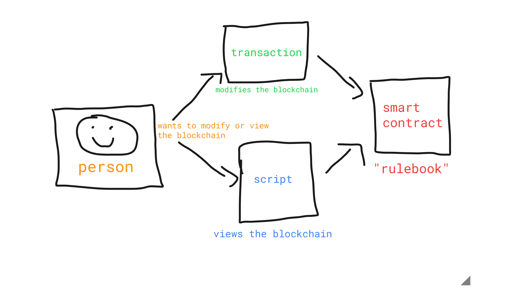
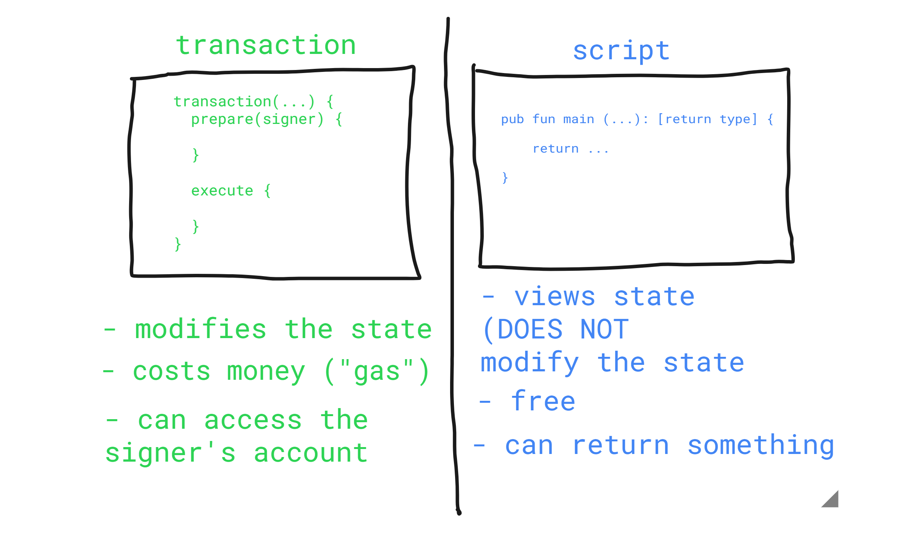
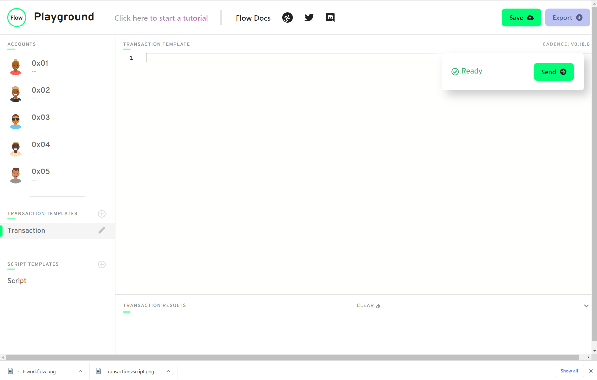
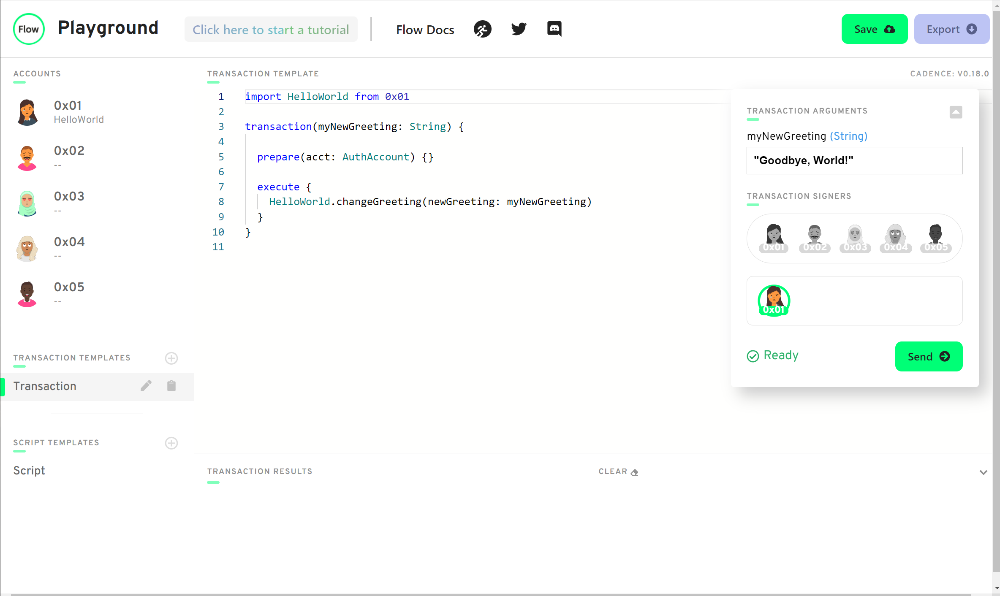

# 第二章·第二日·交易和脚本

嘿，疯狂的 Cadence 小伙伴们！我们又迎来了新的一天的内容，今天我们将更深入地讨论交易和脚本。请确保你阅读了第一章第一日中关于交易和脚本的介绍。

## 视频

如果你想通过视频来学习这精彩的内容，可以观看这个视频：https://www.youtube.com/watch?v=T2QTTFnQa5k

## 交易和脚本

交易和脚本对于任何区块链应用都是必不可少的。没有它们，我们就根本无法与区块链互动。在 Flow 上，它们更加特别，因为*它们都独立于合约。*如果你以前在以太坊上编程，你会知道交易只是你调用的合约内的函数（如果你不知道，那也没关系！）。然而，在 Flow 上，交易和脚本在与区块链交互的人和智能合约之间充当某种 “中间人”。它看起来像这样：



## 交易 vs 脚本

现在，交易和脚本之间有什么区别？嗯，最大的区别是，交易**修改区块链上的数据**，而脚本**查看区块链上的数据**。这里有一个有用的图表来帮助你理解这些区别：



正如你所看到的，脚本不需要花费任何金钱（呼！）。另一方面，交易需要花费 “gas”，这是改变区块链上的数据所需的一种支付方式。

## 脚本

在过去的一天里，我们实际上在 Flow Playground 上实现了我们的第一个脚本。让我们重温一下这个例子。

加载 Flow Playground（https://play.onflow.org），把这个合约复制到`0x01` 账户中，然后点击“Deploy”。
```cadence
pub contract HelloWorld {

    pub let greeting: String

    init() {
        self.greeting = "Hello, World!"
    }
}
```

然后，点击左侧的“Script”标签，把我们昨天的脚本贴进去：
```cadence
import HelloWorld from 0x01

pub fun main(): String {
    return HelloWorld.greeting
}
```

如果你点击“Execute”，你应该在控制台看到“Hello, World!”。太好了! 你刚才所做的是运行一个脚本。注意，不需要付费就能**查看**我们的智能合约中的数据。

## 交易

现在，我们来做一个交易的例子。在左侧的“Transaction Templates”下，点击“Transaction”标签。让我们删除该标签中的所有内容，使其看起来像这样：



好的，很酷。现在我们想修改区块链上的数据。为了做到这一点，让我们设置我们的交易。把这段代码放到页面中：

```cadence
transaction() {
    prepare(signer: AuthAccount) {}

    execute {}
}
```

Boom！这是一个空的交易，不做任何事情。为了解释什么是 `prepare` 和 `execute`，我们需要快速休息一下，谈谈Flow上的账户。


### Flow 的账户

在 Flow 上，账户可以存储自己的数据。这意味着什么？如果我在 Flow 上拥有一个 NFT（NonFungibleToken），该 NFT 会被存储在我的账户中。这与以太坊等其他区块链有很大不同。在以太坊上，你的 NFT 被存储在智能合约中。在 Flow 上，我们实际上允许账户自己存储自己的数据，这是超级酷的。但我们如何访问他们账户中的数据呢？我们可以通过 `AuthAccount` 类型来做到这一点。每次用户（像是你我）发送交易时，你必须为交易付款，然后你“签署”它。所有这些意味着你点击了一个按钮，说“嘿，我想批准这个交易”。当你签署它时，该交易就接收了你的 `AuthAccount`，并可以访问你账户中的数据。

你可以看到这是在交易的 `prepare` 部分进行的，这就是 `prepare` 阶段的全部意义：访问你账户中的信息/数据。另一方面，`execute` 阶段不能这样做。但它可以调用函数，做一些事情来改变区块链上的数据。注意：在现实中，你实际上从来不需要 `execute` 阶段。从技术上讲，你可以在 `prepare` 阶段做所有事情，但这样的代码就不那么清晰了。最好是把逻辑分开。

### 回到我们的例子

好吧，我们想把我们的 `greeting` 字段改成 “Hello, World” 以外的内容。但是有一个问题。我们从来没有在智能合约中添加过修改数据的方法！所以我们必须在合约中添加一个函数来做这件事。

回到账户`0x01`，在合约中添加这个函数：

```cadence
pub fun changeGreeting(newGreeting: String) {
    self.greeting = newGreeting
}
```

这是什么意思？回想前几天我们说过的关于函数的内容，你这样设置它们：
`[访问修改器] fun [函数名](参数1: 参数1类型, 参数2: 参数2类型, ...)。[返回类型] {}`。

为了简单起见，我们使用 `pub` 作为我们的访问修饰符。`pub` 意味着我们可以从任何地方（在我们的合约或交易中）调用这个函数。我们还接收了一个 `newGreeting` 参数，它是一个字符串，我们将我们的 `greeting` 设置为我们的 `newGreeting`。

但是，等等! 合约中出现了一个错误。它说 “不能赋值给常量：`greeting`”。为什么这样说呢？记住，我们用 `let` 定义 `greeting`。`let` 意味着它是一个常量，所以如果我们想改变我们的 `greeting`，我们必须把它改用 `var` 定义。请再次点击 “Deploy”。你的代码现在应该是这样的：

```cadence
pub contract HelloWorld {

    pub var greeting: String

    pub fun changeGreeting(newGreeting: String) {
        self.greeting = newGreeting
    }

    init() {
        self.greeting = "Hello, World!"
    }
}
```

现在我们已经设置好了我们的合约，让我们回到交易中去。首先，让我们确保 `导入` 我们的 HelloWorld 合约，像这样：`import HelloWorld from 0x01`。然后，我们必须决定：我们要在哪里调用 `changeGreeting`？是在 `prepare` 阶段，还是在 `execute` 阶段？答案是 `execute` 阶段，因为我们没有访问账户中的任何数据。我们只是改变智能合约中的一些数据。

我们可以通过在 `execute` 阶段添加这一行来做到这一点。`HelloWorld.changeGreeting(newGreeting: myNewGreeting)`。当你在Cadence中调用一个函数时，你通过 `(参数名: 参数值`) 来传递参数，其中`参数名` 是参数的名称，`参数值` 是实际值。你会注意到我们得到了一个错误，即`myNewGreeting` 没有被定义，这很合理，因为我们没有从任何地方获取这个参数。所以让我们在交易中添加一个叫做 `myNewGreeting` 的参数，这样我们就可以为新的 `greeting` 传递一个值。我们可以这样做：

```cadence
import HelloWorld from 0x01

transaction(myNewGreeting: String) {

  prepare(signer: AuthAccount) {}

  execute {
    HelloWorld.changeGreeting(newGreeting: myNewGreeting)
  }
}
```

现在，在右侧你会看到一个提示框弹出。我们可以在里面输入新的 `greeting`! 让我们输入 “Goodbye, World!”。



还请注意，我们可以从任何账户 “签署” 这笔交易。因为这并不重要（我们并没有访问账户中的数据），所以请随意选择你希望的任何账户。

在你点击 “Send” 后，回到你的脚本并点击 “Execute”。现在你应该看到“Goodbye, World!”的字样出现在控制台。砰，你刚刚成功地实现了你的第一个交易。

今天的工作就这样结束了。

## 任务

自选语言回答下列问题。

1. 解释一下为什么我们不在脚本中调用 `changeGreeting`。

2. 在交易的 `prepare` 阶段，`AuthAccount` 是什么意思？

3. 交易的 `prepare` 阶段和 `execute` 阶段之间有什么区别？

4. 这是迄今为止最难的任务，所以如果你需要花费更长时间，请不要担心！如果你有问题，我可以在 Discord 中帮助你。

- 在你的合约里面添加两个新东西。
    - 一个名为 `myNumber` 的变量，其类型为 `Int`（在合约部署时将其设置为 0）。
    - 一个名为 `updateMyNumber` 的函数，接收一个名为 `newNumber` 的新数字作为参数，其类型为 `Int`，并将 `myNumber` 更新为 `newNumber`

- 添加一个脚本，从合约中读取 `myNumber`。

- 添加一个交易，接收一个名为 `myNewNumber` 的参数，并将其传递给`updateMyNumber` 函数。通过再次运行脚本来验证你的数字是否发生了变化。


