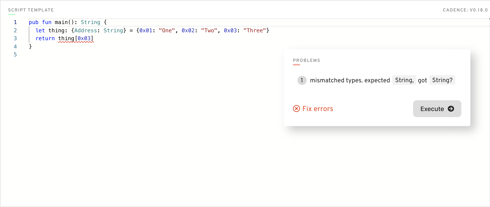

# Глава 2 День 3 - Массивы, словари и необязательные типы

Приветствуем новичков в Cadence. Сегодня мы изучим некоторые из наиболее важных типов, которые вы будете использовать почти в каждом контракте, который вы пишете.

## Видео

Все по порядку:
1. (Массивы и словари в Cadence) Смотрите это видео с 00:00-12:10. Не смотрите дальше 12:10, это будем разбирать завтра: https://www.youtube.com/watch?v=LAUN7hqlL0w

2. (Необязательный тип в Cadence) Посмотрите это видео: https://www.youtube.com/watch?v=I9Z1z9BsZ0I

## Типы

Чтобы начать играть с типами, давайте откроем игровую площадку Flow (https://play.onflow.org) и откроем скрипт. Сегодня мы не будем писать никаких смарт-контрактов :)

В Cadence по написанному вами коду сразу определяется какой это тип. Например, если вы напишете:
```cadence
var jacob = "isCool"
```
Cadence автоматически поймет, что вы инициализировали String. Однако если мы хотим более четко определить наши типы, мы можем включить тип в объявление, например, так:
```cadence
var jacob: String = "isCool"
```

Часто бывает полезно указать тип переменной, чтобы мы могли понять, где мы ошиблись при написании кода. Cadence также прямо скажет вам, что вы допустили ошибку, если вы хотели, чтобы переменная имела другой тип. Например, попробуйте напечатать:
```cadence
var jacob: String = 3
```
Cadence скажет: "Эй! Эти типы не подходят". Или что-то в этом роде. Но суть в том, что мы можем включить типы, чтобы помочь нам понять, где мы ошиблись.

## Массивы

Круто. Итак, что такое массив? Массив - это список элементов. Давайте рассмотрим очень простой массив в Cadence:
```cadence
var people: [String] = ["Jacob", "Alice", "Damian"]
```
Это список строк. Мы объявляем тип массива следующим образом: `[Type]`. Давайте рассмотрим другой пример. Если нам нужен список адресов, то все очень похоже:
```cadence
var addresses: [Address] = [0x1, 0x2, 0x3]
```

Мы также можем индексировать массивы, чтобы увидеть, какие в них есть элементы. Это точно так же, как в Javascript и подобных языках.

```cadence
var addresses: [Address] = [0x1, 0x2, 0x3]
log(addresses[0]) // 0x1
log(addresses[1]) // 0x2
log(addresses[2]) // 0x3
```

### Полезные функции массивов, которые я постоянно использую

Все, что мы рассмотрели выше - это фиксированные массивы. Мы также можем делать интересные вещи с массивами, и я перечислю некоторые из них здесь.

**append(_ element: Type)** 

(обратите внимание, что перед меткой аргумента `element` стоит символ `_`, что означает, что она неявная, поэтому вам не нужно помещать метку аргумента при вызове функции. Вместо `.append(element: value)`, вы можете просто сделать `.append(value)`)

Добавляет элемент в конец массива.

ex.
```cadence
var people: [String] = ["Jacob", "Alice", "Damian"]
people.append("Ochako Unaraka") // anyone watch My Hero Academia? :D
log(people) // ["Jacob", "Alice", "Damian", "Ochako Unaraka"]
```

**contains(_ element_: Type): Bool** 

Проверяет, содержится ли в массиве элемент.

ex.
```cadence
var people: [String] = ["Jacob", "Alice", "Damian"]
log(people.contains("Jacob")) // true
log(people.contains("Poop")) // false
```

**remove(at: Int)** 

Удаляет элемент по заданному индексу (индекс начинается с 0, то есть первый элемент имеет индекс 0)

ex.
```cadence
var people: [String] = ["Jacob", "Alice", "Damian"]
people.remove(at: 1)
log(people) // ["Jacob", "Damian"]
```

**length**

Возвращает длину массива.

ex.
```cadence
var people: [String] = ["Jacob", "Alice", "Damian"]
log(people.length) // 3
```

## Словари

Отлично! Вот вам и массивы. Пришло время словарей. Что же это за штука?! Словарь - это то, что сопоставляет `ключ` со `значением`. Давайте рассмотрим простой пример ниже.

```cadence
var names: {String: String} = {"Jacob": "Tucker", "Bob": "Vance", "Ochako": "Unaraka"} // anyone watch The Office?
```
В приведенном выше примере мы сопоставили `String` на `String`. Точнее, мы сопоставили чье-то имя с фамилией. Мы сделали это с помощью словаря типа `{Type: Type}`. Мы можем использовать этот словарь для получения фамилий людей следующим образом:
```cadence
var names: {String: String} = {"Jacob": "Tucker", "Bob": "Vance", "Ochako": "Unaraka"}
log(names["Jacob"]) // "Tucker"
log(names["Bob"]) // "Vance"
log(names["Ochako"]) // "Unaraka"
```
Давайте рассмотрим пример сопоставления `String` с `Int`. Мы сопоставим чье-то имя с номером его любимого телефона.
```cadence
var favouriteNums: {String: Int} = {"Jacob": 13, "Bob": 0, "Ochako": 1000100103}
log(favouriteNums["Jacob"]) // 13
```

Это круто. Но есть еще кое-что. Мы рассмотрим, почему словари сложнее, в разделе "Словари и необязательные типы" внизу. А пока давайте посмотрим на некоторые полезные функции.

### Полезные функции словаря, которые я постоянно использую

**insert(key: Type, _ value: Type)**

(обратите внимание, что метка аргумента `value` является неявной, а `key` - нет)

ex.
```cadence
var favouriteNums: {String: Int} = {"Jacob": 13, "Bob": 0, "Ochako": 1000100103}
favouriteNums.insert(key: "Justin Bieber", 1)
log(favouriteNums) // {"Jacob": 13, "Bob": 0, "Ochako": 1000100103, "Justin Bieber": 1}
```

**remove(key: Type): Type?**

Удаляет `ключ` и его значение и возвращает это значение.

ex.
```cadence
var favouriteNums: {String: Int} = {"Jacob": 13, "Bob": 0, "Ochako": 1000100103}
let removedNumber = favouriteNums.remove(key: "Jacob")
log(favouriteNums) // {"Bob": 0, "Ochako": 1000100103}
log(removedNumber) // 13
```

**keys: [Type]**

Возвращает массив всех ключей в словаре.

ex.
```cadence
var favouriteNums: {String: Int} = {"Jacob": 13, "Bob": 0, "Ochako": 1000100103}
log(favouriteNums.keys) // ["Jacob", "Bob", "Ochako"]
```

**values: [Type]**

Возвращает массив всех значений в словаре.

ex.
```cadence
var favouriteNums: {String: Int} = {"Jacob": 13, "Bob": 0, "Ochako": 1000100103}
log(favouriteNums.values) // [13, 0, 1000100103]
```

## Необязательные типы

Итак, мы переходим к необязательным типам. Блин. Необязательные типы очень важны, но могут быть сложными. Вы, вероятно, будете сталкиваться с этими типами во всем, что вы делаете в Cadence. В большинстве случаев это будет связано со словарями.

Необязательный тип" в Cadence обозначается символом `?`. Это означает: "Это либо тип, который был объявлен, либо `nil`". Джейкоб, что, черт возьми, ты только что сказал? Давай посмотрим:

```cadence
var name: String? = "Jacob"
```
Обратите внимание на `?` после `String`. Это означает: "переменная `name` является либо `String`, либо `nil`". Очевидно, мы знаем, что это `String`, потому что она равна "Jacob". Но мы также можем иметь что-то вроде этого:
```cadence
var name: String? = nil
```
Это не вызовет ошибок компиляции, потому что это корректно. Тип `String?` может быть `nil`. 

Не так уж плохо, да? Чувак, я лучший учитель на свете. Вам всем так повезло, что я здесь.

### Оператор принудительного разворачивания

Это приводит нас к оператору force-unwrap, `!`. Этот оператор "разворачивает" необязательный тип, говоря: "Если эта штука равна nil, PANIC! Если это не nil, то все в порядке, но избавьтесь от необязательного типа". Что же, черт возьми, это значит? Давайте посмотрим:

```cadence
var name1: String? = "Jacob"
var unwrappedName1: String = name1! // Notice it removes the optional type

var name2: String? = nil
var unwrappedName2: String = name2! // PANICS! The entire program will abort because it found a problem. It tried to unwrap a nil, which isn't allowed
```

## Необязательные типы и словари

Итак, здесь мы объединим все, что знаем, чтобы поговорить о необязательных типах и словарях. Раньше, когда я объяснял словари, я упустил ключевую (без каламбура) часть информации: Когда вы обращаетесь к элементам словаря, он возвращает значение как **необязательное**. Что это значит? Давайте посмотрим ниже:

Допустим, у нас есть такой словарь:
```cadence
let thing: {String: Int} = {"Hi": 1, "Bonjour": 2, "Hola": 3}
```
Круто! Теперь предположим, что мы хотим вывести значение, сопоставленное с ключом "Bonjour":
```cadence
let thing: {String: Int} = {"Hi": 1, "Bonjour": 2, "Hola": 3}
log(thing["Bonjour"]) // this will print 2
```

Он выведет 2, как мы показали выше. Так что это не выглядит странно. Но на самом деле это так. Давайте создадим новый скрипт, который будет выглядеть следующим образом:

```cadence
pub fun main(): Int {
    let thing: {String: Int} = {"Hi": 1, "Bonjour": 2, "Hola": 3}
    return thing["Bonjour"] // ERROR: "Mismatched types. expected `Int`, got `Int?`"
}
```

В результате мы получим ОШИБКУ! Ошибка гласит: "Несовпадение типов. Ожидалось `Int`, получено `Int?`". Ну, теперь мы знаем, что означает `Int?`! Это значит, что это необязательный параметр, поэтому он может быть `Int` или `nil`. Чтобы исправить эту ошибку, мы должны использовать оператор принудительного разворачивания `!`, например, так:

```cadence
pub fun main(): Int {
    let thing: {String: Int} = {"Hi": 1, "Bonjour": 2, "Hola": 3}
    return thing["Bonjour"]! // we added the force-unwrap operator
}
```

Теперь нет никаких ошибок :D

### Возвращение необязательных типов vs. разворачивание

Вы можете спросить: "Бывают ли случаи, когда я хочу вернуть необязательный параметр вместо того, чтобы принудительно разворачивать его? Ответ - да. На самом деле, в большинстве случаев предпочтительнее возвращать необязательный параметр вместо разворачивания. Например, посмотрите на этот код:

```cadence
pub fun main(): Int {
    let thing: {String: Int} = {"Hi": 1, "Bonjour": 2, "Hola": 3}
    return thing["Bonjour"]! // we are force-unwrapping the optional
}
```

... это приведет к `panic` и прерыванию программы, если нет значения для ключа "Bonjour". Вместо этого мы можем написать код следующим образом:

```cadence
pub fun main(): Int? { // notice the return value is an optional type
    let thing: {String: Int} = {"Hi": 1, "Bonjour": 2, "Hola": 3}
    return thing["Bonjour"] // we leave the optional
}
```

Таким образом, клиент/вызывающая сторона может обработать случай, когда возвращаемое значение равно `nil`, вместо того, чтобы беспокоиться об ошибках в программе. Эта же логика применима и к другим функциям в коде Cadence.

### Основной момент

Основной вывод заключается в том, что при обращении к значениям словаря вы всегда будете получать обратно необязательные значения. Поэтому, если вам нужен *фактический тип*, а не необязательный, вы должны "развернуть" его с помощью оператора force-unwrap `!`.

## Квесты

1. В скрипте инициализируйте массив (который имеет длину == 3) ваших любимых людей, представленных типом `String`, и  выведите его в консоль `log`.

2. В скрипте инициализируйте словарь, который сопоставляет `String` Facebook, Instagram, Twitter, YouTube, Reddit и LinkedIn с `UInt64`, который представляет порядок их использования от наиболее частому к наименее частому в использовании. Например, YouTube --> 1, Reddit --> 2 и т.д. Если вы никогда раньше не использовали что-то из списка, присвойте ему значение 0!

3. Объясните, что делает оператор принудительного разворачивания `!`, на примере, отличном от того, который я вам показал (вы можете просто изменить тип).

4. Используя приведенный ниже скриншот, объясните...
    - Что означает сообщение об ошибке
    - Почему у нас возникает эта ошибка
    - Как это исправить

