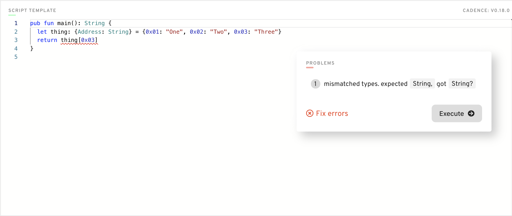

# 第二章·第三日·数组、字典和可选值

Cadence 小伙伴，你们好呀。今天，我们将学习一些最重要的类型，这些类型几乎会在你写的每一个合约中使用。

## 视频

按序观看：

1. （Cadence 中的数组和字典）看这个视频的 00:00-12:10 部分。不要看 12:10 之后的部分，它在明天会讲到：https://www.youtube.com/watch?v=LAUN7hqlL0w

2. (Cadence中的可选值) 观看这个视频: https://www.youtube.com/watch?v=I9Z1z9BsZ0I

## 类型

为了开始学习类型，让我们打开 Flow playground（https://play.onflow.org），并打开一个脚本。我们今天不打算写任何智能合约 :)

在 Cadence 中，你写的代码通常可以推断出变量的类型。例如，如果你写下
```cadence
var jacob = "isCool"
```

Cadence 会自动检测到你已经初始化了一个 String。然而，如果我们想更明确地说明我们的类型，我们可以在声明中包含类型，比如说：

```cadence
var jacob: String = "isCool"
```

在声明中包含类型往往是有帮助的，这样我们就可以推理出我们的程序中哪里出了问题。如果你想让一个变量具有不同的类型，Cadence 也会直接告诉你，你犯了错误。例如，试着输入：

```cadence
var jacob: String = 3
```

Cadence 会说“嘿！这些类型不匹配”，或者类似这样的话。但重点是我们可以在声明中包含类型来帮助我们理解出错的地方。

## 数组

很好。那么什么是数组呢？一个数组是一个元素列表。让我们看看 Cadence 中一个非常基本的数组。

```cadence
var people: [String] = ["Jacob", "Alice", "Damian"]
```

这是一个字符串的列表。我们像这样声明一个数组类型。`[类型]`。再来一个例子。如果我们想要一个地址列表，嗯，和之前的很相似：

```cadence
var addresses: [Address] = [0x1, 0x2, 0x3］
```

我们还可以对数组进行索引来查看元素。这与 Javascript 或类似语言完全一样。

```cadence
var addresses: [Address] = [0x1, 0x2, 0x3］
log(address[0]) // 0x1
log(addresses[1]) // 0x2
log(addresses[2]) // 0x3
```

### 我一直在使用的有用的数组函数

我们在上面看到的都是固定的数组。我们还可以用数组做一些很酷的事情，我在这里列举一些。

**append(_ element: Type)** 

(注意参数标签 `element` 前面有一个 `_`，这意味着它是隐含的，所以你在调用函数时不必把参数标签放进去。所以你使用 `.append(value)` 而非 `.append(element: value)`)

将一个元素添加到数组的末尾。

例子：
```cadence
var people: [String] = ["Jacob", "Alice", "Damian"]
people.append("Ochako Unaraka") //有人看《我的英雄学院》吗？
log(people) // ["Jacob", "Alice", "Damian", "Ochako Unaraka"]
```

**contains(_ element_: Type): Bool** 

检查一个数组是否包含一个元素。

例子：
```cadence
var people: [String] = ["Jacob", "Alice", "Damian"]
log(people.contains("Jacob")) // true
log(people.contains("Poop")) // false
```

**remove(at: Int)** 

在给定的索引处删除一个元素（索引从 0 开始，意味着第一个元素的索引为 0）。

例子：
```cadence
var people: [String] = ["Jacob", "Alice", "Damian"]
people.remove(at: 1)
log(people) // ["Jacob", "Damian"]
```

**length**

返回数组的长度。

例子：
```cadence
var people: [String] = ["Jacob", "Alice", "Damian"]
log(people.length) // 3
```

## 字典

很好! 数组部分到此结束。现在是讨论字典的时候了。那么，这是什么呢？字典是将一个 “键” 映射到一个 “值” 的东西。让我们看看下面的一个简单例子。

```cadence
var names: {String: String} = {"Jacob": "Tucker", "Bob": "Vance", "Ochako": "Unaraka"} //有人看《办公室》吗？
```

在上面的例子中，我们将 `String` 映射到 `String`。更具体地说，我们将某人的名字映射到他们的姓氏。我们用字典类型来做这件事，即 `{Type: Type}`。我们可以使用这个字典来获取人们的姓氏，比如说：

```cadence
var names: {String: String} = {"Jacob": "Tucker", "Bob": "Vance", "Ochako": "Unaraka"}
log(names["Jacob"]) // "Tucker"
log(names["Bob"]) // "Vance"
log(names["Ochako"]) // "Unaraka"
```

让我们看看一个将 `String` 映射到 `Int` 的例子。我们将把某人的名字映射到他最喜欢的号码。

```cadence
var favouriteNums: {String: Int} = {"Jacob": 13, "Bob": 0, "Ochako": 1000100103}
log(favoriteNums["Jacob"]) // 13
```

这很酷。但还有更多。我们将在底部的 “字典和可选值” 部分讨论为什么字典会更复杂。现在，让我们来看看一些有用的函数。

### 我经常使用的有用的字典函数

**insert(key: Type, _ value: Type)**

(注意 `value` 的参数标签是隐含的，但 `key` 不是)

例子：

```cadence
var favouriteNums: {String: Int} = {"Jacob": 13, "Bob": 0, "Ochako": 1000100103}
favouriteNums.insert(key: "Justin Bieber", 1)
log(favoriteNums) // {"Jacob": 13, "Bob": 0, "Ochako": 1000100103, "Justin Bieber": 1}
```

**remove(key: Type): Type?**

删除 `key` 和与之相关的值，并返回该值。

例子：
```cadence
var favouriteNums: {String: Int} = {"Jacob": 13, "Bob": 0, "Ochako": 1000100103}
let removedNumber = favouriteNums.remove(key: "Jacob")
log(favoriteNums) // {"Bob": 0, "Ochako": 1000100103}
log(removeNumber) // 13
```

**keys: [Type]**

返回字典中所有键的数组。

例子：
```cadence
var favouriteNums: {String: Int} = {"Jacob": 13, "Bob": 0, "Ochako": 1000100103}
log(favoriteNums.key) // ["Jacob", "Bob", "Ochako"]
```

**values: [Type]**

返回字典中所有值的数组。

例子：
```cadence
var favouriteNums: {String: Int} = {"Jacob": 13, "Bob": 0, "Ochako": 1000100103}
log(favoriteNums.values) // [13, 0, 1000100103]
```

## 可选值

好了，现在我们聊聊可选值。不妙的是，可选值是非常重要的，但也可能是很棘手的。你在 Cadence 中做的每件事都可能会遇到可选值。大多数时候，这是因为字典的原因。

在 Cadence 中，一个 `可选类型` 用 `?` 来表示。它意味着。“它要么是它所说的类型，要么是 `nil`”。Jacob，你刚才说的是什么鬼？让我们看一下：

```cadence
var name: String? = "Jacob"
```

注意在 `String` 后面的 `?`。这意味着。变量 `name` 要么是一个`String`，要么是`nil`"。很明显，我们知道它是一个`String`，因为它等于 “Jacob”。但我们也可以这样做：

```cadence
var name: String? = nil
```

这不会有任何编译错误，因为它是正确的。一个 `String?` 类型可以是 `nil`。

感觉还行吧？伙计，我是有史以来最好的老师。有我在这里，你们都很幸运。

### 强制解包操作符

让我们聊聊强制解包操作符，`！`。这个操作符可以“解包”一个可选类型：“如果这个东西是 nil, 抛出 PANIC 错误! 如果它不是 nil，无事发生，但是它不再是可选值。那么，这到底是什么意思呢！？我们来看看。

```cadence
var name1: String? = "Jacob"
var unwrappedName1: String = name1! // 注意它不再是可选类型

var name2: String? = nil
var unwrappedName2: String = name2! // PANIC！ 整个程序将中止，因为发生了一个问题：它试图解包一个nil，这是不允许的
```

## 可选值和字典

好了，下面我们将结合我们所知道的一切来讨论可选值和字典的问题。之前，当我解释字典的时候，我遗漏了一个关键的信息（不是双关语。译者注：原文为 left out a key. key 可以是字典的键的意思，也可以关键的意思）。当你访问字典中的元素时，它返回的值是一个**可选值**。那是什么意思呢？让我们接着看。

比方说，我们有这样一个字典：
```cadence
let thing: {String: Int} = {"Hi": 1, "Bonjour": 2, "Hola": 3}
```

很好! 现在我们想打印映射到 "Bonjour" 键的值。

```cadence
let thing: {String: Int} = {"Hi": 1, "Bonjour": 2, "Hola": 3}
log(thing["Bonjour"]) // 这将打印出 2
```

它将打印出 2，正如我们上面所显示的。所以它**看起来**很正常。但它实际上有点问题。让我们写一个新的脚本，就像这样。

```cadence
pub fun main(): Int {
    let thing: {String: Int} = {"Hi": 1, "Bonjour": 2, "Hola": 3}
    return thing["Bonjour"] // ERROR: "类型不匹配。预期是 `Int`, 得到的是 `Int?`"
}
```

这将给我们抛出一个错误! 错误说：“类型不匹配，预期是`Int`，得到的是`Int`”。好吧，我们现在知道 `Int?` 的意思了! 这意味着它是一个可选值，所以它可能是`Int`，也可能是`nil`。为了解决这个错误，我们必须使用强制解包操作符`！`，像这样：

```cadence
pub fun main(): Int {
    let thing: {String: Int} = {"Hi": 1, "Bonjour": 2, "Hola": 3}
    return thing["Bonjour"]! // 我们添加了强制解包操作符
}
```

现在，没有错误了 :D

### 返回可选值与解包的关系

你可能会问，“有没有这样的情况，我想返回一个可选值，而不是强制解包可选值？”答案是肯定的。事实上，在大多数情况下，我们更倾向于返回一个可选的东西，而不是解包。例如，看一下这段代码。

```cadence
pub fun main(): Int {
    let thing: {String: Int} = {"Hi": 1, "Bonjour": 2, "Hola": 3}
    return thing["Bonjour"]! // 我们正在强制解开可选值
}
```

......如果 "Bonjour" 键处没有值，这将会引发 `panic` 并中止程序。相反，我们可以这样写代码。

```cadence
pub fun main(): Int? { // 注意返回值是一个可选的类型
    let thing: {String: Int} = {"Hi": 1, "Bonjour": 2, "Hola": 3}
    return thing["Bonjour"] // 我们保留可选值。
}
```

这样，客户端/调用者可以处理返回值为 `nil` 的情况，而不必担心程序中的错误。这种逻辑也适用于你 Cadence 代码中的其他函数。

### 主要观点

主要的启示是，当访问一个字典的值时，你总是会得到可选值作为返回值。因此，如果你想要的是*实际类型*，而不是可选值，你必须使用强制解包操作符`！`来“解包”它。

## 任务

1. 在一个脚本中，初始化一个数组(长度 == 3)，将你喜欢的人用 `String` 表示，并 `log` 出来。

2. 在一个脚本中，初始化一个字典，将 Facebook、Instagram、Twitter、YouTube、Reddit 和 LinkedIn 这些 `String` 映射为一个 `UInt64`，代表你使用它们的顺序，从多到少。例如，YouTube --> 1，Reddit --> 2，等等。对于以前从未使用过的项目，请将其映射为 0!

3. 使用一个和我所列举的不同的例子来解释强制解包运算符`！`的作用（你可以只改变类型）。

4. 用下面这张图片，解释一下...
    - 错误信息是什么意思
    - 为什么我们会得到这个错误
    - 如何修复它

