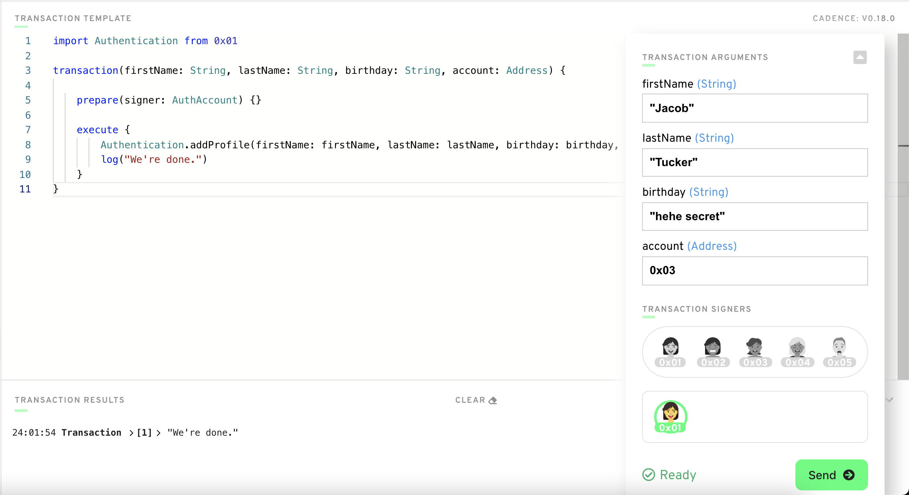

# Capítulo 2 Día 4 - Structs Básicos

Hola idiotas. Hoy es tu dia para aprender Structs! Las buenas noticias es que el structs es bastante simple de aprender, así que hoy no será demasiado largo. ¡Wooohooo! Empezamos. 

## Video

1. (Structs + Dictionaries & Optionals) - Watch this video from 12:10-The End: https://www.youtube.com/watch?v=LAUN7hqlL0w

## Structs

¿Qué son los structs? Structs son contenedores de otros tipos. Miramos a un ejemplo: 

```cadence
pub struct Profile {
    pub let firstName: String
    pub let lastName: String
    pub let birthday: String
    pub let account: Address

    // se llama a `init()` cuando se crea esta estructura…
    // Tienes que pasar 4 argumentos al crear esta estructura.
    init(_firstName: String, _lastName: String, _birthday: String, _account: Address) {
        self.firstName = _firstName
        self.lastName = _lastName
        self.birthday = _birthday
        self.account = _account
    }
}
```

Bueno, hay mucho pasando allí. ¿Qué pasa? Básicamente, definimos un nuevo Tipo llamado `Profile`. Es un Struct. Como puedes ver, se contiene 4 pedazos de data: 
1. Un nombre (`firstName`)
2. Un apellido (`lastName`)
3. Un cumpleaños (`birthday`)
4. Un dirección de una cuenta (`account`)

Es muy útil para hacer un Struct cuando queremos que la información se reúna juntos en un contenedor.

Pensamos por qué esto es útil. Digamos que vamos a hacer un guión nuevo en el Flow playground y queramos devolver la información de la profilé de alguien. ¿Cómo podemos hacer eso? Sin un Struct, tenemos que devolver un array de Strings (`[String]`) que contiene toda la información, conviertes el parámetro de `account` a un `String`, etc. Eso es mucho esfuerzo y dolor. En lugar, podemos devolver un struct de Profile. Vamos a mirar un ejemplo real. 

Notar también que Structs tiene la función de `init()` que se llama cuando se crea la estructura, como la función de `init()` que se llama cuando el contrato es desplegado. Además, te darás cuenta que has utilizado “_” antes de el nombre de mis variables en las funciones de `init()`. Esto es algo que hago para distinguir entre la variable real y el valor inicializado. Este NO es lo mismo como el sintaxi implícito de argumento label ` `. Yo sé, esto es confuso.

**Importante**: Structs solo puede tener el modificador acceso de `pub` (cúal vamos a hablar sobre en los días futuros.) Miremos un ejemplo real. 

## Ejemplo Real

Empecemos con desplegando un nuevo Smart Contract a la cuenta de `0x01`:

```cadence
pub contract Authentication {

    pub var profiles: {Address: Profile}
    
    pub struct Profile {
        pub let firstName: String
        pub let lastName: String
        pub let birthday: String
        pub let account: Address

        // Tienes que pasar en 4 argumentos cuando creando este Struct.
        init(_firstName: String, _lastName: String, _birthday: String, _account: Address) {
            self.firstName = _firstName
            self.lastName = _lastName
            self.birthday = _birthday
            self.account = _account
        }
    }

    pub fun addProfile(firstName: String, lastName: String, birthday: String, account: Address) {
        let newProfile = Profile(_firstName: firstName, _lastName: lastName, _birthday: birthday, _account: account)
        self.profiles[account] = newProfile
    }

    init() {
        self.profiles = {}
    }

}
```

Te tiré mucho aquí. Pero realmente lo sabes todo ahora! Veamos esto:

1. Definimos un nuevo contrato llamado `Authentication`
2. Definimos un diccionario llamado `profiles` que pones un Tipo de `Address` igual a un tipo de `Profile`
3. Definimos un nuevo Struct llamado `Profile` que contiene 4 campos
4. Definimos un nuevo función llamado `addProfile` que toma 4 argumentos y crea un nuevo `Profile` con ellos. Luego crea una nueva asignación desde `account` -> el `Profile` associada con eso cuenta 
5. Initaliza `profiles` a un diccionario vacío cuando el contrato es desplegado 

Si puedes entender esas cosas, has hecho un progreso significativo. Si tienes dificultades con este, no te preocupes! Yo recomiendo revisar algunos de los conceptos de los últimos días. Y recuerda, aún no tienes que saber que `pub` significa.

### Añadir un nuevo perfil

Ahora que hemos definido un nuevo Struct, veamos por qué puede ser útil. 

Abramos un nuevo transacción y entonces copiar y pegar el código de transacción:

```cadence
import Authentication from 0x01

transaction() {

    prepare(signer: AuthAccount) {}

    execute {
        log("We're done.")
    }
}
```

¡Genial! Ahora, queremos añadir un nuevo perfil al diccionario de `Profiles` en el contrato de `Authentication`. Pues, llamemos el función de `addProfile` con todo los argumentos que necesitamos como así: `Authentication.addProfile(firstName: firstName, lastName: lastName, birthday: birthday, account: account)`. Pero espera, tenemos que conseguir estos argumentos de algún lugar primero! Podemos hacerlo pasándolo a las transacciones como argumentos, como así:

```cadence
import Authentication from 0x01

transaction(firstName: String, lastName: String, birthday: String, account: Address) {

    prepare(signer: AuthAccount) {}

    execute {
        Authentication.addProfile(firstName: firstName, lastName: lastName, birthday: birthday, account: account)
        log("We're done.")
    }
}
```

¡Bam! Ejecutemos este transacción con cualquier cuenta y pasar en algún ejemplo de data como así: 



### Leer nuestro perfil

Para leer nuestro nuevo Perfil, abramos un guión y entonces copiar y pegar este codigo de guión: 

```cadence
import Authentication from 0x01

pub fun main() {

}
```

Ahora, leamos nuestro `Profile`. Podemos hacer esto pasar en un `Address` que representa una cuenta, ya que ponemos accounts -> profiles en nuestro diccionario de `profiles` en el contrato. Entonces podemos devolver el tipo de `Profile` que conseguimos de eso dicconario como así: 

```cadence
import Authentication from 0x01

pub fun main(account: Address): Authentication.Profile {
    return Authentication.profiles[account]
}
```

¡Aha! ¡ESPERA UN MINUTO JACOB! Hay un error: “tipos no coincidentes''. Esperada `Authentication.Profile`, consiguió `Authentication.Profile?`” Pues, sabemos como solucionar eso desde el contenido de ayer. Tenemos que añadir el operador de desenvolver a la fuerza, como así:

```cadence
import Authentication from 0x01

pub fun main(account: Address): Authentication.Profile {
    return Authentication.profiles[account]!
}
```

También puede darse cuenta del tipo de devolución aquí: `Authentication.Profile`. Eso es porque estamos desenvolviendo el tipo de `Profile` definido en el contrato de `Authentication`. **Tipos son siempre basados en el contrato se definen en.** ¡Y boom! Eso es todo. Ahora, quien llamó a este guión puede tener toda la información de `Profile` necesitan.

## Busquedas

1. Desplegar un nuevo contrato que tiene un Struct de tu preferencia dentro (tiene que ser diferente de `Profile`).

2. Crear un diccionario o array que contiene el Struct que te definen. 

3. Añadir una transacción para llamar esa función en paso 3.

4. Añadir un guión para leer el Struct que te definen. 

¡Eso es todo! Nos vemos mañana gente ;)
