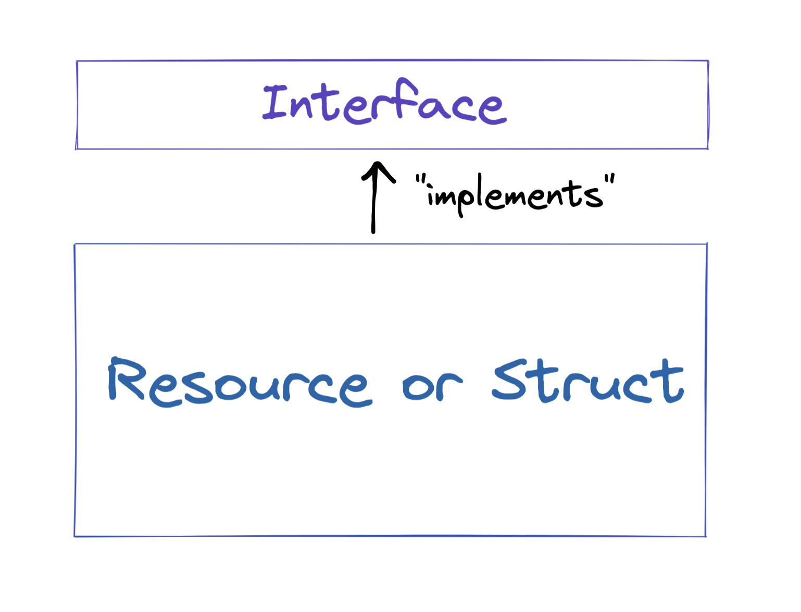

# Chapter 3 Day 4 - Resource/Struct Interfaces

Yooooo yo yo yo! We're BACK for another day of Cadence fun. Today, we'll be learning about resource interfaces.

## Video

If you'd like to watch a video on Resource Interfaces, you can go here: https://www.youtube.com/watch?v=5wnn9qsCXgE

## What is an Interface?

Interfaces are very common in traditional programming languages. There are two main things interfaces are used for:
1. It specifies a set of requirements for something to implement
2. It allows you to only expose certain things to certain people

Let's look at some code to figure out what I mean.



## Using Interfaces as Requirements

In this lesson, I will only be using resource interfaces, however, **struct interfaces are exactly the same thing, just for structs. Lol.** Just keep that in mind.

In Cadence, resource/struct interfaces are essentially "requirements," or ways for you to expose data from a resource/struct. On their own, interfaces don't do anything. They just sit there. But when they're *applied* to a resource/struct, that's when they do something.

Resource interfaces are defined with the `resource interface` keyword (for structs it is `struct interface`):

```cadence
pub contract Stuff {

    pub resource interface ITest {

    }

    pub resource Test {
      init() {
      }
    }
}
```

In the above example, you can see that we did two things:
1. We defined an empty `resource interface` named `ITest`.
2. We defined an empty `resource` named `Test`.

Personally, I always name interfaces with an "I" in front, because it helps me determine what it actually is.

In the above example, `ITest` doesn't actually do anything. It's just sitting there. Let's add some stuff to it.

```cadence
pub contract Stuff {

    pub resource interface ITest {
      pub let name: String
    }

    pub resource Test {
      init() {
      }
    }
}
```

Now, `ITest` contains a `name` field. Cool! But ITest still isn't doing anything. It's just sitting there in space. So let's make `Test` *implement* the `ITest` resource interface.

```cadence
pub contract Stuff {

    pub resource interface ITest {
      pub let name: String
    }

    // ERROR: 
    // `resource Stuff.Test does not conform
    // to resource interface Stuff.ITest`
    pub resource Test: ITest {
      init() {

      }
    }
}
```

Notice what we just did. We made `Test` implement `ITest` by adding the `: ITest` syntax. What that means is, "This resource implements the resource interfaces after the `:`".

But you'll notice there's an error: "resource Stuff.Test does not conform to resource interface Stuff.ITest". Remember what we said above? Resource interfaces are *requirements*. If a resource implements a resource interface, it MUST define the things in the interface. Let's fix it.

```cadence
pub contract Stuff {

    pub resource interface ITest {
      pub let name: String
    }

    // It's good now :)
    pub resource Test: ITest {
      pub let name: String
      init() {
        self.name = "Spongebob" // anyone else like Spongebob?
      }
    }
}
```

There's no errors now! Woohoo!

## Using Interfaces to Expose Specific Things

Above, we learned that resource interfaces make the resource implement certain things. But resource interfaces are actually much more important than that. Remember the 2nd thing they do? We said: "It allows you to only expose certain things to certain people". THAT is why they are powerful. Let's look below:

```cadence
pub contract Stuff {

    pub resource interface ITest {
      pub let name: String
    }

    pub resource Test: ITest {
      pub let name: String
      pub let number: Int
      init() {
        self.name = "Spongebob"
        self.number = 1
      }
    }

    pub fun noInterface() {
      let test: @Test <- create Test()
      log(test.number) // 1

      destroy test
    }

    pub fun yesInterface() {
      let test: @Test{ITest} <- create Test()
      log(test.number) // ERROR: `member of restricted type is not accessible: number`

      destroy test
    }
}
```

Okay, what the heck just happened. There's a lot going on:
1. We made a function called `noInterface`. This function creates a new resource (with type `@Test`) and logs its `number` field. This works perfectly.
2. We made a function called `yesInterface`. This function creates a new resource **that is restricted to the `ITest` interface** (with type `@Test{ITest}`) and tries to log the `number` field, but fails.

In Cadence, you "restrict the type" of a resource by using `{RESOURCE_INTERFACE}` notation. You use `{}` brackets and put the name of the resource interface in the middle. That means: "this type is a resource **that can only use the things exposed by the interface**." If you understand this, you understand resource interfaces really well.

So, why does the `log` in `yesInterface` fail? Well, it's because `ITest` does NOT expose the `number` field! So if we type the `test` variable to be `@Test{ITest}`, we won't be able to access it.

## Complex Example

Here's a more complex example that also includes functions:

```cadence
pub contract Stuff {

    pub resource interface ITest {
      pub var name: String
    }

    pub resource Test: ITest {
      pub var name: String
      pub var number: Int

      pub fun updateNumber(newNumber: Int): Int {
        self.number = newNumber
        return self.number // returns the new number
      }

      init() {
        self.name = "Spongebob"
        self.number = 1
      }
    }

    pub fun noInterface() {
      let test: @Test <- create Test()
      test.updateNumber(newNumber: 5)
      log(test.number) // 5

      destroy test
    }

    pub fun yesInterface() {
      let test: @Test{ITest} <- create Test()
      let newNumber = test.updateNumber(newNumber: 5) // ERROR: `member of restricted type is not accessible: updateNumber`
      log(newNumber)

      destroy test
    }
}
```

I wanted to show you another example to show you that you can also choose not to expose functions. There's so many things you can do! :D If we wanted to fix this code, we would do:

```cadence
pub contract Stuff {

    pub resource interface ITest {
      pub var name: String
      pub var number: Int
      pub fun updateNumber(newNumber: Int): Int
    }

    pub resource Test: ITest {
      pub var name: String
      pub var number: Int

      pub fun updateNumber(newNumber: Int): Int {
        self.number = newNumber
        return self.number // returns the new number
      }

      init() {
        self.name = "Spongebob"
        self.number = 1
      }
    }

    pub fun noInterface() {
      let test: @Test <- create Test()
      test.updateNumber(newNumber: 5)
      log(test.number) // 5

      destroy test
    }

    // Works totally fine now! :D
    pub fun yesInterface() {
      let test: @Test{ITest} <- create Test()
      let newNumber = test.updateNumber(newNumber: 5)
      log(newNumber) // 5

      destroy test
    }
}
```

Notice that when I added the function to `ITest`, I only put the function definition: `pub fun updateNumber(newNumber: Int): Int`. You cannot implement a function in an interface, you can only define it.

## Conclusion

Great job in getting through today's content. Resource interfaces will be extremely important when we start talking about account storage in Chapter 4.

## Quests

1. Explain, in your own words, the 2 things resource interfaces can be used for (we went over both in today's content)

2. Define your own contract. Make your own resource interface and a resource that implements the interface. Create 2 functions. In the 1st function, show an example of not restricting the type of the resource and accessing its content. In the 2nd function, show an example of restricting the type of the resource and NOT being able to access its content.

3. How would we fix this code? 

```cadence
pub contract Stuff {

    pub struct interface ITest {
      pub var greeting: String
      pub var favouriteFruit: String
    }

    // ERROR:
    // `structure Stuff.Test does not conform 
    // to structure interface Stuff.ITest`
    pub struct Test: ITest {
      pub var greeting: String

      pub fun changeGreeting(newGreeting: String): String {
        self.greeting = newGreeting
        return self.greeting // returns the new greeting
      }

      init() {
        self.greeting = "Hello!"
      }
    }

    pub fun fixThis() {
      let test: Test{ITest} = Test()
      let newGreeting = test.changeGreeting(newGreeting: "Bonjour!") // ERROR HERE: `member of restricted type is not accessible: changeGreeting`
      log(newGreeting)
    }
}
```