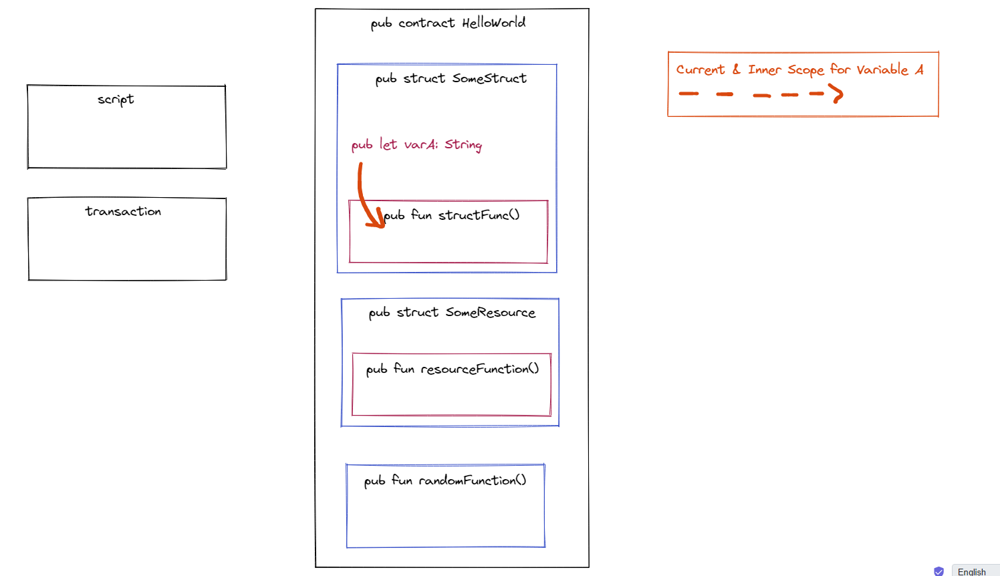
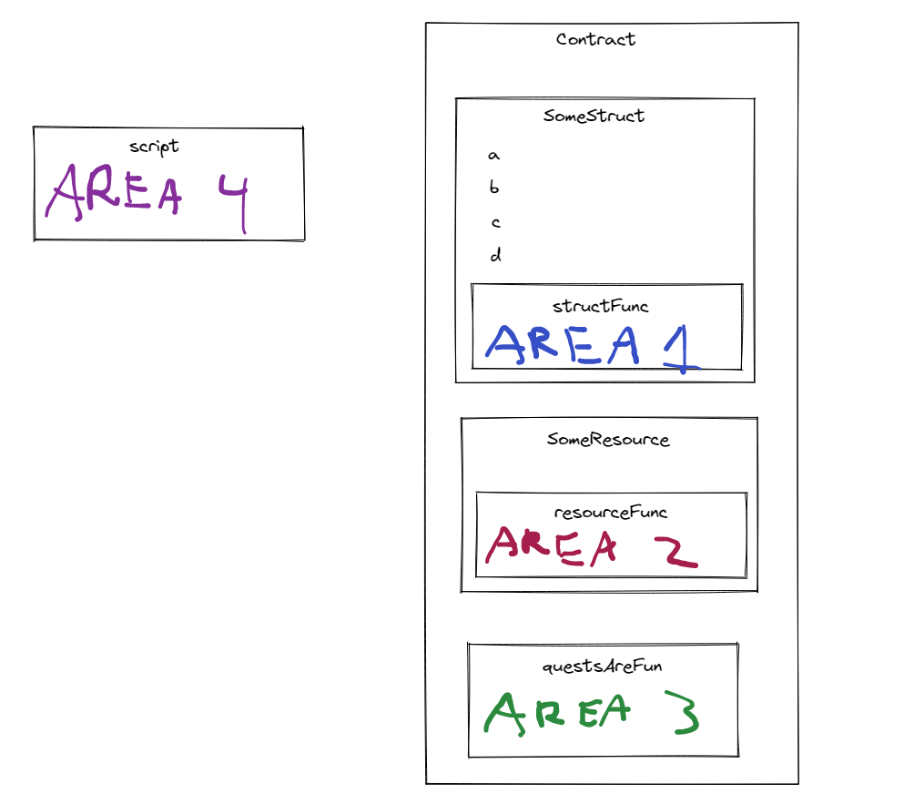

# Chapter 3 Day 5 - Access Control

SUUUUUUUUP! Today, we're learning about access control. Let's learn.

## Video

I STRONGLY ENCOURAGE you watch the video for today's content. It will help you so much because access control is very confusing: https://www.youtube.com/watch?v=ly3rNs0xCRQ&t

## Introduction to Access Control & Access Modifiers

Access Control is an extremely powerful feature in Cadence, and makes it very special. 

Access Control describes the way in which we can use things called "Access Modifiers" to increase the security of our smart contracts. 

Previously, in all of our lessons, we declared all of our variables and functions using the `pub` keyword, like so:
```cadence
pub let x: Bool

pub fun jacobIsAwesome(): Bool {
  return true // obviously
}
```

But what exactly does `pub` mean? Why are we putting it there? Are there other things we can do instead? That is what we'll be learning today.

## Access Modifiers

`pub` is something called an "Access Modifier" in Cadence. An Access Modifier is basically a level of security in our smart contracts. But there are a bunch of others we can use as well. Let's take a look at this diagram to help give us an idea of all the different access modifiers we can use.


We are only going to focus on the `var` rows, because `let` does not have a write scope since it is a constant. I really encourage you to watch the video before reading over this next section.

## What does "Scope" mean?

Scope is the area in which you can access, modify, or call your "things" (variables, constants, fields, or functions). There are 4 types of scope:

### 1. All Scope
This means we can access our thing from **anywhere**. Inside the contract, in transactions and scripts, wherever.


### 2. Current & Inner Scope
This means we can only access our thing from where it is defined and inside of that.



### 3. Containing Contract Scope
This means we can access our thing anywhere inside the contract that it is defined.


### 4. Account Scope
This means we can access our thing anywhere inside the account that it is defined. This means all of the contracts that are in the account. Remember: we can deploy multiple contracts to one account.

## Back to Access Modifiers

Cool! We just reviewed what different "scopes" mean. Let's take a look at our graphic again...


Now it is easier to understand what it's saying. Let's walk through all of the access modifiers together...

### pub(set)

`pub(set)` only applies to variables, constants, and fields. Functions **cannot** be publically settable. It is also the most dangerous and easily accessible modifier.

Ex.
```cadence
pub(set) var x: String
```

Write Scope - **All Scope**

Read Scope - **All Scope**

### pub/access(all)

`pub` is the same thing as `access(all)`. This is the next layer down from pub(set).

Ex.
```cadence
pub var x: String
access(all) var y: String

pub fun testFuncOne() {}
access(all) fun testFuncTwo() {}
```

Write Scope - Current & Inner

Read Scope - **All Scope**

### access(account)

`access(account)` is a little more restrictive than `pub` due to its read scope.

Ex.
```cadence
access(account) var x: String

access(account) fun testFunc() {}
```

Write Scope - Current & Inner

Read Scope - All Contracts in the Account

### access(contract)

`access(contract)` is a little more restrictive than `access(account)` due to its read scope.

Ex.
```cadence
access(contract) var x: String

access(contract) fun testFunc() {}
```

Write Scope - Current & Inner

Read Scope - Containing Contract

### priv/access(self)

`priv` is the same thing as `access(self)`. This is the most restrictive (and safe) access modifier.

Ex.
```cadence
priv var x: String
access(self) var y: String

priv fun testFuncOne() {}
access(self) fun testFuncTwo() {}
```

Write Scope - Current & Inner

Read Scope - Current & Inner

## Very Important Notes


After looking at our access modifiers, we must make an extremely important distinction: **Even though some access modifiers like `priv` make fields unreadable in your Cadence code, this does not mean people cannot read this info by looking at the blockchain. *Everything on the blockchain is public*, regardless of its read scope.** Access modifiers simply let you determine what is readable/writeable in the context of your Cadence code. Never store private information on the blockchain!

## Conclusion

We learned a LOT about access modifiers today. In order to test your understanding, we're going to do a lot of busy work in the quests for today. I honestly believe you will learn the most from doing the quests themselves.

See you in Chapter 4, folks! <3

## Quests

For today's quest, you will be looking at a contract and a script. You will be looking at 4 variables (a, b, c, d) and 3 functions (publicFunc, contractFunc, privateFunc) defined in `SomeContract`. In each AREA (1, 2, 3, and 4), I want you to do the following: for each variable (a, b, c, and d), tell me in which areas they can be read (read scope) and which areas they can be modified (write scope). For each function (publicFunc, contractFunc, and privateFunc), simply tell me where they can be called.

You can use this diagram to help you:


```cadence
access(all) contract SomeContract {
    pub var testStruct: SomeStruct

    pub struct SomeStruct {

        //
        // 4 Variables
        //

        pub(set) var a: String

        pub var b: String

        access(contract) var c: String

        access(self) var d: String

        //
        // 3 Functions
        //

        pub fun publicFunc() {}

        access(contract) fun contractFunc() {}

        access(self) fun privateFunc() {}


        pub fun structFunc() {
            /**************/
            /*** AREA 1 ***/
            /**************/
        }

        init() {
            self.a = "a"
            self.b = "b"
            self.c = "c"
            self.d = "d"
        }
    }

    pub resource SomeResource {
        pub var e: Int

        pub fun resourceFunc() {
            /**************/
            /*** AREA 2 ***/
            /**************/
        }

        init() {
            self.e = 17
        }
    }

    pub fun createSomeResource(): @SomeResource {
        return <- create SomeResource()
    }

    pub fun questsAreFun() {
        /**************/
        /*** AREA 3 ****/
        /**************/
    }

    init() {
        self.testStruct = SomeStruct()
    }
}
```

This is a script that imports the contract above:
```cadence
import SomeContract from 0x01

pub fun main() {
  /**************/
  /*** AREA 4 ***/
  /**************/
}
```