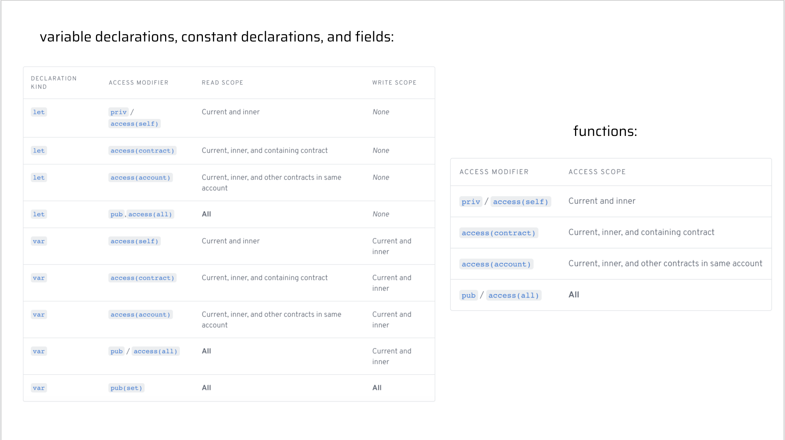

# Глава 3 День 5 - Контроль доступа

ПРИВЕЕЕЕЕЕЕТ! Сегодня мы узнаем о контроле доступа. Поехали.

## Видео

Я НАСТОЯТЕЛЬНО рекомендую вам посмотреть видеоматериал по сегодняшнему уроку. Это очень поможет вам, потому что контроль достаточно сложен для понимания: https://www.youtube.com/watch?v=ly3rNs0xCRQ&t

## Введение в контроль и модификаторы доступа

Контроль доступа - это чрезвычайно мощная функция в Cadence, которая делает его особенным. 

Контроль доступа описывает способ, которым мы можем использовать вещи, называемые "модификаторами доступа", для повышения безопасности наших смарт-контрактов. 

Ранее, во всех наших уроках, мы объявляли все наши переменные и функции, используя ключевое слово `pub`, примерно так:
```cadence
pub let x: Bool

pub fun jacobIsAwesome(): Bool {
  return true // obviously
}
```

Но что именно означает `pub`? Почему мы помещаем его туда? Есть ли другие вещи, которые мы можем сделать вместо этого? Это мы сегодня и узнаем.

## Модификаторы доступа

`pub` - это то, что в Cadence называется "модификатором доступа". Модификатор доступа - это, по сути, уровень безопасности в наших смарт-контрактах. Но есть и множество других, которые мы можем использовать. Давайте посмотрим на эту таблицу, чтобы узнать о различных модификаторах доступа, которые мы можем использовать.



Мы сосредоточимся только на строках `var`, поскольку `let` не имеет области записи, так как является константой. Я очень рекомендую вам посмотреть видео, прежде чем читать далее.

## Что означает термин "Область видимости"?

Область видимости - это область, в которой вы можете получить доступ, изменить или вызвать ваши "вещи" (переменные, константы, поля или функции). Существует 4 типа области видимости:

### 1. Все области видимости
Это означает, что мы можем получить доступ к нашей вещи **отовсюду**. Внутри контракта, в транзакциях и скриптах, где угодно.


### 2. Текущая и внутренняя область
Это означает, что мы можем получить доступ к нашей вещи только из того места, где она определена, и внутри него.


### 3. Область видимости внутри контракта
Это означает, что мы можем получить доступ к нашей вещи в любом месте внутри контракта, в котором она определена.


### 4. Область видимости аккаунта
Это означает, что мы можем получить доступ к нашей вещи в любом месте внутри аккаунта, в котором она определена. Это означает, что мы имеем доступ ко всем контрактам, которые находятся в аккаунте. Помните: мы можем развернуть несколько контрактов в одном аккаунте.

## Вернемся к модификаторам доступа

Круто! Мы только что рассмотрели, что означают различные "области видимости". Давайте снова посмотрим на нашу таблицу...


Теперь легче понять, о чем идет речь. Давайте вместе пройдемся по всем модификаторам доступа...

### pub(set)

`pub(set)` применяется только к переменным, константам и полям. Функции **не могут** быть публично устанавливаемыми. Это также самый опасный и легкодоступный модификатор.

Ex.
```cadence
pub(set) var x: String
```

Область записи- **Вся область**

Область чтения - **Вся область**

### pub/access(all)

`pub` - это то же самое, что и `access(all)`. Это следующий уровень после pub(set).

Ex.
```cadence
pub var x: String
access(all) var y: String

pub fun testFuncOne() {}
access(all) fun testFuncTwo() {}
```

Область записи - текущая и внутренняя

Область чтения - **Вся область**

### access(account)

`access(account)` является немного более ограниченным, чем `pub`, из-за его области чтения.

Ex.
```cadence
access(account) var x: String

access(account) fun testFunc() {}
```

Область записи - текущая и внутренняя

Область чтения - все контракты в аккаунте

### access(contract)

`access(contract)` является немного более ограниченным, чем `access(account)` из-за области чтения.

Ex.
```cadence
access(contract) var x: String

access(contract) fun testFunc() {}
```

Область записи - текущая и внутренняя

Область чтения - Содержимое контракта

### priv/access(self)

`priv` - это то же самое, что и `access(self)`. Это самый ограниченный (и безопасный) модификатор доступа.

Ex.
```cadence
priv var x: String
access(self) var y: String

priv fun testFuncOne() {}
access(self) fun testFuncTwo() {}
```

Область записи - текущая и внутренняя

Область чтения - текущая и внутренняя

## Очень важные примечания


Рассмотрев наши модификаторы доступа, мы должны сделать чрезвычайно важное замечание: **Даже если некоторые модификаторы доступа, такие как `priv`, делают поля нечитаемыми в вашем коде Cadence, это не означает, что люди не могут прочитать эту информацию, посмотрев на блокчейн. *Все в блокчейне является публичным*, независимо от области его чтения.** Модификаторы доступа просто позволяют вам определить, что можно читать/записывать в контексте вашего кода Cadence. Никогда не храните приватную информацию в блокчейне!

## Заключение

Сегодня мы узнали много нового о модификаторах доступа. Чтобы проверить ваши знания, вы должны выполнить немало квестов на сегодня. Я искренне верю, что больше всего вы узнаете и поймете, самостоятельно выполняя задания.

Увидимся в 4 главе, друзья! <3

## Квесты

В сегодняшнем квесте вы будете рассматривать контракт и скрипт. Вы будете рассматривать 4 переменные (a, b, c, d) и 3 функции (publicFunc, contractFunc, privateFunc), определенные в `SomeContract`. В каждой из AREA (1, 2, 3 и 4) я хочу, чтобы вы сделали следующее: для каждой переменной (a, b, c и d) скажите, в каких областях они могут быть прочитаны (read scope) и в каких областях они могут быть изменены (write scope). Для каждой функции (publicFunc, contractFunc и privateFunc) просто скажите, где их можно вызвать.

Вы можете использовать этот рисунок, в качестве шпаргалки:


```cadence
access(all) contract SomeContract {
    pub var testStruct: SomeStruct

    pub struct SomeStruct {

        //
        // 4 Variables
        //

        pub(set) var a: String

        pub var b: String

        access(contract) var c: String

        access(self) var d: String

        //
        // 3 Functions
        //

        pub fun publicFunc() {}

        access(contract) fun contractFunc() {}

        access(self) fun privateFunc() {}


        pub fun structFunc() {
            /**************/
            /*** AREA 1 ***/
            /**************/
        }

        init() {
            self.a = "a"
            self.b = "b"
            self.c = "c"
            self.d = "d"
        }
    }

    pub resource SomeResource {
        pub var e: Int

        pub fun resourceFunc() {
            /**************/
            /*** AREA 2 ***/
            /**************/
        }

        init() {
            self.e = 17
        }
    }

    pub fun createSomeResource(): @SomeResource {
        return <- create SomeResource()
    }

    pub fun questsAreFun() {
        /**************/
        /*** AREA 3 ****/
        /**************/
    }

    init() {
        self.testStruct = SomeStruct()
    }
}
```

This is a script that imports the contract above:
```cadence
import SomeContract from 0x01

pub fun main() {
  /**************/
  /*** AREA 4 ***/
  /**************/
}
```