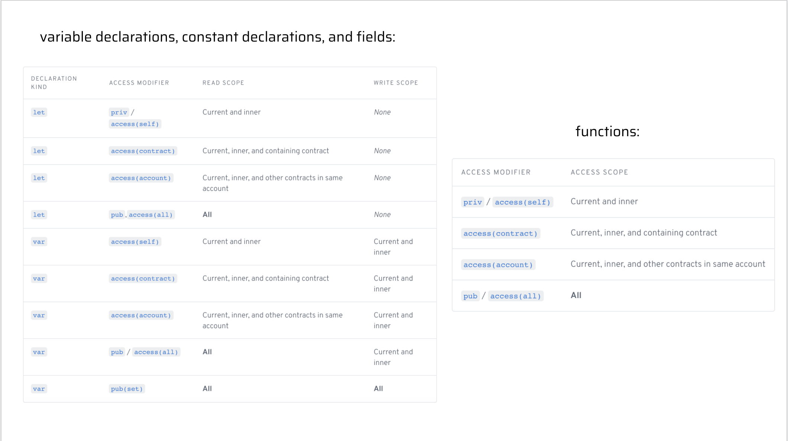

# Chapter 3 Day 5 - 访问控制


GM！今天，我们将学习访问控制。

## 视频


我强烈建议大家观看今天内容的视频。它会帮你很多，因为访问控制非常容易混淆：https://www.youtube.com/watch?v=ly3rNs0xCRQ&t

## 访问控制和访问修饰符的简述

访问控制是 Cadence 中一个非常强大的功能，使其非常特殊。
访问控制描述了我们可以使用 “访问修饰符” 来提高智能合约的安全性的方式。


之前，在我们的所有课程中，我们使用 `pub` 关键字声明了所有变量和函数，如下所示：
```cadence
pub let x: Bool

pub fun jacobIsAwesome(): Bool {
  return true // obviously
}
```

但 `pub` 到底是什么意思？我们为什么要把它放在那里？我们还能做其他事情吗？这就是我们今天要学的。

## 访问修饰符

`pub` 在 Cadence 中被称为 “访问修饰符”。访问修改器基本上是智能合约中的一种安全级别。但我们也可以使用其他一些。让我们看看这个图表，帮助我们了解我们可以使用的所有不同访问修饰符。



We are only going to focus on the `var` rows, because `let` does not have a write scope since it is a constant. I really encourage you to watch the video before reading over this next section.

我们只关注 `var` 行，因为 `let` 没有写作用域，它是一个常量。我真的鼓励你在阅读下一节之前先看一下视频。

## “作用域”是什么意思?

Scope is the area in which you can access, modify, or call your "things" (variables, constants, fields, or functions). There are 4 types of scope:

作用域是你可以访问、修改或调用“事物”（变量、常量、字段或函数）的区域。有 4 种类型的作用域：

### 1. 所有作用域
This means we can access our thing from **anywhere**. Inside the contract, in transactions and scripts, wherever.

这意味着我们可以从**任何地方**访问我们的东西。在合约内部，在交易和脚本中，无论何处。

### 2. 当前 & 内部作用域

这意味着我们只能从定义的地方和它内部访问我们的东西。

Ex. 
```cadence
pub contract Stuff {

  pub struct TestStruct {
  
    pub var x: String

    // "当前和内部范围" 的 'x' 在这里...

    pub fun testFunc() {
      // 和这里...
    }

    init(){...}
  }

  // 不在这里.

}
```

### 3. 包含合约作用域

这意味着我们可以在合约中定义的任何地方访问我们的东西。

Ex. 
```cadence
pub contract TestContract {

  // "包含合约" 的 'x' 在这里...

  pub struct TestStruct {
    
    pub var x: String

    // 这里.

    pub fun testFunc() {
      // 和这里
    }

    init(){...}
  }
}
```

### 4. 账户作用域

这意味着我们可以在账户定义的任何地方访问我们的东西。这意味着账户中的所有合约。记住：我们可以将多个合约部署到一个帐户。

## 回到访问修改器


太棒了，我们刚刚回顾了不同“范围”的含义。让我们再看看我们的图片。。。


现在更容易理解它在说什么。让我们一起浏览所有访问修饰符。。。

### pub(set)

`pub(set)` 仅适用于变量、常量和字段。功能**不能**公开设置。它也是最危险、最容易接近的修饰语。

Ex.
```cadence
pub(set) var x: String
```

写 Scope - **All Scope**

读 Scope - **All Scope**

### pub/access(all)

`pub` is the same thing as `access(all)`. This is the next layer down from pub(set).

`pub` 和 `access(all)` 是一回事。这是 pub(set) 的下一层。

Ex.
```cadence
pub var x: String
access(all) var y: String

pub fun testFuncOne() {}
access(all) fun testFuncTwo() {}
```

写 Scope - Current & Inner

读 Scope - **All Scope**

### access(account)

`access（account）`由于其读取范围，比 `pub` 更具限制性。

Ex.
```cadence
access(account) var x: String

access(account) fun testFunc() {}
```

写 Scop - Current & Inner

读 Scope - All Contracts in the Account

### access(contract)

 is a little more restrictive than `access(account)` due to its read scope.

由于它的读取范围，它比 `access(account)` 有一点限制性。

Ex.
```cadence
access(contract) var x: String

access(contract) fun testFunc() {}
```

写 Scop - Current & Inner

读 Scope - Containing Contract

### priv/access(self)

`priv` 与 `access(self)`是同一个词。这是最严格（也是最安全）的访问修改器。

Ex.
```cadence
priv var x: String
access(self) var y: String

priv fun testFuncOne() {}
access(self) fun testFuncTwo() {}
```

写 Scop - Current & Inner

读 Scope - Current & Inner

## 非常重要的注意事项


在查看了我们的访问修饰符之后，我们必须做出一个极其重要的区分：尽管像 `priv` 这样的一些访问修饰符使您的 Cadence 代码中的字段无法读取，但这并不意味着人们无法通过查看区块链来读取此信息*区块链上的所有内容都是公开的*，无论其读取范围如何。访问修饰符只是让您确定在 Cadence 代码的上下文中什么是可读写的。永远不要在区块链上存储私人信息！

## 结论

今天我们学到了很多关于访问修饰符的知识。为了测试你的理解力，我们将在今天的任务中做很多繁忙的工作。我相信你会从自己的任务中学到最多。

第四章见，各位<3.

## Quests

For today's quest, you will be looking at a contract and a script. You will be looking at 4 variables (a, b, c, d) and 3 functions (publicFunc, contractFunc, privateFunc) defined in `SomeContract`. In each AREA (1, 2, 3, and 4), I want you to do the following: for each variable (a, b, c, and d), tell me in which areas they can be read (read scope) and which areas they can be modified (write scope). For each function (publicFunc, contractFunc, and privateFunc), simply tell me where they can be called.

在今天的任务中，你将看到一份合约和一份脚本。您将看到 `SomeContract` 中定义的 4 个变量（a、b、c、d）和 3 个函数（publicFunc、contractFunc、privateFunc）。在每个区域（1、2、3 和 4）中，我希望您执行以下操作：对于每个变量（a、b、c 和 d），请告诉我在哪些区域可以读取它们（读取范围），哪些区域可以修改它们（写入范围）。对于每个函数（publicFunc、contractFunc和privateFunc），只需告诉我在哪里可以调用它们。

```cadence
access(all) contract SomeContract {
    pub var testStruct: SomeStruct

    pub struct SomeStruct {

        //
        // 4 Variables
        //

        pub(set) var a: String

        pub var b: String

        access(contract) var c: String

        access(self) var d: String

        //
        // 3 Functions
        //

        pub fun publicFunc() {}

        access(contract) fun contractFunc() {}

        access(self) fun privateFunc() {}


        pub fun structFunc() {
            /**************/
            /*** AREA 1 ***/
            /**************/
        }

        init() {
            self.a = "a"
            self.b = "b"
            self.c = "c"
            self.d = "d"
        }
    }

    pub resource SomeResource {
        pub var e: Int

        pub fun resourceFunc() {
            /**************/
            /*** AREA 2 ***/
            /**************/
        }

        init() {
            self.e = 17
        }
    }

    pub fun createSomeResource(): @SomeResource {
        return <- create SomeResource()
    }

    pub fun questsAreFun() {
        /**************/
        /*** AREA 3 ****/
        /**************/
    }

    init() {
        self.testStruct = SomeStruct()
    }
}
```

This is a script that imports the contract above:
```cadence
import SomeContract from 0x01

pub fun main() {
  /**************/
  /*** AREA 4 ***/
  /**************/
}
```