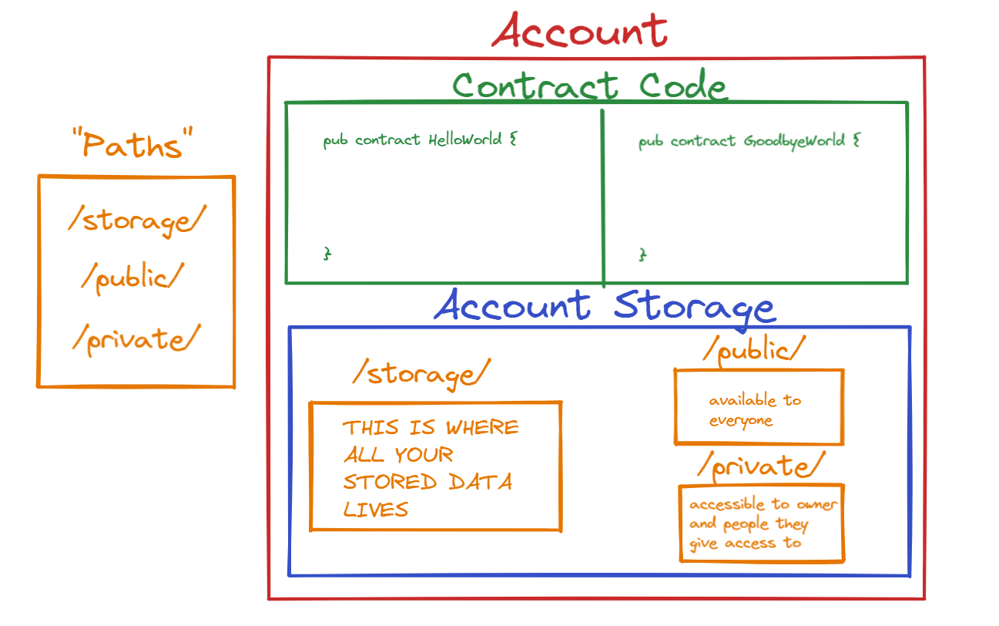

# Capítulo 4 Día 1 - Almacenamiento de Cuenta

Lo superamos a través de 3 capítulos. Pero hay mucho más que ir ;) Hacemos! 

## Video

Mira este video hasta 14:45: https://www.youtube.com/watch?v=01zvWVoDKmU 

Vamos a cubrir el resto mañana. 

## Cuentas en Flow

Si recuerdas volver a Capítulo 2 Día 1 cuando aprendimos sobre transacciones, yo también hablé sobre cuentas en flow y cómo pueden almacenar datos. Voy a copiar y pegar eso debajo porque es beneficiar a revisar: 

En Flow, cuentas puede almacenar tus propios datos. ¿Qué significa? Pues, si tengo un NFT (NonFungibleToken) en Flow, esa NFT es almacenada en mi cuenta. Este es *muy diferente* que otros blockchain como Ethereum. En Ethereum, tu NFT es almacenada en un smart contract. En Flow, permitimos las cuentas a almacenar el data a sí mismo, que es super genial. Pero, cómo accedemos el data en su cuenta? Podemos hacer eso con el tipo de `AuthAccount`. Cada vez que un usuario (como tú y yo) envía una transacción, tienes que pagar para la transacción, y entonces te “firmas” el. Todo esto significa que haz clic un botón diciendo “Quiero aprobar esta transacción.” Cuando lo firmas, la transacción toma tu `AuthAccount` y puede acceder a los datos en tu cuenta. 

Puede ver que esto se está haciendo en la porción de `prepare` de la transacción, y ese el punto de la fase de `preparación`: para acceder la información/datos en tu cuenta. A la otra mano, la fase de `ejecutar` no puede hacer eso. Pero puede llamar funciones y hacer cosas para cambiar el data en el blockchain. NOTA: En realidad, tú nunca *realmente* necesitas la fase de `ejecutar`. Técnicamente puedes hacer todo en la fase de `preparación`, pero el código es menos claro de esa manera. Es mejor separar lo lógico.

## ¿Qué vive en una cuenta?



Como se lee arriba, en Flow, las cuentas realmente almacenan sus propios datos. Esto significa que, si tengo un recurso de `NFT`, puedo almacenar eso en mi propia cuenta. Pero, ¿donde? 

Usando el diagramo de arriba (estoy super orgulloso de él), hablemos sobre que vives en una cuenta:
1. Código de Contrato - El contrato es desplegado a una cuenta, y vive dentro de la cuenta. Múltiples contratos pueden vivir dentro de una cuenta.
2. Almacenamiento de Cuenta - Todo de tus datos se almacenan dentro del almacenamiento de tu cuenta. 

## Almacenamiento de las Cuentas

Pues, ¿qué es el almacenamiento de tus cuentas? Puedes pensar en el almacenamiento de las cuentas como un “contendor” de data que vive a un camino específico: `/storage/`. En una cuenta de Flow, hay 3 caminos para conseguir datos ciertas: 
1. `/storage/` - sólo el propietario de la cuenta puede acceder este (gracias a dios, o alguien puede robar todo tus datos). TODO de tus datos viven aquí. 
2. `/public/` - disponible a todas 
3. `/private/` - solo disponible a el propietario de la cuenta y las personas que el propietario de la cuenta da acceso a. 

La parte clave para recordar es que solamente el propietario de la cuenta puede dar acceso a su `/storage/`, pero ellos tienen la habilidad para poner cosas en los caminos de `/public/` y `/private/` si ellos quieren. Por ejemplo, si quiero simplemente mostrar mi NFT, puedo poner una versión legible de mi NFT en mi camino de `/public/` así que puedes verlo, pero restringirlo lo suficiente así que no puedes no puedes retirarte de mi cuenta. 

*Pista pista: ¿Puedes ver como los interfaces de los recursos pueden ser útiles aquí? ;)*

Te estarás preguntando: “pues, como acceder mi `/storage/`?” La respuesta es tu tipo de `AuthAccount`. Si recuerdas, cuando te firmas una transacción, el `AuthAccount` de la firmante se coloca como un parámetro en la fase de `preparación` como así: 

```cadence
transaction() {
  prepare(signer: AuthAccount) {
    // Podemos acceder el camino de /storage/ de el firmante aqui! 
  }

  execute {

  }
}
```

Como puedes ver arriba, podemos acceder al camino de `/storage/` de el firmante en la fase de `prepare`. Esto significa que podemos hacer cualquier cosa que queramos. Eso es por qué es tan aterrador pensar en firmar accidentalmente una transacción. Ten cuidado gente.

## Los Funciones de Save & Load

Practiquemos el almacenamiento de algo en una cuenta. Primero definamos un contrato: 

```cadence
pub contract Stuff {

  pub resource Test {
    pub var name: String
    init() {
      self.name = "Jacob"
    }
  }

  pub fun createTest(): @Test {
    return <- create Test()
  }

}
```

Definimos un contrato sencillo que permite crear y devolver un tipo de recurso `@Test`. Consigamos este en una transacción: 

```cadence
import Stuff from 0x01
transaction() {
  prepare(signer: AuthAccount) {
    let testResource <- Stuff.createTest()
    destroy testResource
  }

  execute {

  }
}
```

Todo lo que estamos haciendo es creando y destruyendo un `@Test`. Pero sí queramos almacenarlo en nuestra cuenta? Veamos cómo se hace eso, y entonces vamos a descomponerlo: 

```cadence
import Stuff from 0x01
transaction() {
  prepare(signer: AuthAccount) {
    let testResource <- Stuff.createTest()
    signer.save(<- testResource, to: /storage/MyTestResource) 
    // almacena `testResource` a el camino de la almacenamiento de mi cuenta:
    // /storage/MyTestResource
  }

  execute {

  }
}
```

Mira cómo lo guardamos en nuestra cuenta. Primero, **tenemos que tener un `AuthAccount` para guardarlo a.** En este caso, tenemos el variable de `signer`. Entonces, podemos hacer `signer.save(...)` lo cual significa que estamos guardando algo en el camino de `/storage/`. 

`.save()` toma dos parametros: 
1. La data real para guardar
2. Un parámetro de `to` que es el camino debemos a guárdalo en (tiene que ser un camino de `/storage/`)

En el ejemplo de arriba, lo guarde `testResource` (nota la sintaxi `<-` porque es un recurso) a el camino de `/storage/MyTestResource`. Ahora, cuando queremos conseguirlo, podemos ir a ese camino. Hagamos esto debajo. 

```cadence
import Stuff from 0x01
transaction() {
  prepare(signer: AuthAccount) {
    let testResource <- signer.load<@Stuff.Test>(from: /storage/MyTestResource)
    // toma `testResource` fuera del almacenamiento de mi cuenta

    destroy testResource
  }

  execute {

  }
}
```

En el ejemplo de arriba, usamos la función de `.load()` para tomar datos FUERA del almacenamiento de nuestra cuenta. 

Notarás que tenemos que hacer esa cosa rara: `<@Stuff.Test>`. ¿Qué es eso? Pues, cuando estás interactuando con el almacenamiento de una cuenta, tienes que especificar el tipo que estás viendo. Cadence no tiene nigun idea que hay un `@Stuff.Test` almacenados en ese camino de almacenamiento. Pero como desarrolladores, sabemos que es lo que se almacena allí, así que tenemos que poner `<@Stuff.Test>` para decir “esperamos un `@Stuff.Test` salir de ese camino de almacenamiento.”

`.load()` toma uno parametro:
1. un parámetro de `from` que es el camino debemos tomarlo de (tiene que ser un camino de `/storage/`)

Otra cosa importante es que cuando quieres cargar los datos del almacenamiento, devuelve un opcional. `testResource` realmente tiene el tipo de `@Stuff.Test`? La razón para esto es porque Cadence no tiene ninguna idea que estas diciendo la verdad y algo vive allí realmente, o que incluso es del tipo correcto. Entonces, si era incorrecto, devuelve `nil`. Miremos a un ejemplo: 

```cadence
import Stuff from 0x01
transaction() {
  prepare(signer: AuthAccount) {
    let testResource <- signer.load<@Stuff.Test>(from: /storage/MyTestResource)
    log(testResource.name) // ERROR:  "valor de tipo `Stuff.Test?` no tienes el miembro `name`."

    destroy testResource
  }

  execute {

  }
}
```

Ver? Es un opcional. Para arreglar esto, podemos usar `panic` o el operador `!`. Me gusta usar `panic` porque puedes especificar un mensaje de error.

```cadence
import Stuff from 0x01
transaction() {
  prepare(signer: AuthAccount) {
    let testResource <- signer.load<@Stuff.Test>(from: /storage/MyTestResource)
                          ?? panic("El recurso `@Stuff.Test` no vive aqui.”)
    log(testResource.name) // "Jacob"

    destroy testResource
  }

  execute {

  }
}
```

## Función de Borrow

Previamente, guardamos y cargamos desde nuestra cuentas. Pero qué pasa si queremos mirar algo en una cuenta? Este es dónde las referencias y la función de `.borrow()` son útiles. 


```cadence 
import Stuff from 0x01
transaction() {
  prepare(signer: AuthAccount) {
    // NOTA: Este se consigue un `&Stuff.Test`
    let testResource = signer.borrow<&Stuff.Test>(from: /storage/MyTestResource)
                          ?? panic("El recurso de  `@Stuff.Test` no vive aqui.")
    log(testResource.name) // "Jacob"
  }

  execute {

  }
}
```

Puedes ver que usamos el funcion de `.borrow()` para conseguir una referencia a el recurso en nuestro almacenamiento, no el recurso se mismo. Eso es por qué el tipo que usamos es `<&Stuff.Test>` en lugar de `<@Stuff.Test>`.

`.borrow()` toma uno parametro (lo mismo como `.load()`):
1. Un parámetro de from que es el camino debemos tomarlo de

También tenga en cuenta que debido a que no estamos usando .load(), el recurso permanece dentro del almacenamiento de nuestra cuenta todo el tiempo. ¡Guau, las referencias son increíbles!

## En Conclusión

Miremos a este diagramo de nuevo: 


Ahora, usted debe entender qué es `/storage/`. En el capítulo de mañana, vamos hablar sobre los caminos de `/public/` y `/private/`. 

## Búsquedas

1. Explicar que vive dentro una cuenta.

2. ¿Cuál es la diferencia entre los caminos de /storage/, /public/, /private/?

3. ¿Qué hace .save()? ¿Qué hace .load()? ¿Qué hace .borrow()? 

4. Explicar por qué no podemos almacenar algo en el almacenamiento de nuestra cuenta dentro un guión. 

5. Explicar por qué no puedo almacenar algo en tu cuenta. 

6. Definir un contrato que devuelve un recurso que por lo menos contiene 1 campo en el. Entonces, escribir 2 transacciones: 

    1.) Una transacción que primero guarda el recurso a el almacenamiento de la cuenta, entonces lo carga fuera del almacenamiento de la cuenta, registra un campo         dentro el recurso, y lo destruye.
    
    2.) Una transacción que primero guarda el recurso a el almacenamiento de la cuenta, entonces pedir prestado una referencia a él, y registra un campo dentro eel         recurso.
