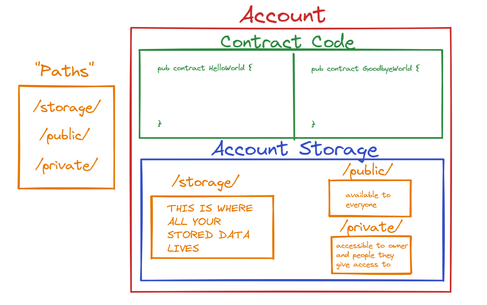

# Глава 4 День 1 - Хранилище аккаунта

Мы прошли уже 3 главы. Но впереди еще много всего ;) Поехали.

## Видео

Посмотрите видео до 14:45: https://www.youtube.com/watch?v=01zvWVoDKmU

Остальное мы рассмотрим завтра.

## Аккаунты на Flow

Если вы помните первый день второй главы, когда мы изучали транзакции, я также говорил об аккаунтах на flow и о том, как они могут хранить данные. Я скопирую и вставлю это ниже, потому что это полезно для обзора:

На Flow аккаунты могут хранить свои собственные данные. Что это значит? Если я владею NFT на Flow, то этот NFT хранится на моем аккаунте. Это *очень отличается* от других блокчейнов, таких как Ethereum. В Ethereum ваш NFT хранится в смарт-контракте. В Flow мы фактически позволяем аккаунтам самим хранить свои данные, что очень здорово. Но как нам получить доступ к данным на своем аккаунте? Мы можем сделать это с помощью типа `AuthAccount`. Каждый раз, когда пользователь (вроде нас с вами) отправляет транзакцию, вы должны оплатить ее, а затем "подписать" ее. Это означает, что вы нажали на кнопку, говорящую: "Эй, я хочу одобрить эту транзакцию". Когда вы подписываете ее, транзакция принимает ваш `AuthAccount` и может получить доступ к данным вашего аккаунта. 

Вы можете видеть, как это делается в части транзакции `prepare`, и в этом весь смысл фазы `prepare`: получить доступ к информации/данным вашего счета. С другой стороны, фаза `execute` не может этого сделать. Но она может вызывать функции и делать то, что нужно для изменения данных в блокчейне. ПРИМЕЧАНИЕ: В действительности вам никогда не понадобится фаза `execute`. Технически вы можете сделать все в фазе `prepare`, но так код будет менее понятным. Лучше разделить логику.
 
## Что находится в аккаунте?



Как вы читали выше, на Flow аккаунты фактически хранят свои собственные данные. Это означает, что если у меня есть ресурс `NFT`, я могу хранить его в своем собственном аккаунте. Но где?

Используя приведенный выше рисунок (я так горжусь им), давайте поговорим о том, что живет в аккаунте:
1. Код контракта - контракт развертывается на аккаунте и живет внутри аккаунта. Несколько контрактов могут жить в одном аккаунте.
2. Хранилище аккаунта - все ваши данные хранятся в хранилище аккаунта

## Хранилище аккаунта

Что же тогда представляет собой хранилище аккаунта? Хранилище аккаунта можно представить как "контейнер" данных, который находится по определенному пути: `/storage/`. В аккаунте Flow есть 3 пути для доступа к определенным данным:
1. `/storage/` - доступ сюда может получить только владелец аккаунта (слава богу, иначе кто-то мог бы украсть все ваши данные). Здесь хранятся ВСЕ ваши данные.
2. `/public/` - доступен всем
3. `/private/` - доступно только владельцу аккаунта и людям, которым владелец аккаунта предоставляет доступ

Главное помнить, что только владелец аккаунта может получить доступ к своему `/storage/`, но у него есть возможность помещать вещи в пути `/public/` и `/private/`, если он захочет. Например, если я хочу просто показать вам свой NFT, я могу поместить демонстративную версию своего NFT в путь `/public/`, чтобы вы могли его увидеть, но ограничить его настолько, чтобы вы не могли забрать его с моего аккаунта. 

*Подсказка: Вы видите, как интерфейсы ресурсов могут быть полезны здесь? ;)*.

Возможно, вы задаетесь вопросом: "а как мне получить доступ к моему `/storage/`?". Ответ заключается в вашем типе `AuthAccount`. Если вы помните, когда вы подписываете транзакцию, `AuthAccount` подписанта помещается в качестве параметра на этапе `prepare`, как показано ниже:

```cadence
transaction() {
  prepare(signer: AuthAccount) {
    // We can access the signer's /storage/ path here!
  }

  execute {

  }
}
```

Как вы можете видеть выше, мы можем получить доступ к `/storage/` подписанта на этапе `prepare`. Это означает, что мы можем делать с его учетной записью все, что захотим. Вот почему так страшно подумать о случайном подписании транзакции! Будьте осторожны, друзья.

## Функции сохранения и загрузки

Давайте попрактикуемся в хранении чего-либо на аккаунте. Сначала определим контракт:

```cadence
pub contract Stuff {

  pub resource Test {
    pub var name: String
    init() {
      self.name = "Jacob"
    }
  }

  pub fun createTest(): @Test {
    return <- create Test()
  }

}
```

Мы определили простой контракт, позволяющий создавать и возвращать тип ресурса `@Test`. Давайте получим это в транзакции:

```cadence
import Stuff from 0x01
transaction() {
  prepare(signer: AuthAccount) {
    let testResource <- Stuff.createTest()
    destroy testResource
  }

  execute {

  }
}
```

Все, что мы делаем, это создаем и уничтожаем `@Test`. Но что если мы захотим сохранить его в нашем аккаунте? Давайте посмотрим, как это делается, а затем пройдемся по этому вопросу:

```cadence
import Stuff from 0x01
transaction() {
  prepare(signer: AuthAccount) {
    let testResource <- Stuff.createTest()
    signer.save(<- testResource, to: /storage/MyTestResource) 
    // saves `testResource` to my account storage at this path:
    // /storage/MyTestResource
  }

  execute {

  }
}
```

Посмотрите, как мы сохранили его в нашем аккаунте. Во-первых, мы **должны иметь `AuthAccount` для сохранения.** В данном случае у нас есть переменная `signer`. Затем мы можем выполнить `signer.save(...)`, что означает, что мы сохраняем что-то по пути `/storage/`. 

`.save()` принимает два параметра:
1. Фактические данные, которые нужно сохранить
2. параметр `to`, который является путем, куда мы должны сохранить его (это должен быть путь `/storage/`)

В примере выше я сохранил `testResource` (обратите внимание на синтаксис `<-`, поскольку это ресурс) по пути `/storage/MyTestResource`. Теперь, когда мы захотим получить его, мы можем обратиться к этому пути. Давайте сделаем это ниже.

```cadence
import Stuff from 0x01
transaction() {
  prepare(signer: AuthAccount) {
    let testResource <- signer.load<@Stuff.Test>(from: /storage/MyTestResource)
    // takes `testResource` out of my account storage

    destroy testResource
  }

  execute {

  }
}
```

В приведенном выше примере мы используем функцию `.load()` для извлечения данных ИЗ хранилища нашего аккаунта. 

Вы заметите, что мы должны сделать эту странную вещь: `<@Stuff.Test>`. Что это такое? Ну, когда вы взаимодействуете с хранилищем учетных записей, вы должны указать тип, который вы рассматриваете. Cadence понятия не имеет, что `@Stuff.Test` хранится на этом пути хранения. Но как программист, мы знаем, что это то, что там хранится, поэтому мы должны поставить `<@Stuff.Test>`, чтобы сказать "мы ожидаем, что `@Stuff.Test` выйдет из этого пути хранения".

`.load()` принимает один параметр:
1. параметр `from` - путь, из которого мы должны его взять (это должен быть путь `/storage/`)

Еще один важный момент: когда вы `загружаете` данные из хранилища, оно возвращает необязательный тип. `testResource` на самом деле имеет тип `@Stuff.Test?`. Причина этого в том, что Cadence понятия не имеет, что вы говорите правду и что там действительно что-то есть, или что это вообще правильный тип. Поэтому, если вы ошиблись, он вернет `nil`. Давайте рассмотрим пример:

```cadence
import Stuff from 0x01
transaction() {
  prepare(signer: AuthAccount) {
    let testResource <- signer.load<@Stuff.Test>(from: /storage/MyTestResource)
    log(testResource.name) // ERROR: "value of type `Stuff.Test?` has no member `name`."

    destroy testResource
  }

  execute {

  }
}
```

Видите? Это необязательный параметр. Чтобы исправить это, мы можем использовать либо `panic`, либо оператор `!`. Мне нравится использовать `panic`, потому что вы можете указать сообщение об ошибке.

```cadence
import Stuff from 0x01
transaction() {
  prepare(signer: AuthAccount) {
    let testResource <- signer.load<@Stuff.Test>(from: /storage/MyTestResource)
                          ?? panic("A `@Stuff.Test` resource does not live here.")
    log(testResource.name) // "Jacob"

    destroy testResource
  }

  execute {

  }
}
```

## Функция заимствования

Раньше мы сохраняли и загружали из аккаунта. Но что, если мы просто хотим посмотреть что-то в аккаунте? Вот тут-то и приходят на помощь ссылки и функция `.borrow()`.

```cadence 
import Stuff from 0x01
transaction() {
  prepare(signer: AuthAccount) {
    // NOTICE: This gets a `&Stuff.Test`, not a `@Stuff.Test`
    let testResource = signer.borrow<&Stuff.Test>(from: /storage/MyTestResource)
                          ?? panic("A `@Stuff.Test` resource does not live here.")
    log(testResource.name) // "Jacob"
  }

  execute {

  }
}
```

Видно, что мы использовали функцию `.borrow()` для получения ссылки на ресурс в нашем хранилище, а не самого ресурса. Поэтому мы используем тип `<&Stuff.Test>`, а не `<@Stuff.Test>`.

`.borrow()` принимает один параметр (такой же, как `.load()`):
1. параметр `from`, который является путем, из которого мы должны взять его

Также обратите внимание, что поскольку мы не используем `.load()`, ресурс все время остается в хранилище нашего аккаунта. Ух ты, ссылки - это круто!

## Заключение

Давайте снова посмотрим на этот рисунок:


Теперь вы должны понимать, что такое `/storage/`. В завтрашней главе мы поговорим о путях `/public/` и `/private/`.

## Квесты

1. Объясните, что находится внутри аккаунта.

2. В чем разница между путями `/storage/`, `/public/` и `/private/`?

3. Что делает `.save()`? Что делает `.load()`? Что делает `.borrow()`?

4. Объясните, почему мы не можем сохранить что-то в хранилище аккаунта внутри скрипта.

5. Объясните, почему я не смог сохранить что-то на ваш аккаунт.

6. Определите контракт, возвращающий ресурс, в котором есть хотя бы одно поле. Затем напишите две транзакции:

    1) Транзакция, которая сначала сохраняет ресурс в хранилище аккаунта, затем загружает его из хранилища аккаунта, регистрирует поле внутри ресурса и уничтожает его.

    2) Транзакция, которая сначала сохраняет ресурс в хранилище аккаунта, затем заимствует ссылку на него и регистрирует поле внутри ресурса.