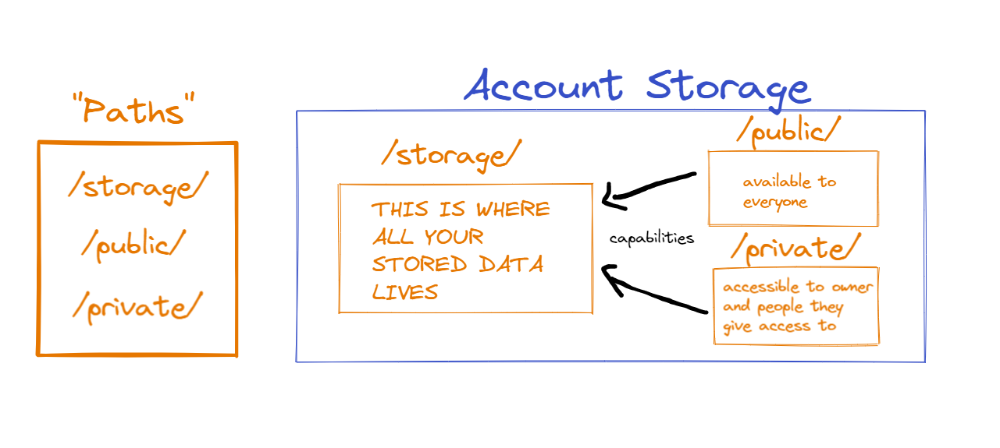

# Chapter 4 Day 2 - Capabilities

In yesterday's chapter, we talked about the `/storage/` path of an account's storage. Today we will talk about the `/public/` and `/private/` paths, and what capabilities are.

**NOTE: THIS CHAPTER CAN GET VERY CONFUSING**. If you feel lost along the way, I will give you a virtual ghost hug. I promise, if you read through it a few times, you will get it eventually.

## Video

You can watch this video from 14:45 to the end (we watched the first half in the last day): https://www.youtube.com/watch?v=01zvWVoDKmU

## Review from Yesterday


Quick review:
1. `/storage/` is only accessible to the account owner. We use `.save()`, `.load()` and `.borrow()` functions to interact with it.
2. `/public/` is available to everyone.
3. `/private/` is available to the account owner and people who the owner gives access to.

For today's chapter, we will be using yesterday's contract code:

```cadence
pub contract Stuff {

  pub resource Test {
    pub var name: String
    init() {
      self.name = "Jacob"
    }
  }

  pub fun createTest(): @Test {
    return <- create Test()
  }

}
```

And don't forget that we saved the resource to our storage like this:
```cadence
import Stuff from 0x01
transaction() {
  prepare(signer: AuthAccount) {
    let testResource <- Stuff.createTest()
    signer.save(<- testResource, to: /storage/MyTestResource) 
    // saves `testResource` to my account storage at this path:
    // /storage/MyTestResource
  }

  execute {

  }
}
```

Okay, we're ready to go.

## `/public/` path

Previously, when we saved something to account storage, only the account owner could access it. That is because it was saved to the `/storage/` path. But what if we want other people to read the `name` field from my resource? Well, you may have guessed it. Let's make our resource publically accessible!

```cadence 
import Stuff from 0x01
transaction() {
  prepare(signer: AuthAccount) {
    // Links our resource to the public so other people can now access it
    signer.link<&Stuff.Test>(/public/MyTestResource, target: /storage/MyTestResource)
  }

  execute {

  }
}
```

In the example above, we used the `.link()` function to "link" our resource to the `/public/` path. In simpler terms, we took the thing at `/storage/MyTestResource` and exposed a `&Stuff.Test` to the public so they can read from it.

`.link()` takes in two parameters:
1. A `/public/` or `/private/` path
2. a `target` parameter that is a `/storage/` path where the data you're linking currently lives

Now, anyone can run a script to read the `name` field on our resource. I will show you how to do that, but I need to introduce you to some things first.

## Capabilities

When you "link" something to the `/public/` or `/private/` paths, you are creating something called a capability. Nothing *actually* lives in the `/public/` or `/private/` paths, everything lives in your `/storage/`. However, we can think of capabilities like "pointers" that point from a `/public/` or `/private/` path to its associated `/storage/` path. Here's a helpful visualization:



The cool part is that you can make your `/public/` or `/private/` capabilities *more restrictive* than what is inside your `/storage/` path. This is super cool because you can limit what other people are able to do, but still allow them to do some things. We will do this with resource interfaces later.

## `PublicAccount` vs. `AuthAccount`

We already learned that an `AuthAccount` allows you to do anything you want with an account. On the other hand, `PublicAccount` allows anyone to read from it, but only the things that the account owner exposes. You can get a `PublicAccount` type by using the `getAccount` function like so:

```cadence
let account: PublicAccount = getAccount(0x1)
// `account` now holds the PublicAccount of address 0x1
```

The reason I'm telling you this is because the only way to get a capability from a `/public/` path is to use `PublicAccount`. On the other hand, you can only get a capability from a `/private/` path with an `AuthAccount`.

## Back to `/public/`

Okay, so we linked our resource to the public. Let's read from it in a script now, and apply some of what we've learned!

```cadence
import Stuff from 0x01
pub fun main(address: Address): String {
  // gets the public capability that is pointing to a `&Stuff.Test` type
  let publicCapability: Capability<&Stuff.Test> =
    getAccount(address).getCapability<&Stuff.Test>(/public/MyTestResource)

  // Borrow the `&Stuff.Test` from the public capability
  let testResource: &Stuff.Test = publicCapability.borrow() ?? panic("The capability doesn't exist or you did not specify the right type when you got the capability.")

  return testResource.name // "Jacob"
}
```

Sweet! We read the name of our resource from the `/public/` path. Here are the steps:
1. Get the public account of the address we're reading from: `getAccount(address)`
2. Get the capability that is pointing to a `&Stuff.Test` type at the `/public/MyTestResource` path: `getCapability<&Stuff.Test>(/public/MyTestResource)`
3. Borrow the capability to return the actual reference: `let testResource: &Stuff.Test = publicCapability.borrow() ?? panic("The capability is invalid")`
4. Return the name: `return testResource.name`

You may be wondering, why didn't we have to specify the type of the reference when we do `.borrow()`? The answer is because the capability already specifies the type, so it is assuming that is the type it's borrowing. If it borrows a different type, or the capability did not exist in the first place, it will return `nil` and panic.

## Using Public Capabilities to Restrict a Type

Alright! Awesomeness. We've made it here at least, i'm proud of you. The next topic is figuring out how to restrict certain parts of our reference so the public can't do things we don't want them to.

Let's define another contract:

```cadence
pub contract Stuff {

  pub resource Test {
    pub var name: String

    pub fun changeName(newName: String) {
      self.name = newName
    }

    init() {
      self.name = "Jacob"
    }
  }

  pub fun createTest(): @Test {
    return <- create Test()
  }

}
```

In this example, I added a `changeName` function that allows you to change the name in the resource. But what if we don't want the public to be able to do this? Right now we have a problem:

```cadence
import Stuff from 0x01
transaction(address: Address) {

  prepare(signer: AuthAccount) {

  }

  execute {
    let publicCapability: Capability<&Stuff.Test> =
      getAccount(address).getCapability<&Stuff.Test>(/public/MyTestResource)

    let testResource: &Stuff.Test = publicCapability.borrow() ?? panic("The capability doesn't exist or you did not specify the right type when you got the capability.")

    testResource.changeName(newName: "Sarah") // THIS IS A SECURITY PROBLEM!!!!!!!!!
  }
}
```

See the problem? Because we linked our resource to the public, anyone can call `changeName` and change our name! That's not fair.

The way to solve this is to:
1. Define a new resource interface that only exposes the `name` field, and NOT `changeName`
2. When we `.link()` the resource to the `/public/` path, we restrict the reference to use that resource interface in step 1).

Let's add a resource interface to our contract:

```cadence
pub contract Stuff {

  pub resource interface ITest {
    pub var name: String
  }

  // `Test` now implements `ITest`
  pub resource Test: ITest {
    pub var name: String

    pub fun changeName(newName: String) {
      self.name = newName
    }

    init() {
      self.name = "Jacob"
    }
  }

  pub fun createTest(): @Test {
    return <- create Test()
  }

}
```

Awesome! Now `Test` implements a resource interface named `ITest` that only has the `name` in it. Now we can link our resource to the public by doing this:

```cadence 
import Stuff from 0x01
transaction() {
  prepare(signer: AuthAccount) {
    // Save the resource to account storage
    signer.save(<- Stuff.createTest(), to: /storage/MyTestResource)

    // See what I did here? I only linked `&Stuff.Test{Stuff.ITest}`, NOT `&Stuff.Test`.
    // Now the public only has access to the things in `Stuff.ITest`.
    signer.link<&Stuff.Test{Stuff.ITest}>(/public/MyTestResource, target: /storage/MyTestResource)
  }

  execute {

  }
}
```

So, what happens if we try to access the entire reference now in a script, like we did before?

```cadence
import Stuff from 0x01
transaction(address: Address) {
  prepare(signer: AuthAccount) {

  }

  execute {
    let publicCapability: Capability<&Stuff.Test> =
      getAccount(address).getCapability<&Stuff.Test>(/public/MyTestResource)

    // ERROR: "The capability doesn't exist or you did not 
    // specify the right type when you got the capability."
    let testResource: &Stuff.Test = publicCapability.borrow() ?? panic("The capability doesn't exist or you did not specify the right type when you got the capability.")

    testResource.changeName(newName: "Sarah")
  }
}
```

Now, we get an error! Haha, get recked hacker! You can't borrow the capability because you tried to borrow a capability to `&Stuff.Test`, and I didn't make that available to you. I only made `&Stuff.Test{Stuff.ITest}` available. ;)

What if we try this?

```cadence
import Stuff from 0x01
transaction(address: Address) {

  prepare(signer: AuthAccount) {

  }

  execute {
    let publicCapability: Capability<&Stuff.Test{Stuff.ITest}> =
      getAccount(address).getCapability<&Stuff.Test{Stuff.ITest}>(/public/MyTestResource)

    // This works...
    let testResource: &Stuff.Test{Stuff.ITest} = publicCapability.borrow() ?? panic("The capability doesn't exist or you did not specify the right type when you got the capability.")

    // ERROR: "Member of restricted type is not accessible: changeName"
    testResource.changeName(newName: "Sarah")
  }
}
```

And again! Get recked scammer. Even though you borrowed the right type, you can't call `changeName` because it's not accessible through the `&Stuff.Test{Stuff.ITest}` type.

But, this will work:

```cadence
import Stuff from 0x01
pub fun main(address: Address): String {
  let publicCapability: Capability<&Stuff.Test{Stuff.ITest}> =
    getAccount(address).getCapability<&Stuff.Test{Stuff.ITest}>(/public/MyTestResource)

  let testResource: &Stuff.Test{Stuff.ITest} = publicCapability.borrow() ?? panic("The capability doesn't exist or you did not specify the right type when you got the capability.")

  // This works because `name` is in `&Stuff.Test{Stuff.ITest}`
  return testResource.name
}
```

Yaaaaaaay! Exactly like we wanted :)

## Conclusion

Holy cow. That was a lot. The good news? You have learned an insane amount about Cadence so far. And even better, you have learned all the complicated stuff. I am so, so proud of you.

I also intentionally didn't go into depth on `/private/`. This is because, in practice, you will rarely ever use `/private/`, and I didn't want to shove too much info into your head. 

And, well... I'm hungry. So I'm going to eat food. Maybe I'll add it to this chapter later ;)

## Quests

Please answer in the language of your choice.

1. What does `.link()` do?

2. In your own words (no code), explain how we can use resource interfaces to only expose certain things to the `/public/` path.

3. Deploy a contract that contains a resource that implements a resource interface. Then, do the following:

    1) In a transaction, save the resource to storage and link it to the public with the restrictive interface. 

    2) Run a script that tries to access a non-exposed field in the resource interface, and see the error pop up.

    3) Run the script and access something you CAN read from. Return it from the script.