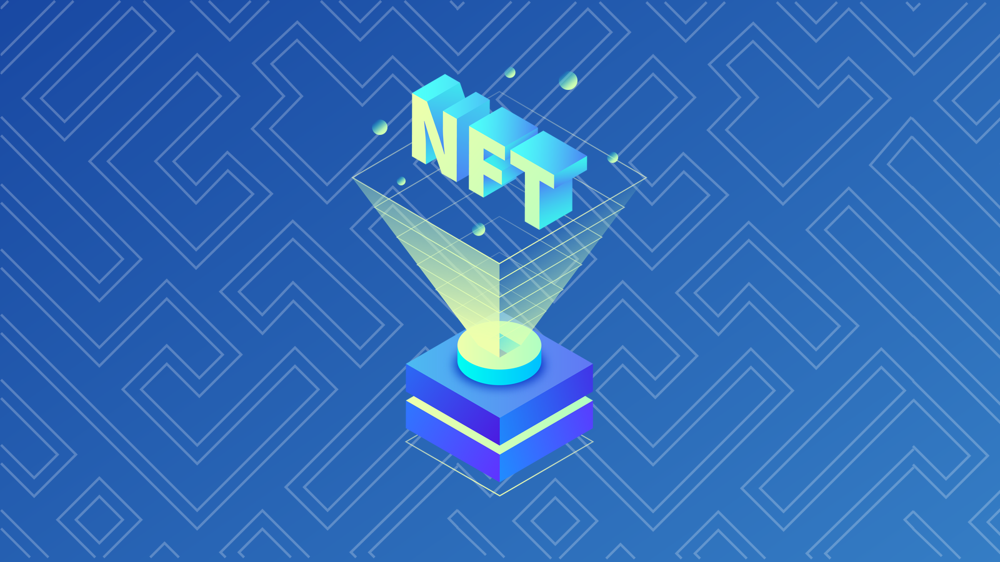

# Capítulo 5 Día 2 - Los Interfaces de Los Contratos

Hoy, vamos a aprender el último concepto necesario para completar nuestro smart contract de NFT. 

## Video

Los Interfaces de Los Contratos: https://www.youtube.com/watch?v=NHMBE6iRyfY 

## Los Interfaces de Los Contratos

Las buenas noticias sobre la lección de hoy es que es realmente fácil. Ya has aprendido la mayor parte de esto, simplemente no lo sabes todavía ;)

Los interfaces de los contratos son casi lo mismo como los interfaces de los recursos, excepto ellos son para los contratos. Hay algunas diferencias, aunque, como “¿cómo definimos los interfaces de los contratos?” Miremos abajo: 

```cadence
pub contract interface IHelloWorld {

}
```

Los interfaces de los contratos son como contratos en que ellos son desplegados por su cuenta. Ellos no están dentro de un contrato, pero son completamente independientes. 

Te despliegas una interfaz de contrato como un contrato normal. La única diferencia es que ellos son declarados con las palabra claves de `contract interface`, como el ejemplo arriba. 

Similar a los interfaces de los recursos, no puedes inicializar ninguna variables o definir ninguna función. Aquí es un ejemplo: 

```cadence
pub contract interface IHelloWorld {
  pub var greeting: String
  
  pub fun changeGreeting(newGreeting: String)
}
```

Podemos tomar este interfaz de contrato y implemarlo en un contrato actual:

```cadence
import IHelloWorld from 0x01
pub contract HelloWorld: IHelloWorld {

}
```

Notarás que lo implementamos al igual que lo hacemos con los recursos, usando el sintaxi de `:{nombre de la interfaz de contrato}`. 

También notarás que estamos consiguiendo algunos errores: “contract `HelloWorld` does not conform to contract `IHelloWorld`”. ¿Por qué es esto? Pues, porque no hemos implementado las cosas por supuesto! 

```cadence
import IHelloWorld from 0x01
pub contract HelloWorld: IHelloWorld {
  pub var greeting: String
  
  pub fun changeGreeting(newGreeting: String) {
    self.greeting = newGreeting
  }

  init() {
    self.greeting = "Hola, Jacob!"
  }
}
```

Ahh, todo mejor ahora. ¡Genial!

## Condiciones de Pre/Post

Ayer aprendimos sobre las condiciones de pre/post. La cosas buena sobre ellos es que podemos usarlo dentro una interfaz de recurso o contrato, como así: 

```cadence
pub contract interface IHelloWorld {
  pub var greeting: String
  
  pub fun changeGreeting(newGreeting: String) {
    post {
      self.greeting == newGreeting: "No actualizamos el greeting adecuadamente."
    }
  }
}
```

Todavía no implementamos la función, pero aplicamos una restricción: la cuenta que implementa este interfaz de contrato TIENES que hacer lo siguiente: 
1. Defina un string de `greeting`
2. Defina una función de `changeGreeting`
3. Además, porque la condición de post, ellos tienes que actualizar el `greeting` adecuadamente para ser el `newGreeting` aprobado en. 

Esta es una manera genial para hacer seguro que las personas están siguiendo nuestras reglas. 

### Los Interfaces de los Recursos en Los Interfaces de Los Contratos

Sumemos un recurso y una interfaz de recurso a nuestra interfaz de contrato: 

```cadence
pub contract interface IHelloWorld {
  pub var greeting: String
  
  pub fun changeGreeting(newGreeting: String) {
    post {
      self.greeting == newGreeting: "No actualizamos el greeting adecuadamente."
    }
  }

  pub resource interface IGreeting {
    pub var favouriteFood: String
  }

  pub resource Greeting: IGreeting {
    pub var favouriteFood: String
  }
}
```

¡Mira! Definimos un recurso llamado `Greeting` y una interfaz de recurso llamado `IGreeting` dentro nuestra interfaz de contrato. Que este está diciendo es “Cualquier contrato que implementa este interfaz de contrato, DEBE TENER un recurso de `Greeting` que implementa específicamente `IHelloWorld.IGreeting`.”

Esto es muy importante a entender. Si definimos nuestro propio contrato que define su propio `IGreeting`, como así: 

```cadence
import IHelloWorld from 0x01
pub contract HelloWorld: IHelloWorld {
  pub var greeting: String
  
  pub fun changeGreeting(newGreeting: String) {
    self.greeting = newGreeting
  }

  pub resource interface IGreeting {
    pub var favouriteFood: String
  }

  // ERROR: resource `HelloWorld.Greeting` is missing a declaration to 
  // required conformance to resource interface `IHelloWorld.IGreeting`
  pub resource Greeting: IGreeting {
    pub var favouriteFood: String

    init() {
      self.favouriteFood = "Pancakes con chispas de chocolate" // que ricoooo
    }
  }

  init() {
    self.greeting = "Hola, Jacob!"
  }
}
```

… conseguimos un error. La razón porque estamos conseguindo un error es porque nuestra interfaz de contrato está diciendo que nuestro recurso de `Greeting` debe implementar `IHelloWorld.IGreeting`, no cualquier arbitrario de `IGreeting` que alguien defina. Así que este es que el contrato debe parece como: 

```cadence
import IHelloWorld from 0x01
pub contract HelloWorld: IHelloWorld {
  pub var greeting: String
  
  pub fun changeGreeting(newGreeting: String) {
    self.greeting = newGreeting
  }

  pub resource Greeting: IHelloWorld.IGreeting {
    pub var favouriteFood: String

    init() {
      self.favouriteFood = "Pancakes con chispas de chocolate" // que ricoooo
    }
  }

  init() {
    self.greeting = "Hola, Jacob!"
  }
}
```

Ahora, estamos bien. :)

**Nota: Aunque si una interfaz de contrato define una interfaz de recurso, el contrato de implementación NO tienes que implementar la interfaz de recursos también. Eso puede quedarse en la interfaz de contrato, como hicimos arriba.**

## Los Interfaces de Contratos como “Standards”



Los interfaces de los contratos permiten especificar algunos requisitos para un contrato de implementación, y adicionalmente, crear “standards”(estándares) en qué contratos ciertos parece como. 

¿No sería útil si pudiéramos racionalizar que un contrato es un "Contrato NFT" sin leer realmente su código? Bueno, ¡ya existe! La interfaz de contrato de NonFungibleToken (también conocido como el estándar NonFungibleToken) es una interfaz de contrato que define que los contratos de NFTs tienes que tener para ser “contratos de NFT” oficiales.  Esto es útil así que los clientes como un DApp de Mercado puede entender lo que están mirando, y sobre todo, **no tener que implementar diferente funcionalidades para cada contrato de NFT.** 

Estandarizado es super útil así que un cliente usando muchos contratos puede tener una manera singular de interactuando con todo esos contratos. Por ejemplo, todo los contratos de NFT tienes un recurso llamado `Collection` que tiene las funciones de `deposit` y `withdraw`. De esta manera, aunque el DApp de cliente está interactuando con 100 contratos de NFTs, solo tiene que importar el standard de NonFungibleToken para llamar esas funciones, porque es debajo un tipo genérico. 

Puedes leer más sobre el aquí: https://github.com/onflow/flow-nft 

## En Conlusión

Los interfaces de los contratos son muy similares a los interfaces de los recursos en que ellos requieren que se implemente ciertas cosas y permite a implementar restricciones fuertes en que puedes hacer. Adicionalmente, ellos permiten poner “standards” lo cual es muy beneficioso en el contexto de racionalizar o asegurar un contrato es lo que dice ser. 

Coincidentemente, los interfaces de contratos son (en mi opinión) el tópico más debatido en Flow. Eso es porque, por ejemplo, la interfaz de contrato NonFungibleToken (definido aqui: https://github.com/onflow/flow-nft/blob/master/contracts/NonFungibleToken.cdc) es relativiamente viejo, y hay muchas debates sobre cómo solucionarlo. Si alguna vez estás en la discordia de Flow, nos verás discutiendo al respecto sin parar ;)

## Búsquedas

1. Explicar por qué los estándares pueden ser beneficiosas para el ecosistema de Flow? 

2. ¿Cuál es tu comida favorita? 

3. Por favor resolver este código (Pista: Hay dos cosas incorrecto):

La interfaz de contrato: 
```cadence
pub contract interface ITest {
  pub var number: Int
  
  pub fun updateNumber(newNumber: Int) {
    pre {
      newNumber >= 0: "No nos gustan los números negativos por alguna razón. Somos malos."
    }
    post {
      self.number == newNumber: "No actualicé el número para que fuera el nuevo número."
    }
  }

  pub resource interface IStuff {
    pub var favouriteActivity: String
  }

  pub resource Stuff {
    pub var favouriteActivity: String
  }
}
```

El Contrato de Implementación: 
```cadence
pub contract Test {
  pub var number: Int
  
  pub fun updateNumber(newNumber: Int) {
    self.number = 5
  }

  pub resource interface IStuff {
    pub var favouriteActivity: String
  }

  pub resource Stuff: IStuff {
    pub var favouriteActivity: String

    init() {
      self.favouriteActivity = "Jugando League of Legends."
    }
  }

  init() {
    self.number = 0
  }
}
```
