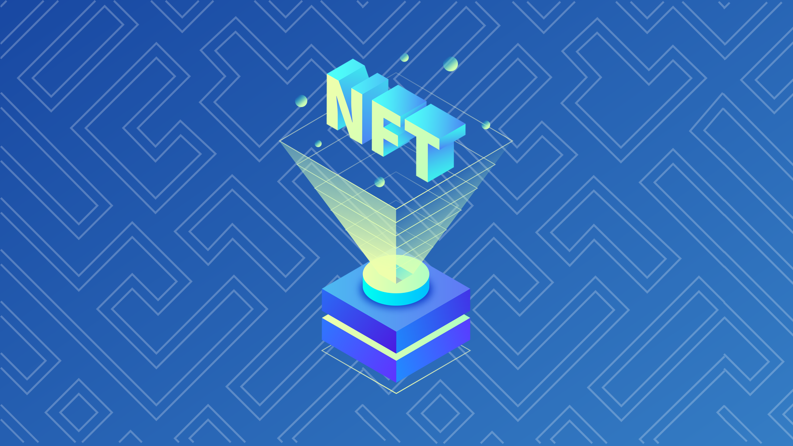

# Глава 5 День 2 - Интерфейсы контрактов

Сегодня мы изучим последнюю оставшуюся концепцию, необходимую для завершения нашего смарт-контракта NFT.

## Видео

Интерфейсы контрактов: https://www.youtube.com/watch?v=NHMBE6iRyfY

## Интерфейсы контрактов:

Хорошая новость о сегодняшнем уроке заключается в том, что он на самом деле довольно прост. Большую часть этого вы уже выучили, просто вы еще не знаете об этом ;)

Интерфейсы контрактов практически полностью аналогичны интерфейсам ресурсов, за исключением того, что они предназначены для контрактов. Однако есть несколько отличий, например, "как мы определяем интерфейсы контрактов?". Давайте посмотрим ниже:

```cadence
pub contract interface IHelloWorld {

}
```

Интерфейсы контрактов похожи на контракты тем, что они разворачиваются сами по себе. Они не находятся внутри контракта, скорее, они полностью независимы. 

Вы разворачиваете интерфейс контракта точно так же, как и обычный контракт. Единственное отличие - они объявляются с ключевыми словами `contract interface`, как в примере выше.

Как и в интерфейсах ресурсов, вы не можете инициализировать какие-либо переменные или определять какие-либо функции. Вот пример интерфейса:

```cadence
pub contract interface IHelloWorld {
  pub var greeting: String
  
  pub fun changeGreeting(newGreeting: String)
}
```

Мы можем взять этот интерфейс контракта и реализовать его на реальном контракте:

```cadence
import IHelloWorld from 0x01
pub contract HelloWorld: IHelloWorld {

}
```

Вы заметите, что мы реализуем его так же, как мы это делаем с ресурсами, используя синтаксис `: {contract interface name}` синтаксис.

Вы также заметите, что мы получаем некоторые ошибки: " contract `HelloWorld` не соответствует contract interface `IHelloWorld`". Почему? Ну, конечно же, потому что мы не реализовали этот интерфейс!


```cadence
import IHelloWorld from 0x01
pub contract HelloWorld: IHelloWorld {
  pub var greeting: String
  
  pub fun changeGreeting(newGreeting: String) {
    self.greeting = newGreeting
  }

  init() {
    self.greeting = "Hello, Jacob!"
  }
}
```

Ааа, теперь уже лучше. Потрясающе!

### Pre/Post условия

Вчера мы узнали о pre/post-условиях. Самое замечательное в них то, что мы можем использовать их внутри интерфейса ресурса или интерфейса контракта, например, так:

```cadence
pub contract interface IHelloWorld {
  pub var greeting: String
  
  pub fun changeGreeting(newGreeting: String) {
    post {
      self.greeting == newGreeting: "We didn't update the greeting appropiately."
    }
  }
}
```

Мы по-прежнему не реализовали функцию, но мы ввели ограничение: счет, который реализует этот интерфейс контракта, ДОЛЖЕН делать следующее:
1. Определить строку `greeting`
2. Определить функцию `changeGreeting`
3. Более того, из-за условия post, они должны обновить `greeting` соответствующим образом, чтобы оно стало `newGreeting`, переданным в функции.

Для нас это отличный способ убедиться, что люди следуют нашим правилам.

### Интерфейсы ресурсов в интерфейсах контрактов

Давайте включим воображение? Добавим ресурс и интерфейс ресурса к нашему интерфейсу контракта:

```cadence
pub contract interface IHelloWorld {
  pub var greeting: String
  
  pub fun changeGreeting(newGreeting: String) {
    post {
      self.greeting == newGreeting: "We didn't update the greeting appropiately."
    }
  }

  pub resource interface IGreeting {
    pub var favouriteFood: String
  }

  pub resource Greeting: IGreeting {
    pub var favouriteFood: String
  }
}
```

Смотрите сюда! Мы определили ресурс `Greeting` и интерфейс ресурса `IGreeting` внутри нашего интерфейса контракта. Это означает: "Какой бы контракт ни реализовывал этот интерфейс контракта, он ДОЛЖЕН иметь ресурс `Greeting`, который конкретно реализует `IHelloWorld.IGreeting`".

Это очень важно понять. Если мы определим наш собственный контракт, который определит свой собственный `IGreeting`, например:

```cadence
import IHelloWorld from 0x01
pub contract HelloWorld: IHelloWorld {
  pub var greeting: String
  
  pub fun changeGreeting(newGreeting: String) {
    self.greeting = newGreeting
  }

  pub resource interface IGreeting {
    pub var favouriteFood: String
  }

  // ERROR: resource `HelloWorld.Greeting` is missing a declaration to 
  // required conformance to resource interface `IHelloWorld.IGreeting`
  pub resource Greeting: IGreeting {
    pub var favouriteFood: String

    init() {
      self.favouriteFood = "Chocolate chip pancakes." // soooooo good
    }
  }

  init() {
    self.greeting = "Hello, Jacob!"
  }
}
```

... мы получим ошибку. Причина, по которой мы получаем ошибку, заключается в том, что наш интерфейс контракта конкретно говорит, что наш ресурс `Greeting` должен реализовать `IHelloWorld.IGreeting`, а не какой-либо другой, `IGreeting`, который кто-то определит. Вот как на самом деле будет выглядеть контракт:

```cadence
import IHelloWorld from 0x01
pub contract HelloWorld: IHelloWorld {
  pub var greeting: String
  
  pub fun changeGreeting(newGreeting: String) {
    self.greeting = newGreeting
  }

  pub resource Greeting: IHelloWorld.IGreeting {
    pub var favouriteFood: String

    init() {
      self.favouriteFood = "Chocolate chip pancakes." // soooooo good
    }
  }

  init() {
    self.greeting = "Hello, Jacob!"
  }
}
```

Теперь все в порядке :)

**Примечание: Даже если интерфейс контракта определяет интерфейс ресурса, реализующий контракт НЕ обязан реализовывать интерфейс ресурса. Это может оставаться в интерфейсе контракта, как мы сделали выше.**.

## Интерфейсы контрактов как "стандарты"



Интерфейсы контрактов позволяют вам определить некоторые требования к реализующему контракту, а также создать "стандарты" того, как выглядят определенные контракты. 

Разве не было бы полезно, если бы мы могли обосновать, что контракт является "контрактом NFT", не читая его код? Ну, это уже существует! Интерфейс контракта NonFungibleToken (иначе известный как стандарт NonFungibleToken) - это интерфейс контракта, который определяет, что должно быть у контрактов NFT, чтобы считаться "контрактами NFT". Это полезно для того, чтобы клиенты, такие как Marketplace DApp, могли понять, на что они смотрят, и, самое главное, **не нужно реализовывать различные функции для каждого контракта NFT.**.

Стандартизация невероятно полезна, чтобы клиент, использующий несколько контрактов, мог иметь единый способ взаимодействия со всеми этими контрактами. Например, все контракты NFT имеют ресурс под названием Collection, который имеет функции `deposit` и `withdraw`. Таким образом, даже если клиентский DApp взаимодействует со 100 контрактами NFT, ему достаточно импортировать стандарт NonFungibleToken для вызова этих функций, поскольку все они относятся к одному общему типу. 

Подробнее об этом можно прочитать здесь: https://github.com/onflow/flow-nft

## Заключение

Интерфейсы контрактов очень похожи на интерфейсы ресурсов в том, что они требуют от вас реализации определенных вещей и позволяют вам реализовать серьезные ограничения на то, что вам разрешено делать. Кроме того, они позволяют вам устанавливать "стандарты", что очень полезно в контексте рационализации или обеспечения того, что контракт является тем, на что он претендует. 

По совпадению, интерфейсы контрактов являются (на мой взгляд) наиболее обсуждаемой темой на Flow. Это потому, что, например, интерфейс контракта NonFungibleToken (определенный здесь: https://github.com/onflow/flow-nft/blob/master/contracts/NonFungibleToken.cdc) относительно старый, и есть много споров о том, как его исправить. Если вы когда-нибудь будете в дискорде Flow, вы увидите, как мы спорим об этом без остановки ;)

## Квесты

1. Объясните, почему стандарты могут быть полезны для экосистемы Flow.

2. Какое ВАШЕ любимое блюдо?

3. Пожалуйста, исправьте этот код (Подсказка: есть две ошибки):

The contract interface:
```cadence
pub contract interface ITest {
  pub var number: Int
  
  pub fun updateNumber(newNumber: Int) {
    pre {
      newNumber >= 0: "We don't like negative numbers for some reason. We're mean."
    }
    post {
      self.number == newNumber: "Didn't update the number to be the new number."
    }
  }

  pub resource interface IStuff {
    pub var favouriteActivity: String
  }

  pub resource Stuff {
    pub var favouriteActivity: String
  }
}
```

The implementing contract:
```cadence
pub contract Test {
  pub var number: Int
  
  pub fun updateNumber(newNumber: Int) {
    self.number = 5
  }

  pub resource interface IStuff {
    pub var favouriteActivity: String
  }

  pub resource Stuff: IStuff {
    pub var favouriteActivity: String

    init() {
      self.favouriteActivity = "Playing League of Legends."
    }
  }

  init() {
    self.number = 0
  }
}
```