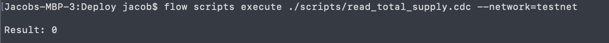

# 第六章·第二天 - 测试网上的合约交互

现在我们将合约部署到了测试网，我们可以使用 Flow CLI 在终端中与它进行交互。 呜呼！ 我们将继续深入。希望你们能沉浸其中！

今天情况会有所不同。 涉及到一些协作。 我不会给出所有的答案 🙂

## 与我们的合约交互

现在我们已经在测试网上部署了合约，可以在终端里使用 Flow CLI 和它交互了。

### 读取 Total Supply

读取智能合约的 total supply!

> 步骤 1: 编写一个 script 来读取我们合约的 totalSupply 并返回它。

> 步骤 2: 粘贴步骤 1 的 script 到 scripts 文件夹，命名为 `read_total_supply.cdc`

> 步骤 3: 打开终端，在项目根目录执行:

```bash
flow scripts execute ./scripts/read_total_supply.cdc --network=testnet
```

如果可以正常工作，你将在 console 里看到 total supply (如果你还没有 mint，应该是 0).



### 设置 NFT Collection

让我们来执行一个 transaction 在测试网上设置 NFT Collection.

> 步骤 1: 如果你还没有设置过，请进行一个 transaction 来设置用户的 collection 用来存储 NFT。

> 步骤 2: 添加 `setup_collection.cdc` 文件到 transactions 文件夹。

> 步骤 3: 打开终端，在项目根目录执行:

```bash
flow transactions send ./transactions/setup_collection.cdc --network=testnet --signer=testnet-account
```

如果可以正常工作，你讲看到这个 transasction 生效了，状态是 ✅sealed （已完成）！


非常棒!!! 我们成功的地在测试网上设置了 NFT Collection。🆒

### 如何使用 Flow CLI 传递参数

到目前为止，我们还没有展示如何使用 Flow CLI 将参数传递到 script/transaction 中。

很简单，只需将参数放在 script/transaction 的文件路径之后。

例子 #1:

```bash
flow transactions send ./transactions/mint_nft.cdc 0xfa88aefbb588049d --network=testnet --signer=testnet-account
```

在 transaction `mint_nft.cdc` 中，参数： `recipient: Address` ，值： `0xfa88aefbb588049d`。

例子 #2:

```bash
flow scripts execute ./scripts/read_nft.cdc 0xfa88aefbb588049d 3  --network=testnet
```

在 script `read_nft.cdc` 中，参数： `recipient: Address, id: UInt64`，值：`0xfa88aefbb588049d`，`3`。

例子 #3:

```bash
flow transactions send ./transactions/mint_nft.cdc 0xfa88aefbb588049d "Jacob the Legend" --network=testnet --signer=testnet-account
```

在 transaction `mint_nft.cdc` 中，参数： `recipient: Address, name: String`，值分别是：`0xfa88aefbb588049d` 和 `Jacob the Legend`。

## 结论

今天又很多内容，但是也非常🆒！我们在 Flow 的测试网上部署了自己的合约，执行了 script 来读取 `totalSupply`，并执行了一个 transaction 来设置我们的 collection。干得漂亮！

## 任务

1. 搞清楚如何使用 Flow CLI 发送 transaction 来铸造 NFT。就像今天我们的设置 collection 的那样。你也可以传递一些参数。

*提示*: 请记住，只有合约的所有者才能访问 `Minter` 资源。 对我们是有利的，因为 transaction 的 `signer` 将是部署合约的人，因此我们有权限访问 `Minter`。

*提示 #2*: 另外还要记住：为了设置 collection，你必须给 transaction 签名，以便 transaction 可以访问 `AuthAccount`。 在这种情况下，因为只有 1 测试网帐户（部署合约的那个），为了简化操作，我们可以给自己铸造 NFT。

2. 使用 Flow CLI 来执行 script 来读取 `totalSupply` 的最新值

3. 使用 Flow CLI 来执行 script 来读取某人的 collection 中 NFT 的 ids

4. 使用 Flow CLI 来执行 script 来读取某个 collection 中 一个具体的 NFT 的 metadata

5. 执行 script 来读取 **Flow Mainnet** 上 GoatedGoats 的 `totalSupply`。 他们的合约在这: https://flow-view-source.com/mainnet/account/0x2068315349bdfce5/contract/GoatedGoats

*提示 #1*: 在 Mainnet 上执行 script 很简单，只需把 `--network=testnet` 替换为 `--network=mainnet`

*提示 #2*: 因为你要执行本地文件里的 script，所以需要把 GoatedGoats 合约的主网地址硬编码到你的 script:
```cadence
import GoatedGoats from 0x2068315349bdfce5
```

不幸的是，现在会遇到编译错误（VSCode 扩展将无法理解导入），但它仍然可以工作。

6. 搞清楚如何从他们的 collection 中读取某人的 GoatedGoats NFT，并使用 Flow CLI 运行 script 来执行此操作。